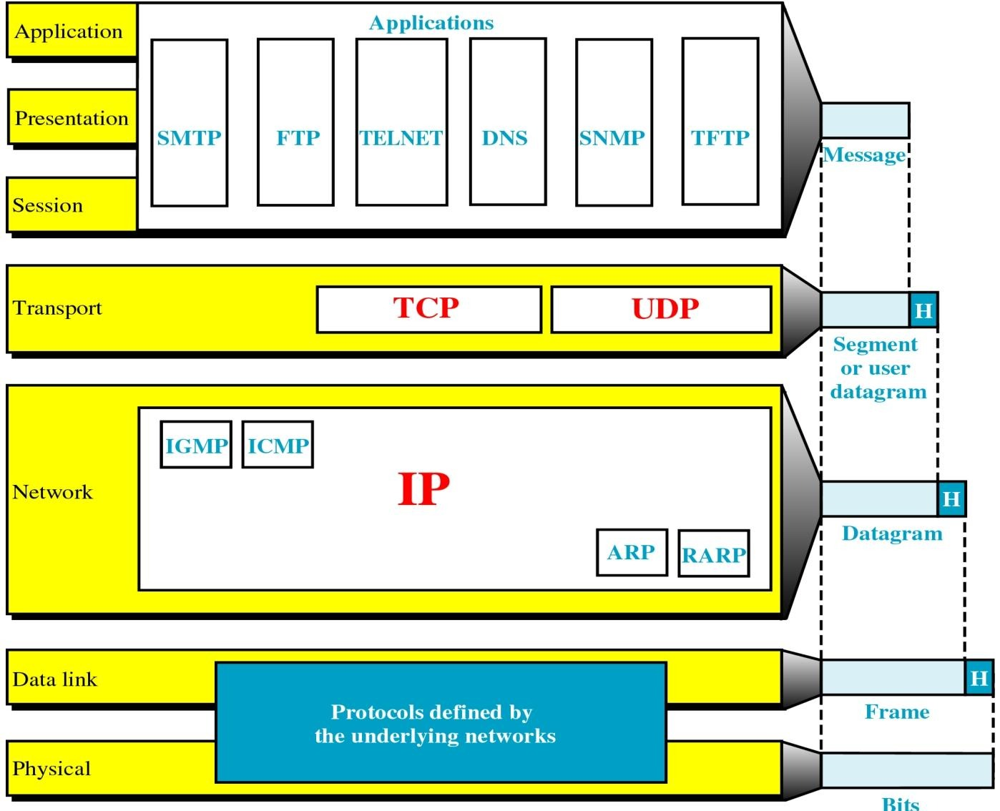

# Introduction
## 概览
---
### 一段话总结
本文围绕计算机网络与分布式系统展开，介绍了网络硬件（包括传输技术和不同规模网络）、网络软件（协议分层、设计问题、服务类型等）、参考模型（OSI和TCP/IP模型）、示例网络、网络标准化等内容。**网络硬件有广播和点到点传输技术，按规模分为多种网络；网络软件通过分层协议实现通信，存在可靠性、路由等设计问题；OSI和TCP/IP是重要参考模型，各有优劣；网络标准化由多个国际组织推动**。

---

---
### 详细总结
1. **计算机网络与分布式系统基础概念**
    - **计算机网络**：由自治计算机通过单一技术互联，用户能直接接触实际机器，机器的硬件和操作系统差异对用户可见。
    - **分布式系统**：由独立计算机组成，对用户呈现为单一连贯系统，通过操作系统之上的中间件实现特定模型（如Web）。
2. **网络硬件**
    - **传输技术**：
        - **广播网络**：数据包发送给所有目的地，各机器根据地址字段判断是否处理。
        - **点到点网络**：数据包从源到目的可能经过多个中间机器，存在多条路径，选择合适路径很重要。
    - **网络按规模分类**：
    
    |分类|距离范围|示例|
    |---|---|---|
    |个人区域网络（PAN）|1m左右|蓝牙连接计算机与周边设备|
    |局域网（LAN）|100m左右（如在建筑物内）|以太网、802.11无线LAN|
    |城域网（MAN）|10km左右（城市范围）| - |
    |广域网（WAN）|100km以上（国家、洲际等）|互联网的骨干网络部分|

3. **网络软件**
    - **协议分层**：网络采用分层结构，每层为上层提供服务，隐藏服务实现细节，降低设计复杂度，类似面向对象编程。
    - **设计问题**：涉及可靠性（如错误控制）、路由（寻找路径、处理乱序消息）、网络演化（寻址、网络互通、扩展性等）、资源分配（统计时分复用）、流量控制、拥塞控制、服务质量（QoS）、安全（防窃听、身份鉴别、防篡改等）。
    - **服务类型**：
        - **面向连接服务**：需建立、使用和释放连接，通信双方协商参数，数据按序传输。
        - **无连接服务**：每个消息携带完整目的地址，独立路由。
4. **参考模型**
    - **OSI参考模型**：
        - **七层结构**：从物理层到应用层，每层功能明确，如物理层负责原始比特传输，数据链路层将物理传输转化为逻辑通道。
        - **评价**：概念清晰，但存在技术和实现问题，如部分层功能空或过满，协议复杂低效。
    - **TCP/IP参考模型**：
        - **四层结构**：包括应用层、传输层（TCP和UDP协议）、互联网层（IP协议）、链路层。
        - **评价**：简洁实用，但存在服务、接口和协议区分不明确等问题。
5. **网络标准化**
    - **国际组织**：ITU（国际电信联盟）、ISO（国际标准化组织）、IEEE（电气和电子工程师协会）、IETF（互联网工程任务组）等推动网络标准制定。
    - **标准示例**：IEEE 802委员会制定了多种LAN标准，如802.11（无线LAN）、802.3（以太网） 。
---
### 关键问题
1. **广播网络中，单播、广播、组播、任播的区别是什么？**
    - 单播是数据包发送给单一目的地址；广播是发送给所有目的地；组播是发送给一组特定接收者（需先订阅）；任播是发送给一组接收者中的任意一个（通常是最近的一个）。在无线局域网中区分组播和广播，是因为组播可实现特定群组通信，避免不必要的广播流量，提高网络效率。
2. **OSI模型和TCP/IP模型的主要区别有哪些？**
    - OSI模型有七层，概念清晰，严格区分服务、接口和协议；TCP/IP模型有四层，更注重实际应用，简洁实用。OSI模型部分层功能存在问题，协议复杂低效；TCP/IP模型服务、接口和协议区分不明确，且对物理和数据链路层提及较少。
3. **在网络分层体系结构中，为什么要进行分层，以及分层带来了哪些好处？**
    - 分层是为了降低网络设计的复杂度。分层的好处包括各层功能明确，便于独立设计和维护；实现上下层解耦，某一层的变化不会影响其他层；有利于标准化，不同系统的相同层可遵循统一标准实现互联互通。 

该部分内容主要介绍了计算机网络和分布式系统的定义与特点，具体如下：

- **计算机网络**：是由通过单一技术相互连接的自治计算机组成的集合。在计算机网络中，用户直接接触实际的机器，若这些机器的硬件和操作系统不同，用户能够完全察觉到。这意味着用户能明显感知到不同计算机在硬件性能（如处理器速度、内存大小）和操作系统功能（如操作界面、软件兼容性）上的差异。
- **分布式系统**：是由独立计算机组成的集合，但对用户而言，它呈现为一个统一连贯的系统。它为用户提供单一的模型或范式，例如常见的网络应用（web服务）。操作系统之上有一层名为中间件的软件，负责实现这种统一的系统呈现，它屏蔽了底层计算机的异构性，使用户无需关心系统内部的复杂结构和不同计算机之间的差异，就能方便地使用整个系统的资源和服务。     
## 1.2 Network Hardware
### Transmission Technology and Scale
该部分内容主要围绕传输技术和网络规模分类进行介绍，具体如下：

- **传输技术**：分为广播网络和点到点网络。
    - **广播网络**：会向所有目的地发送数据包。每台机器都会检查数据包的地址字段，若数据包的目标地址是自身，则进行处理；若不是，则忽略该数据包。广播网络中还涉及单播、广播、组播和任播这几种不同的传输方式，区分它们很有必要，比如单播用于一对一通信，广播用于一对所有的通信，组播用于一对特定组的通信，任播用于一对一组中任意一个的通信，不同的方式适用于不同的应用场景 。
    - **点到点网络**：数据包从源端传输到目的端的过程中，可能会经过一台或多台中间机器。由于往往存在多条可行路径，所以找到良好的路径至关重要，这关系到数据传输的效率、延迟等性能指标。
- **网络规模分类**：此部分在后续内容中按处理器间距离，将网络分为个人区域网络、局域网等，不同规模的网络有着不同的特点和应用场景 。 

| Interprocessor distance | Processors located in same | Example |
| --- | --- | --- |
| 1 m | Square meter | Personal area network |
| 10 m | Room | Local area network |
| 100 m | Building | Local area network |
| 1 km | Campus | Local area network |
| 10 km | City | Metropolitan area network |
| 100 km | Country | Wide area network |
| 1000 km | Continent | Wide area network |
| 10,000 km | Planet | The Internet | 

### Personal Area Networks (PAN)
这段内容主要介绍了个人区域网络（PAN），以蓝牙为例进行说明，具体如下：

- **连接设备**：蓝牙是个人区域网络的一种应用，用于连接计算机与其周边设备，如鼠标、键盘等。
- **工作模式**：采用主从范式，通常情况下，个人计算机（PC）作为主设备，鼠标、键盘等周边设备作为从设备。主设备在这个网络中起到主导控制作用。
- **主设备的控制内容**：主设备会告知从设备诸如使用什么地址、何时可以进行广播、能够传输多长时间以及可以使用哪些频率等信息 。这确保了整个个人区域网络内设备间通信的有序性和规范性，让不同设备在有限的范围内高效协同工作。 
### Local Area Networks (LAN)
这段内容主要介绍了局域网（LAN）的拓扑结构和信道分配方式，具体如下：

- **拓扑结构**：提到了总线型（Bus）和环形（Ring）这两种常见的局域网拓扑结构。总线型拓扑结构是所有设备连接在一条总线上，共享传输介质；环形拓扑结构中，设备连接成一个闭合的环，数据沿着环单向传输 。不同的拓扑结构影响着网络的性能、可靠性和成本等方面。
- **信道分配**：分为静态分配和动态分配两种方式。
    - **静态分配**：将时间划分为离散的间隔，采用轮询算法（round-robin algorithm）。在这种算法下，每个机器只能在其对应的时间槽到来时进行广播。时分复用（TDM）和频分复用（FDM）是典型的静态分配技术。TDM是按时间片轮流分配信道，每个时间段只有一个设备能使用信道；FDM是将总带宽划分为不同频率的子信道，每个设备占用特定频率的子信道进行通信。这种分配方式简单且可预测，但可能导致资源利用率不高。
    - **动态分配**：包括集中式和分散式两种方法。集中式动态分配由一个中心节点（如服务器或交换机）来管理和分配信道资源，根据各设备的需求进行分配；分散式动态分配则是各设备自行协商如何使用信道资源，没有统一的中心控制，这种方式更灵活，但实现和管理相对复杂 。 
### MAN and WAN
这段内容主要介绍了城域网（MAN）和广域网（WAN），重点阐述了广域网的拓扑结构、通信子网等相关知识，具体如下：

- **广域网拓扑结构**：涉及子网、局域网（LAN）和主机。其中，子网与局域网上的主机存在特定关系，主机通过子网实现与其他网络设备的通信 。
- **通信子网**
    - **组成部分**：由传输线路和交换元件（路由器）构成。传输线路负责数据的物理传输，是数据在网络中传输的物理载体；路由器则用于连接不同的网络，并在网络之间转发数据包 。
    - **数据传输方式**：采用存储 - 转发（packet - switched，分组交换）机制。即路由器先接收数据包，将其存储在缓存中，然后根据路由算法确定转发路径，再将数据包转发出去 。
    - **路由决策**：依靠路由算法来决定数据包的转发路径。存在单路径和多路径选择，在实际传输中，通常要选择最佳路径来发送数据包，以确保数据高效传输 。并且，路由决策是在本地路由器上进行的，每个路由器根据自身的路由表和路由算法独立做出决策 。 
## 1.3 Network Software
### Protocol Hierarchies
这段内容围绕网络协议层次结构展开，介绍了网络架构、层间关系、关键概念及信息流动过程，具体如下：

1. **网络架构与分层优势**
    - 网络采用分层结构，各层协同工作。这种设计能降低网络设计的复杂度，将复杂的网络功能分解到不同层次，便于管理和维护。
    - 每一层都为上层提供特定服务，同时对上层隐藏服务的具体实现细节，以此降低上下层之间的耦合度。这意味着某一层的变化不会对其他层造成太大影响，提高了系统的稳定性和可扩展性。例如，底层网络硬件的升级，只要其提供给上层的服务接口不变，上层软件无需修改就能继续使用 。
    - 每一层类似一个虚拟机器，为上层提供服务。上层只需调用下层提供的服务，无需了解下层的具体实现方式。
2. **关键概念**
    - **协议**：是通信双方就通信过程达成的约定，规定了数据的格式、传输顺序、错误处理等内容，确保通信双方能正确理解和处理数据。
    - **对等体**：不同机器上对应层的实体，如进程、硬件设备等。它们在对等层之间进行通信，遵循相同的协议规则，协同完成网络功能 。
    - **接口**：定义了下层为上层提供的基本操作和服务。上层通过接口使用下层的功能，接口规定了上层可以调用的操作和能获得的服务，是上下层交互的桥梁 。
    - **网络架构**：由一组层次和协议构成，旨在实现异构计算机系统的“互联互通”。它不涉及具体的实现细节和接口规范，重点在于定义层次结构和各层协议的功能 。
3. **信息流动过程（以第5层对等体通信为例）**
    - **第5层**：应用进程产生消息M并传递给第4层进行传输 。
    - **第4层**：在消息前添加头部，头部包含控制信息，如序列号等，用于标识消息，然后将添加头部后的消息传递给第3层 。
    - **第3层**：由于第3层协议对传输消息大小有限制，所以会将接收到的消息拆分成较小的数据包，并为每个数据包添加第3层头部，接着决定数据包的输出线路，再将数据包传递给第2层 。
    - **第2层**：在每个数据包前后分别添加头部和尾部，形成完整的数据帧，然后将数据帧传递给第1层 。
    - **第1层**：负责将数据进行物理传输，通过物理介质将数据发送出去 。 
### Design Issues for the Layers
这段内容主要介绍了网络分层设计时需要考虑的各类问题，涵盖可靠性、路由、网络演化、资源分配、服务质量和安全等方面，具体如下：

1. **可靠性**
    - **错误控制**：由于物理线路存在缺陷，可能出现比特错误。为此需要采用错误检测和纠错编码技术来发现并纠正错误。同时，还需解决接收方如何告知发送方哪些消息已正确接收，哪些未正确接收的问题 ，以确保数据传输的准确性。
    - **路由问题**：网络中可能存在链路或路由器损坏的情况，因此需要寻找有效的网络路径来传输数据。此外，还要处理消息可能出现的乱序问题，这涉及发送方如何对消息编号，以及接收方如何处理乱序到达的消息，从而保证数据按正确顺序处理。
2. **网络演化**
    - **寻址和命名**：每一层都需要具备识别发送方和接收方（机器上的进程）的机制，以便准确地传输数据，就像现实生活中邮件需要明确的收件人和寄件人地址一样。
    - **网络互通性**：指不同网络之间能够相互连接和通信的能力，确保各种异构网络可以协同工作，例如不同类型的局域网、广域网之间的互联互通。
    - **规模扩展性**：随着网络规模的扩大，网络应能适应这种变化，保持良好的性能和功能，比如支持更多的用户、设备和数据流量。 
3. **资源分配**
    - **统计时分复用**：根据实际需求分配网络资源，提高资源利用率。例如，在多个用户共享网络带宽时，根据每个用户的实时需求动态分配带宽，避免资源浪费 。
    - **流量控制**：防止发送方发送数据过快，导致接收方因来不及处理而丢失数据。比如当发送方发送数据的速度远大于接收方的处理速度时，流量控制机制会限制发送方的发送速率 。
    - **拥塞控制**：当网络中的数据流量过大，导致网络性能下降时，需要进行拥塞控制，以维持网络的正常运行，保证数据能够有效传输 。 
4. **服务质量（QoS）**：指网络为用户提供的服务质量，包括延迟、抖动等指标，不同的应用对QoS有不同的要求，如实时视频通话对延迟和抖动较为敏感，需要网络提供较高的QoS保证 。 
5. **安全问题**
    - **防窃听**：确保数据在传输过程中不被非法获取，保护数据的机密性，例如对敏感信息进行加密传输。
    - **身份鉴别**：验证通信双方的身份，防止非法用户接入网络，确保通信的安全性和合法性 。
    - **防篡改、伪造（包括重放）**：保证数据在传输过程中不被篡改或伪造，以及防止重放攻击，确保数据的完整性和真实性 。 
### Connection-Oriented and Connectionless Services
该部分内容主要介绍了面向连接服务和无连接服务，以及相关的服务质量（QoS）概念，具体如下：

- **面向连接服务**：面向连接服务的过程分为三个阶段。首先是建立连接阶段，发送方、接收方和子网会就使用的参数进行协商，例如最大消息大小、所需的服务质量等。这就好比两个人打电话，先得拨通号码建立连接，并商量好通话规则。其次是使用连接阶段，发送方将数据（比特流）从一端发送，接收方从另一端接收，并且在大多数情况下，数据会按照发送的顺序到达，保证了数据的有序性。最后是释放连接阶段，完成数据传输后，双方结束连接。
- **无连接服务**：每个消息都携带完整的目的地址，每个消息在系统中独立进行路由，与其他消息的传输相互独立，就像邮寄信件，每封信都有完整地址，各自独立运输，不受其他信件影响。
- **服务质量（QoS）相关的面向连接服务特性**：在可靠的面向连接服务中，又分为消息序列和字节流两种情况。消息序列会保留消息边界，即每个消息都是独立完整的；而字节流则是将连接视为简单的字节流，没有明显的消息边界，数据像水流一样连续传输 。 

|类型|服务|示例|
|--|--|--|
|面向连接|可靠消息流|页面序列|
|面向连接|可靠字节流|远程登录|
|面向连接|不可靠连接|数字化语音|
|无连接|不可靠数据报|电子垃圾邮件|
|无连接|确认数据报|挂号信|
|无连接|请求 - 应答|数据库查询| 

### Service Primitives
该部分内容主要介绍了服务原语，以及服务与协议的关系，具体如下：

- **服务原语**：是一组可供用户进程访问服务的原语（操作）。这些原语用于指示服务执行某些操作，或者报告对等实体所执行的操作。如果协议栈位于操作系统中，服务原语通常就是系统调用。在操作系统内核内部，驱动程序会涉及到服务原语的使用，它通过这些原语与上层的用户进程和下层的硬件进行交互 。
- **服务与协议的关系**
    - **服务**：定义了层能够执行的操作，也就是语义方面的内容，它涉及服务提供者和服务使用者之间的接口。例如，网络层为传输层提供数据包转发的服务，传输层通过网络层提供的接口来使用该服务 。
    - **协议**：是一组规则，用于规范对等实体之间交换消息的格式和含义。实体利用协议来实现服务的定义。比如，TCP协议通过特定的握手、数据传输和确认机制，实现可靠的字节流传输服务 。
    - **两者关系**：服务和协议是完全解耦的。这意味着在不改变用户可见服务的前提下，协议可以随意更改。例如，底层网络协议从一种技术升级到另一种技术，只要为上层提供的服务不变，上层应用就无需进行修改 。 
## 1.4 Reference Models
### The OSI Reference Model
该部分内容主要介绍了OSI参考模型，涵盖模型的分层原则、各层功能等，具体如下：

1. **分层原则**：各层应执行明确的功能，层边界的选择要使跨接口的信息流最小化。这样的设计有助于将复杂的网络功能分解为相对独立的层次，降低系统设计和维护的复杂度，同时减少层与层之间不必要的数据交互，提高系统效率 。
2. **各层功能**
    - **物理层**：负责在通信信道上传输原始比特流。具体包括确定用多少伏特来表示二进制的1和0（电信号方面）、每个比特持续的时间（时间方面）以及选择物理传输介质，如电缆、光纤等。这是网络通信的最底层，直接与物理传输介质打交道 。
    - **数据链路层**：将原始的传输设施转化为逻辑信道。发送方把输入数据分割成数据帧并进行传输，如果服务是可靠的，接收方会回发确认帧。此外，数据链路层还负责流量控制，防止快速的发送方使慢速的接收方被数据淹没。在广播网络中，它还要控制对共享信道的访问 。
    - **网络层**：控制子网的运行。其主要功能包括数据包的转发和路由选择，路由分为静态路由（在每次会话开始时确定）和高度动态路由。网络层还负责处理拥塞问题，与上层协作调整网络负载，同时要保障服务质量（QoS），处理延迟、抖动等问题，实现异构网络的互连 。
    - **传输层**：是端到端的层次，为上层提供不同类型的服务，如提供无差错的端到端信道、传输独立的消息（但不保证消息的投递顺序）以及将消息广播到多个目的地。传输层在源端和目的端之间建立逻辑连接，确保数据的可靠传输，与底层的点到点通信（第1 - 2层）不同，它关注的是最终源和目的机器之间的通信 。
    - **会话层**：允许不同机器上的用户建立会话。它负责令牌管理，防止双方同时进行互斥的临界区操作，还提供同步功能，通过设置检查点，使长时间的传输在发生故障后能从故障点继续进行 。
    - **表示层**：处理传输信息的语法和语义。涉及抽象数据结构（语义）和标准编码（语法），如二进制数据、ASCII数据、Unicode、中文编码GBK和UTF8，以及对象状态或配置信息（如XML/JSON）、网页HTML等，还有抽象标记表示（ans.1）和管理信息库（MIB库） 。
    - **应用层**：提供用户常用的各种协议，如文件传输、电子邮件、网络新闻、远程登录（Telnet）、超文本传输协议（HTTP）等，直接与用户应用程序交互，满足用户在网络应用方面的需求 。 
### The TCP/IP Reference Model
该部分内容主要介绍了TCP/IP参考模型，包括其各层的功能、相关协议及应用场景，具体如下：

1. **链路层**：是主机和传输链路之间的接口，体现了“IP over everything”的理念 ，即IP协议可以在各种不同的传输链路上运行，负责将IP数据包封装成适合在具体传输链路上传输的帧格式，并实现帧的发送和接收。
2. **网络层（Internet层）**：这是一个基于无连接的分组交换网络层。定义了官方的数据包格式和IP协议，以及辅助的ICMP协议。其主要功能包括：
    - **IP数据包交付**：尽力将IP数据包从源主机传输到目的主机，但不保证数据包一定能成功到达或按顺序到达 。
    - **数据包路由**：根据路由算法确定数据包从源到目的的传输路径 。
    - **拥塞避免**：采取措施防止网络出现拥塞，以维持网络的正常运行 。
3. **传输层**
    - **TCP（传输控制协议）**：提供可靠的面向连接的字节流服务。将输入的字节流分割成离散的消息，接收端再将接收到的消息重新组装成输出流。具备流量控制和拥塞控制机制，能根据网络层的拥塞控制信号调整报文发送速率，确保数据传输的可靠性和稳定性 。
    - **UDP（用户数据报协议）**：是不可靠的无连接协议。虽然不可靠，但在某些场景下仍有应用。例如，对于一些希望自行实现可靠性的应用（如Unix世界流行的NFS网络文件系统 ）、请求/应答查询（如DNS域名解析、NTP网络时间协议 ，这类幂等模式的通信，重复请求结果相同 ）以及对及时交付比准确交付更重要的应用（如实时语音或视频传输，使用RTP实时传输协议 ） 。
4. **其他内容**：提及了TCP/IP中的协议和网络，以及书中将使用的混合参考模型，但未详细展开介绍 。 
### Comparing OSI and TCP/IP Models
该部分内容主要对比了OSI和TCP/IP参考模型，对它们各自的特点、存在的问题进行了分析，具体如下：

- **OSI模型核心概念**：有三个核心概念。服务指各层所具备的功能，关注的是做什么，而非上层如何访问或层内如何工作；接口规定了上层进程访问该层服务的方式；协议涉及各层具体的实现细节。
- **OSI模型的不足**：
    - **时机不佳**：出现时间较晚，在市场上错失先机。
    - **技术缺陷**：技术选择受政治因素影响较大。其中第5层（会话层）和第6层（表示层）功能相对较少，而第2层（数据链路层）和第3层（网络层）功能过于繁杂。服务定义和协议极为复杂，实现难度大且运行效率低，并且流量控制和错误控制在各层重复出现，增加了系统的复杂性 。
    - **实现质量差**：实际的实现版本质量欠佳。
    - **政治因素干扰**：受到欧洲和美国政府官僚作风的影响，在标准制定和推广过程中出现问题。
- **TCP/IP模型的不足**：
    - **概念区分不明确**：对服务、接口和协议的区分不够清晰，容易造成理解和使用上的混淆。
    - **层次定义模糊**：“主机到网络”层不能严格算是一个独立的层，定义不够明确 。
    - **部分层次缺失**：没有明确提及物理层和数据链路层，在模型完整性上有所欠缺 。
    - **协议替换困难**：一些次要协议在系统中根深蒂固，难以进行替换和更新 。 
## 1.6 Network Standardization
这段内容主要介绍了网络标准化相关知识，涵盖标准化组织、标准以及度量单位等内容，具体如下：

1. **标准化组织**
    - **国际电信联盟（ITU）**：自1865年从电报业务发展到电话、数据通信领域，1947年成为联合国机构。成员包括约200个国家政府和700个相关企业。其下设3个主要部门，无线电通信部门（ITU - R）负责全球无线电频率使用的协调；发展部门（ITU - D）；电信标准化部门（ITU - T），前身是CCITT（1956 - 1993），有10个研究小组，制定电话、电报和数据通信接口的技术建议，如H.264、H.265、X.509等标准 。
    - **国际标准组织（ISO）**：成员是157个国家的国家标准组织。
    - **美国相关组织**：美国国家标准学会（ANSI）；美国国家标准与技术研究院（NIST），属于美国商务部，其发布的标准对美国政府采购具有强制约束力 。
    - **欧洲计算机制造商协会（ECMA）**：专注于信息和电信标准化 。
    - **电气和电子工程师协会（IEEE）**：其802委员会制定了多种局域网标准，像802.3以太网标准、802.11无线局域网标准等 。
    - **Internet相关组织**：Internet协会（ISOC），推动、支持和促进Internet发展，将Internet作为全球研究通信的基础设施；体系结构委员会（IAB），负责Internet标准的技术监督、协调、编辑和审核；工程任务组（IETF），专注近期标准开发，分9个领域制定规范；研究任务组（IRTF），主要研究长远项目。IRTF和IETF隶属于IAB，IAB隶属于ISOC 。
2. **标准**：Internet的标准以RFC文档形式出版，需经过提议标准（Proposed Standard）、草案标准（Draft Standard），最终成为正式的Internet标准 。
3. **度量单位**：介绍了常见的度量前缀，如m表示毫（$10^{-3}$）、μ表示微（$10^{-6}$） 。存储容量单位KB、MB、GB分别表示$2^{10}$、$2^{20}$、$2^{30}$字节；网络速率单位kbps、Mbps、Gbps分别表示$10^{3}$、$10^{6}$、$10^{9}$比特每秒 。 