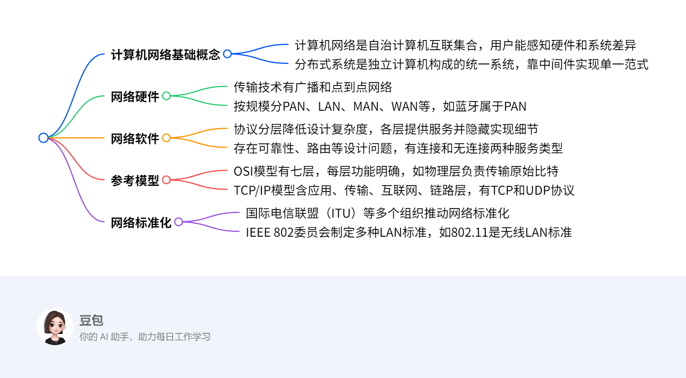

# Introduction

这篇计算机网络技术领域的学习文档，主要围绕计算机网络和分布式系统展开，涵盖网络硬件、软件、参考模型、示例网络以及网络标准化等方面的知识。

1. **计算机网络与分布式系统基础概念**
    - **计算机网络**：是由单一技术互联的自治计算机集合，用户能感知到实际机器的硬件和操作系统差异。
    - **分布式系统**：由独立计算机组成，通过中间件向用户呈现为一个统一的系统。
2. **网络硬件**
    - **传输技术**：分为广播网络（如发送数据包到所有目的地，各机器根据地址判断是否处理）和点到点网络（数据包从源到目的可能经过多个中间机器，路由选择很重要）。
    - **网络按规模分类**：包括个人区域网络（如蓝牙连接计算机及其外设）、局域网（有多种拓扑结构和信道分配方式）、城域网和广域网（涉及子网、路由器等概念）。
3. **网络软件**
    - **协议分层**：网络按层次组织，每层为上层提供服务，降低设计复杂度，减少上下层耦合。涉及协议（通信双方的约定）、对等体（不同机器上对应层的实体）、接口（定义下层对上层提供的操作和服务）等概念。
    - **服务类型**：有面向连接服务（需建立、使用和释放连接，能保证消息顺序）和无连接服务（每个消息独立路由，携带完整目的地址），还有不同服务质量（QoS）的服务。
4. **参考模型**
    - **OSI参考模型**：共七层，从物理层到应用层，各层有明确功能，如物理层负责传输原始比特，数据链路层将传输设施转换为逻辑信道等。
    - **TCP/IP参考模型**：包含网络接口层、网际层（定义IP协议等）、传输层（如TCP提供可靠连接，UDP提供不可靠无连接服务 ）和应用层。
5. **示例网络与网络标准化**：展示了实际网络连接示例；介绍了网络标准相关的国际组织，如ITU、ISO、IEEE、IETF等，以及它们在网络标准制定方面的作用。 