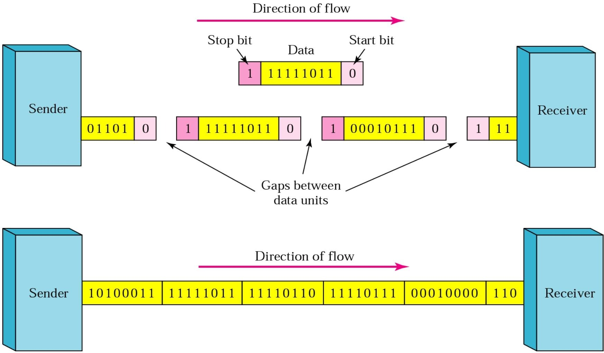
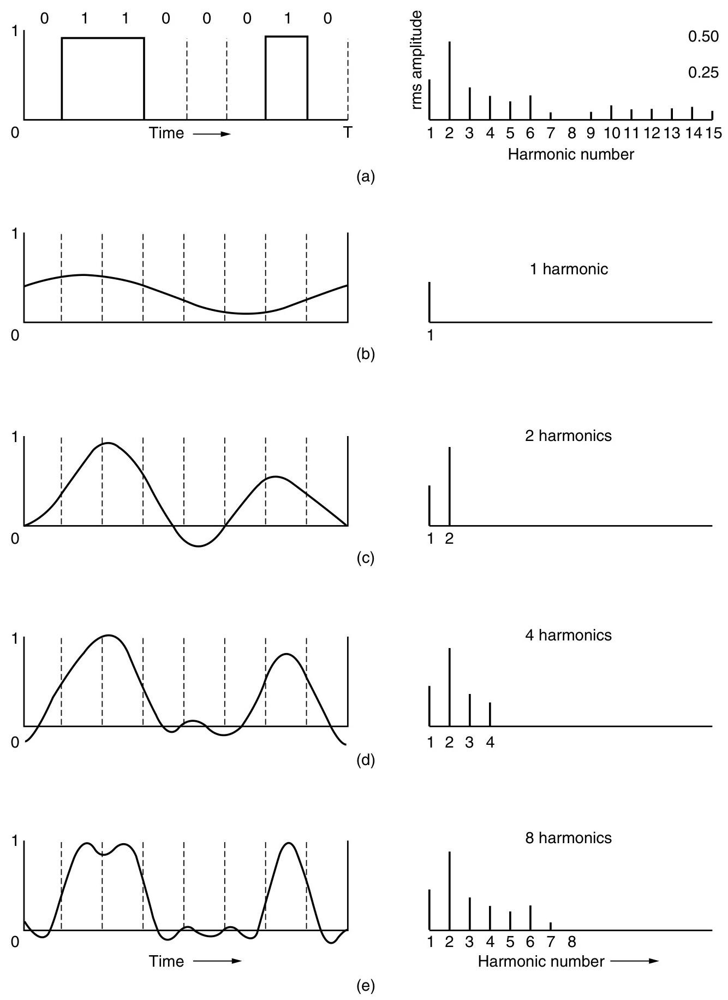
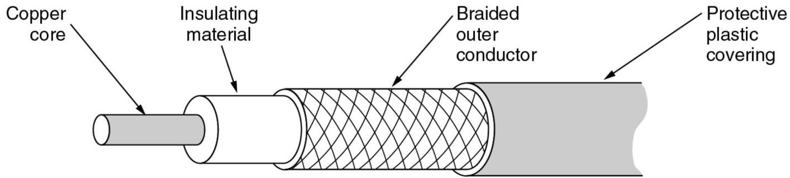
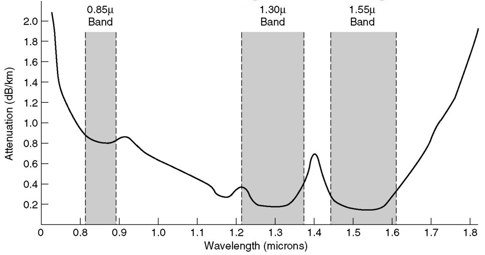
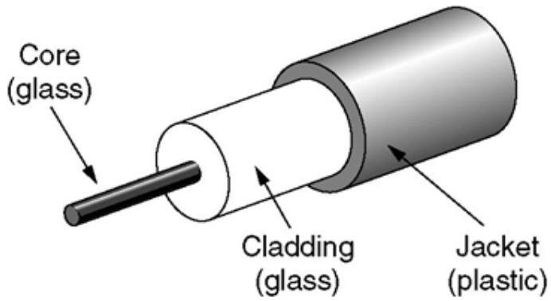
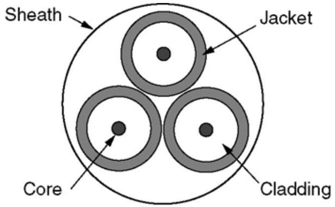

# The Physical Layer
该文档围绕物理层展开，介绍了数据通信理论基础、传输介质、数字调制与复用技术，以及公共交换电话网络，旨在阐述物理层在通信系统中的关键作用与工作原理。

1. **数据通信理论基础**
    - **傅里叶分析**：任何周期函数可分解为正弦和余弦函数的叠加，非周期有限时长数据信号可通过想象其无限重复来进行傅里叶分析。
    - **带宽**：传输设施能无明显衰减传输信号的频率范围，是传输介质的物理属性，受介质构造、厚度和长度影响，不同传输介质带宽不同，如UTP - 3为1MHz，UTP - 5为100MHz。
    - **信道最大数据速率**：奈奎斯特定理指出低通滤波器带宽BHz的信号，每秒2B次采样可完全重构，数据速率C = 2Blog₂V；香农定理表明信道容量C = B log₂(1 + S / N) ，如语音电话线300Hz - 3300Hz，S/N为30dB时，C约30Kbps。
2. **传输介质**
    - **导向传输介质**：双绞线用于模拟和数字信号传输，分为UTP和STP，不同类别带宽不同；同轴电缆可高速长距离传输，带宽高、抗噪性好；光纤电缆以光传输，带宽可达25 - 30THz，误码率低。
    - **无线传输**：涵盖不同频段的无线传输方式，电波特性随频率变化。无线电波在不同频段传播方式不同；微波用于长距离通信，但存在多径衰落问题。各国政府分配电磁频谱，ISM频段允许无执照使用，设备需用扩频技术。
    - **通信卫星**：作为空中微波中继器，含多天线和转发器，转发器接收、放大并转发信号，卫星波束有宽窄之分，寿命约10年。
3. **数字调制与复用技术**
    - **基带与通带传输**：基带传输信号占用从零到最大频率的范围，常用于有线传输；通带传输通过调制载波信号传输数据，用于无线和光通信。
    - **调制技术**：基带传输有多种编码方式，如NRZI、曼彻斯特编码、4B/5B编码等；通带传输有调幅、调频、调相，以及QPSK和QAM等调制方式。
    - **复用技术**：频分复用（FDM）将不同信号分配到不同频率段；时分复用（TDM）按时间片轮流传输多路信号；码分多址（CDMA）是扩频通信，各站有独特码片序列，利用正交性区分信号。
4. **公共交换电话网络（PSTN）**：由本地回路、干线和交换局组成。本地回路用模拟双绞线，干线用数字光纤。存在衰减、延迟畸变和噪声等问题。调制解调器用于数模转换，不同V系列协议调制方式和速率不同。DSL利用数字信号传输技术提高速率，ADSL是常见类型。 
## Fundamental Concepts
2.1节之前的Fundamental Concepts主要围绕数据通信中的基础概念、通信模式、传输方式及数据传输同步方式展开，为理解后续通信技术内容奠定基础。

1. **基础概念**
    - **信道**：传送信息的媒体。
    - **带宽**：信号或信道的频率范围（Hz）。
    - **数据率**：数据传输速率（bps）。
    - **波特率**：波特率是符号速率，也是码元传输速率。它用于衡量单位时间内信号传输的码元数量。其与数据传输速率（bps）的换算关系为$1 Baud =(log _{2} ~V)$bps，其中$V$是码元的电平级数。例如，当码元只有两种电平状态（即$V = 2$）时，根据公式$1 Baud =(log _{2} 2)$bps ，$log _{2} 2 = 1$，所以此时波特率和比特率相等，1波特就等于1bps，像简单的二进制信号传输，只有高电平和低电平两种状态，在这种情况下，每秒传输1个码元，也就意味着每秒传输1比特的数据。再比如，若码元有4种电平状态（$V = 4$） ，则$1 Baud =(log _{2} 4)$bps ，因为$log _{2} 4 = 2$，此时1波特就等于2bps。这表示每秒传输1个码元，但由于每个码元能携带2比特的信息，所以实际的数据传输速率为2bps。 
    - **信道容量**：信道的最大数据率。
    - **传播速度**：信号单位时间内传送的距离（米/秒），速度因媒体而异，且小于光速，同种媒体中频率不同的电磁波速度也有差异。数据率是指数据传输速率，单位为 bps（比特每秒），用于衡量单位时间内传输的数据量；传播速度是指信号在传输介质中单位时间内传送的距离，单位是米 / 秒，它描述的是信号在介质中传播的快慢程度。
    - **误码率BER**：信道传输可靠性指标，BER = 传送错的位数 / 传送总位数。
2. **时延**
    - **定义**：从向网络中发送数据块的第一比特开始，到最后一比特被接收所经历的时间。
    - **组成**
        - **传播时延**：信号通过传输介质的时间。
        - **发送时延**：设备发送一个数据块所需要的时间（数据块长度/传输速率）。
        - **处理时延**：交换机/路由器检查数据、选路的时间。
        - **排队时延**：在交换机/路由器中排队等待的时间。
3. **通信模式**
    - **单工通信**：数据仅能单向传输，如FM广播，信息只能从广播电台传向听众。
    - **半双工通信**：数据可双向传输，但同一时刻仅能单向进行，像语音对讲机，通话双方不能同时说话。
    - **全双工通信**：数据能同时双向传输，例如电话通话，双方可同时交流。
4. **传输方式**
    - **并行传输**：8位数据同时传输，需要8条线路，优点是传输速度快，但成本较高。
    - **串行传输**：数据按顺序一位一位传输，仅需1条线路 ，通过并串/串并转换器实现数据转换，虽传输速度相对较慢，但节省线路资源。
5. **数据传输同步方式**
    - **同步串行传输**：依靠独立的时钟线，以时钟信号实现数据比特同步，提供恒定速率的比特流服务。
    - **异步串行传输**：各设备使用独立时钟，无需同步，以字符为单位传输，通过字符的起始位和停止位实现同步，字符间间隔任意。
## The Theoretical Basis for Data Communication
2.1节主要介绍数据通信的理论基础，包括傅里叶分析、带宽、带宽受限信号以及信道最大数据率相关内容，为理解数据通信原理提供了理论依据，具体如下：

1. **傅里叶分析**：任何周期函数$g(t)$都可以表示为一系列正弦和余弦函数的和，公式为$g(t)=c / 2+\sum_{n=1}^{\infty} a_{n} sin (2 \pi n t f)+\sum_{n=1}^{\infty} b_{n} cos (2 \pi n t f)$，$f = 1 / T$。其中，$a_{n}=2 / T \int_{0}^{T} g(t) sin (2 \pi nft) dt$，$b_{n}=2 / T \int_{0}^{T} g(t) cos (2 \pi n f t) d t$，$c=2 / T \int_{0}^{T} g(t) dt$。对于有限时长的数据信号，可以将其看作是不断重复的周期信号来进行分析。
2. **带宽**：任何传输设施传输信号时都会有一定的功率损耗，且对不同的傅里叶分量的衰减程度不同。带宽指的是信号在传输过程中，能够不被强烈（0.5）衰减传输的频率范围。它是传输介质的物理属性，受传输介质的构造、厚度和长度等因素影响。例如，电话双绞线UTP - 3的带宽为1MHz，UTP - 5的带宽为100MHz。
3. **带宽受限信号**：以二进制信号为例，通过傅里叶分析可知，信号的带宽越窄，需要的谐波数量越少。随着数据率的增加，所需的谐波数量增多。对于3000Hz带宽的语音级线路，当数据率达到38.4kbps及以上时，即使传输设施无噪声，二进制信号也无法正常传输。
    - 
| Bps | T (msec) | First harmonic (Hz) | # Harmonics sent |
| --- | --- | --- | --- |
| 300 | 26.67 | 37.5 | 80 |
| 600 | 13.33 | 75 | 40 |
| 1200 | 6.67 | 150 | 20 |
| 2400 | 3.33 | 300 | 10 |
| 4800 | 1.67 | 600 | 5 |
| 9600 | 0.83 | 1200 | 2 |
| 19200 | 0.42 | 2400 | 1 |
| 38400 | 0.21 | 4800 | 0 |
        - **Bps（Bits per second）**：即比特率，表示数据传输速率，单位是比特每秒。如“300”表示每秒传输300比特数据 ，数值越大，数据传输速度越快。
        - **T(msec)**：表示传输1比特数据所需的时间，单位为毫秒（msec）。它与Bps成反比，通过公式 \(T = \frac{1}{Bps}×1000\) 计算得出。例如，当Bps为300时，\(T=\frac{1}{300}×1000≈26.67\) msec。
        - **First harmonic (Hz)**：表示一次谐波的频率，单位为赫兹（Hz）。它与Bps存在一定关系，计算公式为 \(First harmonic = \frac{Bps}{8}\)。例如，Bps为300时，一次谐波频率为\(\frac{300}{8}=37.5\) Hz。
        - **#Harmonics sent**：表示发送的谐波数量。对于3000Hz语音级线路，其计算公式为 \(Number of harmonics sent=\frac{3000}{First harmonic}=\frac{24000}{Bps}\)。例如，Bps为300时，发送的谐波数量为\(\frac{24000}{300}=80\) 。随着Bps增大，一次谐波频率升高，可发送的谐波数量减少，当数据速率≥38.4kbps时，对于二进制信号，即使传输设施完全无噪声，也难以有效传输。 

4. **信道最大数据率**
    - **奈奎斯特定理（1924年）**：奈奎斯特定理是说，如果有一个信号，经过一个带宽是\(B\)赫兹的低通滤波器后，想要把这个被过滤后的信号完整地还原出来，每秒准确采集\(2B\)次样本就可以做到（这里采集样本的速率，也叫符号率，单位是波特）。而且，在这个情况下，信道能达到的最大数据传输速率（用\(C\)表示，单位是bps）可以用公式\(C = 2B\log_2V\)来计算 ，其中\(V\)是码元的电平级数。打个比方，你要给一幅画拍照记录细节。带宽\(B\)就好比这幅画的复杂程度，越复杂（带宽越大），你拍照的频率就得越高才能完整记录画面。按照奈奎斯特定理，拍照频率达到每秒\(2B\)次，就能完整还原这幅画。而数据传输速率公式就像是根据画面的一些特性（码元电平级数\(V\) ），来计算你记录整幅画的详细信息的速度有多快。 
    - **香农定理（1948年）**：公式为$C = B log₂(1 + S / N)$，其中$C$表示信道容量（最大数据率），$B$是信道带宽，$S / N$是信噪比。例如，对于语音电话线，带宽为300Hz - 3300Hz（即$B = 3000Hz$），信噪比$S / N$为30dB时，通过公式计算可得$C = 3000 log₂(1 + 1000) \approx 30 Kbps$ 。同时，信噪比的分贝表示为$(S / N)_{dB}=10 × log _{10}(S / N)$。 
## Guided Transmission Media
该节主要介绍了三种有线传输介质，即双绞线、同轴电缆和光纤，具体内容如下：

1. **双绞线**：是最常用的传输介质，可用于传输模拟和数字信号。它由两根绝缘导线相互缠绕而成，通过差分传输减弱环境噪音对自身信号的影响，同时减少自身信号对环境的干扰（串扰）。双绞线分为非屏蔽双绞线（UTP）和屏蔽双绞线（STP），不同类别的UTP带宽不同，如Category 3 UTP带宽为16MHz，Category 5 UTP带宽为100MHz。
    - 差分传输是一种信号传输方式，它传输的是差分信号，即在一对存在耦合的传输线上，传输振幅相同、相位相反的信号。其中一条传输线传输信号本身，另一条传输其互补信号。
2. **同轴电缆**：由铜芯、绝缘材料、编织外层导体和保护塑料覆盖层组成。它能在较高速度下传输较长距离，具有高带宽和出色的抗噪声能力，现代同轴电缆带宽可达几个GHz。
3. **光纤**：从1981年到2000年，在CPU和数据通信领域发展迅速。它利用光在光纤中传播来传输数据，误码率低，数据传输速率高，如通过光电二极管实现的传输速率可达40Gbps。光在光纤中传输的衰减程度与光的波长有关，有三个波段用于光通信，每个波段带宽为25 - 30THz，在特定信噪比下，理论传输速率可达300Tbps。
    - **光在光纤中传输的衰减特性**：光在光纤中传输时，其衰减程度取决于光的波长，不同波长的光在光纤中传播时能量损失情况不同。
    - **光通信使用的波段**：有3个波段被用于光通信，这3个波段是光在光纤中传输性能较好、适合承载通信信号的特定波长范围。
    - **带宽及相关参数**：这3个波段的带宽都在25 - 30THz之间，带宽较宽，意味着可以传输大量数据。在信噪比为30dB的情况下，理论上数据传输速率能够达到300Tbps，如此高的传输速率体现了光纤在数据传输方面的巨大优势。 

{width=50%}{width=50%}