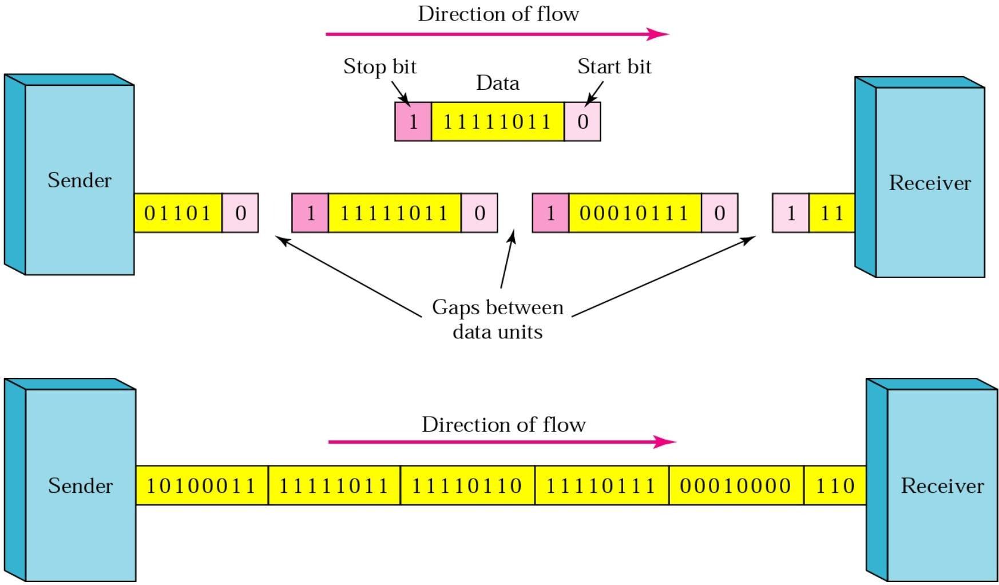

# The Physical Layer
## 概览
---
### 一段话总结
**本文围绕物理层展开，介绍其基本概念，包括信道、带宽、数据率等；阐述数据通信理论基础，如傅里叶分析、带宽限制、信道最大数据率；介绍多种传输介质，像双绞线、同轴电缆等；讲解数字调制和多路复用技术；还以公共交换电话网络为例，说明其结构、组件及相关技术。涵盖通信系统多方面知识，为理解物理层通信原理提供基础。**

---

---
### 详细总结
1. **物理层基本概念**
    - **基本定义**：信道是传送信息的媒体。带宽指信号或信道的频率范围（Hz），数据率是数据传输速率（bps），波特率为符号速率（码元传输速率），1 Baud = ($log _{2} ~V$) bps（V是码元的电平级数），信道容量是信道的最大数据率。传播速度因媒体而异，小于光速，且同种媒体中不同频率电磁波速度有差异。误码率BER用于衡量信道传输可靠性，BER = 传送错的位数 / 传送总位数。
    - **时延相关**：时延包括传播时延、发送时延、处理时延和排队时延。传播时延是信号通过传输介质的时间；发送时延为设备发送一个数据块所需时间（数据块长度/传输速率）；处理时延是交换机/路由器检查数据、选路的时间；排队时延是在交换机/路由器中排队等待的时间。
    - **通信方式分类**：单工通信只能单向传输，如FM广播；半双工通信可双向传输，但同一时刻仅能单向进行，如语音对讲机；全双工通信能双向同时传输，如电话通话。
    - **数据传输方式**：并行传输8位数据同时发送，需8条线路；串行传输8位数据依次发送，仅需1条线路。
    - **同步与异步传输**：同步串行传输依靠独立时钟线进行比特同步，提供恒定速率比特流服务；异步串行传输以字符为单位，独立时钟，依靠起始位和停止位同步，字符间隔任意。
2. **数据通信理论基础**
    - **傅里叶分析**：任何周期函数$g(t)$（周期为T）可表示为$g(t)=c / 2+\sum_{n=1}^{\infty} a_{n} sin (2 \pi n t t)+\sum_{n=1}^{\infty} b_{n} cos (2 \pi n f t)$（$f = 1 / T$），$a_{n}$、$b_{n}$、$c$可通过积分计算得出。有限时长数据信号可视为重复模式处理。
    - **带宽相关**：传输设施传输信号会有功率损耗，不同傅里叶分量衰减程度不同，未被大幅衰减（衰减不超过0.5）的频率范围即带宽。例如，UTP - 3带宽1 MHz，UTP 5带宽100MHz。带宽受传输介质的构造、厚度和长度影响。
    - **带宽受限信号**：不同数据率下，信号所需谐波数量不同。以语音级线路带宽3000Hz为例，$T = 8 / bps$，一次谐波$f = bps / 8$，可传输谐波数量 = 3000 / $f$ = 24000 / $bps$。数据率≥38.4 kbps时，二进制信号传输困难。
    - **信道最大数据率**：奈奎斯特定理指出，经低通滤波器（带宽B Hz）的信号，每秒采样2B次（符号速率，波特），信道容量$C = 2B log _{2}V$（bps）；香农定理为$C = B log _{2}(1 + S / N)$。如语音电话线（300Hz - 3300Hz，S/N 30dB），$C = 3000 log _{2}(1 + 1000) \approx 30 Kbps$，$(S / N)_{d B}=10 × log _{10}(S / N)$。
3. **传输介质**
    - **双绞线**：分为UTP（非屏蔽双绞线）和STP（屏蔽双绞线），是常用传输介质，可传输模拟和数字信号。通过差分传输减弱环境噪音影响，减少串扰。不同类别UTP带宽不同，如UTP 3带宽16MHz，UTP 5带宽100MHz，UTP 6带宽250MHz，UTP 7带宽600MHz。
    - **同轴电缆**：由铜芯、绝缘材料、编织屏蔽层和外塑料保护套组成，能高速长距离传输，带宽高，现代电缆可达几GHz，抗噪声能力强。
    - **光纤**：从1981 - 2000年，在CPU和数据通信领域发展迅速。光在光纤中传输，衰减与波长有关，有三个波段用于光通信，每个波段带宽25 - 30THz（$s / n = 30 dB$时，可达300Tbps），误码率低，从$10^{-5}$到几乎为0，传输速率高，如光电二极管可达40Gbps。
    - **无线传输**：电磁频谱用于通信，不同频段有不同用途。多数传输采用窄频带以获得良好接收效果，扩频技术（如蓝牙、WLAN、CDMA）使用FHSS（跳频扩频）和DSSS（直接序列扩频）。不同频段无线电波传播特性不同，VLF、LF、MF频段电波沿地球曲率传播，HF频段电波经电离层反射；微波（100M - 10GHz）直线传播，传输和接收天线需精确对准，距离80km需中继，存在多径衰落问题。国家对电磁频谱进行分配，ISM频段允许无许可使用，设备需采用扩频技术，功率限制在1瓦以下。
    - **通信卫星**：作为空中微波中继站，含多个天线和转发器。转发器接收、放大并以另一频率重传信号，有宽波束和窄波束。卫星需保持轨道位置，寿命约10年。
4. **数字调制和多路复用**
    - **基带与通带传输**：基带传输信号占用从零到取决于信令速率的最高频率，常用于有线传输；通带传输通过调节载波信号的幅度、相位或频率传输比特，信号位于载波频率周围频带，用于无线和光信道。
    - **基带传输技术**：基带传输注重带宽效率，比特率 = 波特率×每个符号的比特数，信号电平数不要求是2的幂次方。常见编码方式有NRZI编码（用于USB）、Manchester编码（100%开销）、4B/5B编码（25%开销，避免连续3个以上0，用非数据代码表示物理层控制信号）、Scrambler（0%开销，通过与伪随机序列异或处理数据）。
    - **通带传输调制方式**：包括幅度调制、频率调制、相位调制，如QPSK（正交相移键控）和QAM（正交幅度调制）。不同调制方式下，相同信号传输的误码情况不同，以QAM - 16为例，不同接收点解码结果和误码数不同。
    - **多路复用技术**：FDM（频分复用）将不同信号分配到不同频率段；TDM（时分复用）按时间片轮流传输不同信号，如T1载波（1.544Mbps，193位帧，125微秒，24个语音信道，1位帧同步，7位语音样本，8位用于信令），T2 - T4是对T1的复用，E1载波（2.048Mbps，32个8位数据样本，30个用于信息，2个用于信令和同步）；CDMA（码分多址）是扩频通信方式，每个站点分配唯一的m位码片序列（$m = 64$或128），码片序列正交，发送1时发送自身码片序列，发送0时发送互补序列。
5. **公共交换电话网络（PSTN）**
    - **系统结构与组件**：由本地回路、干线和交换局组成。本地回路采用模拟双绞线（UTP - 3）连接用户，干线使用数字光纤连接交换局，交换局负责转接电话。
    - **本地回路问题与技术**：传输线路存在衰减、延迟畸变和噪声（热噪声、串扰、脉冲噪声）问题。Modem用于计算机间模拟和数字信号转换，结合多种调制技术（如QPSK、QAM）提高传输速率，不同V系列协议（V.32、V.32bis等）波特率和比特率不同。DSL（数字用户线路）利用现有电话线传输高速数据，采用DMT（离散多音调调制）技术，将1.1 MHz分为256个4kHz信道，不同服务等级速率不同，标准服务为512 kbps（下行）、64 kbps（上行），高级服务为1 Mbps（下行）、256 kbps（上行）。
    - **干线复用技术**：WDM（波分复用）和DWDM（密集波分复用）用于提高光纤传输容量；TDM技术在干线中广泛应用，如T1、T2 - T4和E1载波。
    - **交换方式**：电路交换在通话时建立物理连接，专用路径，数据包按序到达，有呼叫建立过程，带宽固定；分组交换无呼叫建立，无专用路径，数据包不一定按序到达，带宽动态分配；报文交换存储转发整个报文，与电路交换和分组交换有不同特点，三种交换方式各有优缺点，应用场景不同。
---
### 关键问题
1. **问题**：不同传输介质的带宽差异对数据传输有何影响？
    - **答案**：不同传输介质带宽不同，如UTP - 3带宽1 MHz，UTP 5带宽100MHz，同轴电缆可达几GHz，光纤单个波段带宽25 - 30THz。带宽影响数据传输速率，带宽越高，可传输的谐波数量越多，数据率理论上越高。例如，在语音级线路带宽3000Hz条件下，数据率与可传输谐波数量相关，数据率≥38.4 kbps时，二进制信号传输困难，而高带宽的光纤可实现高达300Tbps的传输速率，能满足高速数据传输需求。
2. **问题**：CDMA技术中码片序列正交的意义及接收方解出特定站点信号的原理是什么？
    - **答案**：码片序列正交意味着不同站点的码片序列向量点积为0，即一半分量相同，一半相反。这保证了不同站点信号在同一频带叠加时相互干扰小。接收方解出特定站点信号时，将接收到的混合信号与目标站点码片序列进行点积运算。若结果为1，表示发送的是1；结果为 - 1，表示发送的是0；结果为0，表示未发送信号。例如，给定多个站点的码片序列和混合传输信号，通过点积计算可恢复出特定站点（如站C）的信号。
3. **问题**：对比电路交换和分组交换，在实时性和资源利用率方面各有什么特点？
    - **答案**：在实时性方面，电路交换在通话前建立物理连接，一旦连接成功，数据传输延迟小，适合实时性要求高的通信，如语音通话，数据包按序到达；分组交换无呼叫建立过程，数据包不一定按序到达，在网络拥塞时可能出现延迟，实时性相对较差。在资源利用率上，电路交换在连接期间独占物理路径，即使无数据传输也占用资源，可能造成浪费；分组交换动态分配带宽，按需使用资源，资源利用率较高，尤其适用于突发数据传输。 
## Fundamental Concepts
2.1节之前的Fundamental Concepts主要围绕数据通信中的基础概念、通信模式、传输方式及数据传输同步方式展开，为理解后续通信技术内容奠定基础。

1. **基础概念**
    - **信道**：传送信息的媒体。
    - **带宽**：信号或信道的频率范围（Hz）。
    - **数据率**：数据传输速率（bps）。
    - **波特率**：波特率是符号速率，也是码元传输速率。它用于衡量单位时间内信号传输的码元数量。其与数据传输速率（bps）的换算关系为$1 Baud =(log _{2} ~V)$bps，其中$V$是码元的电平级数。例如，当码元只有两种电平状态（即$V = 2$）时，根据公式$1 Baud =(log _{2} 2)$bps ，$log _{2} 2 = 1$，所以此时波特率和比特率相等，1波特就等于1bps，像简单的二进制信号传输，只有高电平和低电平两种状态，在这种情况下，每秒传输1个码元，也就意味着每秒传输1比特的数据。再比如，若码元有4种电平状态（$V = 4$） ，则$1 Baud =(log _{2} 4)$bps ，因为$log _{2} 4 = 2$，此时1波特就等于2bps。这表示每秒传输1个码元，但由于每个码元能携带2比特的信息，所以实际的数据传输速率为2bps。 
    - **信道容量**：信道的最大数据率。
    - **传播速度**：信号单位时间内传送的距离（米/秒），速度因媒体而异，且小于光速，同种媒体中频率不同的电磁波速度也有差异。数据率是指数据传输速率，单位为 bps（比特每秒），用于衡量单位时间内传输的数据量；传播速度是指信号在传输介质中单位时间内传送的距离，单位是米 / 秒，它描述的是信号在介质中传播的快慢程度。
    - **误码率BER**：信道传输可靠性指标，BER = 传送错的位数 / 传送总位数。
2. **时延**
    - **定义**：从向网络中发送数据块的第一比特开始，到最后一比特被接收所经历的时间。
    - **组成**
        - **传播时延**：信号通过传输介质的时间。
        - **发送时延**：设备发送一个数据块所需要的时间（数据块长度/传输速率）。
        - **处理时延**：交换机/路由器检查数据、选路的时间。
        - **排队时延**：在交换机/路由器中排队等待的时间。
3. **通信模式**
    - **单工通信**：数据仅能单向传输，如FM广播，信息只能从广播电台传向听众。
    - **半双工通信**：数据可双向传输，但同一时刻仅能单向进行，像语音对讲机，通话双方不能同时说话。
    - **全双工通信**：数据能同时双向传输，例如电话通话，双方可同时交流。
4. **传输方式**
    - **并行传输**：8位数据同时传输，需要8条线路，优点是传输速度快，但成本较高。
    - **串行传输**：数据按顺序一位一位传输，仅需1条线路 ，通过并串/串并转换器实现数据转换，虽传输速度相对较慢，但节省线路资源。
5. **数据传输同步方式**
    - **同步串行传输**：依靠独立的时钟线，以时钟信号实现数据比特同步，提供恒定速率的比特流服务。
    - **异步串行传输**：各设备使用独立时钟，无需同步，以字符为单位传输，通过字符的起始位和停止位实现同步，字符间间隔任意。
## The Theoretical Basis for Data Communication
2.1节主要介绍数据通信的理论基础，包括傅里叶分析、带宽、带宽受限信号以及信道最大数据率相关内容，为理解数据通信原理提供了理论依据，具体如下：

1. **傅里叶分析**：任何周期函数$g(t)$都可以表示为一系列正弦和余弦函数的和，公式为$g(t)=c / 2+\sum_{n=1}^{\infty} a_{n} sin (2 \pi n t f)+\sum_{n=1}^{\infty} b_{n} cos (2 \pi n t f)$，$f = 1 / T$。其中，$a_{n}=2 / T \int_{0}^{T} g(t) sin (2 \pi nft) dt$，$b_{n}=2 / T \int_{0}^{T} g(t) cos (2 \pi n f t) d t$，$c=2 / T \int_{0}^{T} g(t) dt$。对于有限时长的数据信号，可以将其看作是不断重复的周期信号来进行分析。
2. **带宽**：任何传输设施传输信号时都会有一定的功率损耗，且对不同的傅里叶分量的衰减程度不同。带宽指的是信号在传输过程中，能够不被强烈（0.5）衰减传输的频率范围。它是传输介质的物理属性，受传输介质的构造、厚度和长度等因素影响。例如，电话双绞线UTP - 3的带宽为1MHz，UTP - 5的带宽为100MHz。
3. **带宽受限信号**：以二进制信号为例，通过傅里叶分析可知，信号的带宽越窄，需要的谐波数量越少。随着数据率的增加，所需的谐波数量增多。对于3000Hz带宽的语音级线路，当数据率达到38.4kbps及以上时，即使传输设施无噪声，二进制信号也无法正常传输。

    | Bps | T (msec) | First harmonic (Hz) | # Harmonics sent |
    | --- | --- | --- | --- |
    | 300 | 26.67 | 37.5 | 80 |
    | 600 | 13.33 | 75 | 40 |
    | 1200 | 6.67 | 150 | 20 |
    | 2400 | 3.33 | 300 | 10 |
    | 4800 | 1.67 | 600 | 5 |
    | 9600 | 0.83 | 1200 | 2 |
    | 19200 | 0.42 | 2400 | 1 |
    | 38400 | 0.21 | 4800 | 0 |

    - **Bps（Bits per second）**：即比特率，表示数据传输速率，单位是比特每秒。如“300”表示每秒传输300比特数据 ，数值越大，数据传输速度越快。
    - **T(msec)**：表示传输1比特数据所需的时间，单位为毫秒（msec）。它与Bps成反比，通过公式 \(T = \frac{1}{Bps}×1000\) 计算得出。例如，当Bps为300时，\(T=\frac{1}{300}×1000≈26.67\) msec。
    - **First harmonic (Hz)**：表示一次谐波的频率，单位为赫兹（Hz）。它与Bps存在一定关系，计算公式为 \(First harmonic = \frac{Bps}{8}\)。例如，Bps为300时，一次谐波频率为\(\frac{300}{8}=37.5\) Hz。
    - **#Harmonics sent**：表示发送的谐波数量。对于3000Hz语音级线路，其计算公式为 \(Number of harmonics sent=\frac{3000}{First harmonic}=\frac{24000}{Bps}\)。例如，Bps为300时，发送的谐波数量为\(\frac{24000}{300}=80\) 。随着Bps增大，一次谐波频率升高，可发送的谐波数量减少，当数据速率≥38.4kbps时，对于二进制信号，即使传输设施完全无噪声，也难以有效传输。 

4. **信道最大数据率**
    - **奈奎斯特定理（1924年）**：奈奎斯特定理是说，如果有一个信号，经过一个带宽是\(B\)赫兹的低通滤波器后，想要把这个被过滤后的信号完整地还原出来，每秒准确采集\(2B\)次样本就可以做到（这里采集样本的速率，也叫符号率，单位是波特）。而且，在这个情况下，信道能达到的最大数据传输速率（用\(C\)表示，单位是bps）可以用公式\(C = 2B\log_2V\)来计算 ，其中\(V\)是码元的电平级数。打个比方，你要给一幅画拍照记录细节。带宽\(B\)就好比这幅画的复杂程度，越复杂（带宽越大），你拍照的频率就得越高才能完整记录画面。按照奈奎斯特定理，拍照频率达到每秒\(2B\)次，就能完整还原这幅画。而数据传输速率公式就像是根据画面的一些特性（码元电平级数\(V\) ），来计算你记录整幅画的详细信息的速度有多快。 
    - **香农定理（1948年）**：公式为$C = B log₂(1 + S / N)$，其中$C$表示信道容量（最大数据率），$B$是信道带宽，$S / N$是信噪比。例如，对于语音电话线，带宽为300Hz - 3300Hz（即$B = 3000Hz$），信噪比$S / N$为30dB时，通过公式计算可得$C = 3000 log₂(1 + 1000) \approx 30 Kbps$ 。同时，信噪比的分贝表示为$(S / N)_{dB}=10 × log _{10}(S / N)$。 
## Guided Transmission Media
该节主要介绍了三种有线传输介质，即双绞线、同轴电缆和光纤，具体内容如下：

1. **双绞线**：是最常用的传输介质，可用于传输模拟和数字信号。它由两根绝缘导线相互缠绕而成，通过差分传输减弱环境噪音对自身信号的影响，同时减少自身信号对环境的干扰（串扰）。双绞线分为非屏蔽双绞线（UTP）和屏蔽双绞线（STP），不同类别的UTP带宽不同，如Category 3 UTP带宽为16MHz，Category 5 UTP带宽为100MHz。
    - 差分传输是一种信号传输方式，它传输的是差分信号，即在一对存在耦合的传输线上，传输振幅相同、相位相反的信号。其中一条传输线传输信号本身，另一条传输其互补信号。
2. **同轴电缆**：由铜芯、绝缘材料、编织外层导体和保护塑料覆盖层组成。它能在较高速度下传输较长距离，具有高带宽和出色的抗噪声能力，现代同轴电缆带宽可达几个GHz。
3. **光纤**：从1981年到2000年，在CPU和数据通信领域发展迅速。它利用光在光纤中传播来传输数据，误码率低，数据传输速率高，如通过光电二极管实现的传输速率可达40Gbps。光在光纤中传输的衰减程度与光的波长有关，有三个波段用于光通信，每个波段带宽为25 - 30THz，在特定信噪比下，理论传输速率可达300Tbps。
    - **光在光纤中传输的衰减特性**：光在光纤中传输时，其衰减程度取决于光的波长，不同波长的光在光纤中传播时能量损失情况不同。
    - **光通信使用的波段**：有3个波段被用于光通信，这3个波段是光在光纤中传输性能较好、适合承载通信信号的特定波长范围。
    - **带宽及相关参数**：这3个波段的带宽都在25 - 30THz之间，带宽较宽，意味着可以传输大量数据。在信噪比为30dB的情况下，理论上数据传输速率能够达到300Tbps，如此高的传输速率体现了光纤在数据传输方面的巨大优势。 

{width=50%}{width=50%}
## Wireless Transmission
本节主要介绍了无线传输相关知识，包括电磁频谱、传输频段、无线电传输、微波传输以及电磁频谱的管理等内容，具体如下：

- **电磁频谱**：展示了电磁频谱及其在通信中的应用，不同频率范围对应不同的通信方式。从长波无线电到可见光，随着频率升高，波的特性越来越像光，如EHF（极高频）、VHF（甚高频）等频段在通信中有不同的用途。在这个频谱范围内，不同的传输介质（如双绞线、卫星、光纤、同轴电缆等）和通信方式（如AM、FM、微波通信等）各有其特点和适用场景。
- **传输频率带**：介绍了两种主要的传输频段使用方式。一种是使用窄频带（如无线电、电视等），这种方式通过利用较窄的频率范围（∆f/f << 1）来获得最佳接收效果；另一种是扩频技术（如蓝牙、WLAN、CDMA等），其中包括FHSS（跳频扩频）和DSSS（直接序列扩频），扩频技术能够提高通信的抗干扰能力。
- **无线电传输（VLF、LF、MF、HF）**：不同频段的无线电波传播特性不同。在VLF、LF和MF频段，无线电波会沿着地球曲率传播，传播距离可达1000km，例如北京到武汉的距离范围内可实现通信；在HF频段，电波会在高度100 - 500km的电离层反射，实现远距离通信。
- **微波传输（100M - 10GHz）**：在光纤出现之前，微波是长途电话传输系统的核心。微波传播近似直线，因此发射和接收天线必须精确对准。但微波传输存在多径衰落问题，这与天气和频率相关，例如在2.4GHz左右，信号容易被雨水和树叶吸收。
- **电磁频谱的管理**：各国政府负责分配电磁频谱资源，ISM（工业、科学、医疗）频段允许未经许可使用。为减少设备间干扰，FCC规定ISM频段的所有设备都要使用扩频技术，且发射功率要低于1瓦特，同时对频段范围、调制技术和信号强度等进行限制。 
## Communication Satellites
本节围绕通信卫星展开，介绍了通信卫星的功能、组成结构、信号传输特点、轨道相关概念、使用寿命以及存在的问题，具体内容如下：

- **功能与组成**：通信卫星相当于太空中的大型微波中继站，它内部配备多个天线和多个转发器。转发器的作用是接收特定频谱部分的信号，将其放大后，再以另一个频率重新广播（向下发送波束）。
- **信号覆盖特点**：向下发送的波束有不同类型，宽波束能覆盖地球表面相当大的一部分区域；窄波束即点波束，直径可达数百千米，能更精准地覆盖特定区域。
- **轨道与寿命**：通信卫星需保持在特定轨道位置（station keeping），其寿命通常约为10年。不同轨道的卫星，如低轨道、中轨道和地球同步轨道卫星，各有特点。地球同步轨道卫星相对地球静止，能稳定覆盖特定区域；低轨道卫星信号传输延迟小，但覆盖范围有限，需要更多卫星组网实现全球覆盖。
- **存在的问题**：通信卫星存在信号延迟问题，由于卫星距离地球较远，信号往返需要一定时间，这在实时通信中会带来影响。此外，卫星发射成本高昂，且卫星在太空中面临辐射、太空垃圾等威胁，可能影响其正常运行和使用寿命。 
## Digital modulation and multiplexing
本节主要介绍了数字调制和多路复用相关技术，具体内容如下：

- **基带与通带传输**
    - **基带传输**：信号占用从0到取决于信令速率的最大频率范围，常用于有线传输。具有带宽效率特性，其比特率等于波特率乘以每个符号的比特数，信号电平数量不一定是2的幂次方。同时涉及时钟恢复技术，如NRZI编码（用于USB）、Manchester编码（开销100%）、4B/5B编码（开销25%，且不会出现连续3个以上的0），还有用非数据代码表示物理层控制信号，以及通过扰码器（无开销）在传输前将数据与伪随机序列进行异或操作。
    - **通带传输**：通过调节载波信号的幅度、相位或频率来传输比特，信号占用载波频率周围的频带，常用于无线和光通信信道。如QPSK（正交相移键控）和QAM（正交幅度调制）技术，不同的调制方式对应不同的信号变化和数据传输能力。
- **多路复用技术**
    - **FDM（频分复用）**：将不同信号分配到不同的频率范围，各个信号在频域上不重叠，从而实现多路信号在同一传输介质上同时传输。例如，将多个信道的带宽分别调整到不同频率范围，实现多个信号的并行传输。
    - **TDM（时分复用）**：将传输时间划分为不同的时隙，各个信号在不同时隙轮流传输。像T1载波，把193位组成一个帧（125微秒），包含24个语音信道，其中1位用于帧同步，7位用于语音采样（56kbps），8位中的第8位用于信令 。此外，T1系统用于数据传输时，仅23个信道用于数据，第24个用于同步。T2、T3、T4是由多个T1流复用而成，在复用过程中会添加少量开销用于帧同步和恢复。在北美和日本以外地区，使用2.048Mbps的E1载波，其基本帧为125微秒，包含32个8位数据样本（64kbps），30个信道用于信息传输，最多2个用于信令和同步。
    - **CDMA（码分多址）**：属于扩频通信方式，每个比特时间被细分为m个短间隔（芯片），每个站被分配一个唯一的m位码片序列。发送数据时，发送1则发送自身码片序列，发送0则发送码片序列的补码。不同站的码片序列具有正交性，通过这种特性，接收方可以从多个发送站点在同一频带叠加的信号中解出特定站点发送的信号。 
## Public Switched Telephone Network (PSTN)
### 电话系统的结构
- **本地回路（Local loops）**：采用UTP - 3类型的模拟双绞线 ，连接住宅和商业场所。文中提到“总长度光速43分钟”，推测是在强调其总长度规模（按光传播43分钟的距离来衡量 ）。
- **干线（Trunks）**：使用数字光纤连接各个交换局，用于长距离、大容量的信号传输。 
- **交换局（Switching offices）**：是电话呼叫从一条干线转移到另一条干线的场所，负责电话呼叫的转接和交换功能。 
### Local Loops MODEM, ADSL
#### 本地回路（Local Loops）相关问题
本地回路采用UTP - 3模拟双绞线。传输线路存在三大问题：
- **衰减（Attenuation）**：衰减程度与频率相关 。
- **延迟畸变（delay distortion）**：由与频率相关的传播速度差异造成。 
- **噪声（Noise）**：包括热噪声（Thermal noise）、串扰（Crosstalk）、脉冲噪声（Impulse noise） 。 

#### 调制解调器（Modems）
- 计算机间通话会同时使用模拟和数字传输，由调制解调器（Modems）和编解码器（CODEC）完成转换。
- **CODEC**：每秒采样8000次（电话系统内所有时间间隔是125μs的倍数 ） ，1个样本为7或8位（采用非线性编码 ）。
- **调制技术组合**：调制解调器综合运用调制技术，使每波特能传输多个比特（采用多种幅度和相移 ） ，如QPSK（四相相移键控 ）、QAM（正交幅度调制 ） 。调制解调器每秒采样2400次，追求每个样本获取更多比特。不同标准速率不同，如V.32为9.6Kbps 、V.32bis为14.4Kbps 、V.34为28.8Kbps 、V.34bis为33.6Kbps（语音级信道的香农极限 ） ，V.90可达56kbps 。 

#### 数字用户线路（DSL，Digital Subscriber Lines ）
- **DMT（离散多音频调制，Discrete Multitone Modulation ）**：将1.1MHz划分为256个4312.5Hz的信道 。0号信道用于POTS（普通老式电话业务 ） ，1 - 5号信道闲置，防止语音和数据信号相互干扰 ，其余250个信道分别用于上游控制（1个 ）、下游控制（1个 ）、用户数据（248个 ） 。
- **ADSL调制方案**：每个信道采用类似V.34的调制方案，采样率为4000波特（非2400 ） ，持续监测信道质量并调整数据速率 ，实际数据用QAM调制传输，每波特最多15比特 。遵循ANSI T1.413和ITU G.992.1标准 ，速率有8Mbps（下行 ）、1Mbps（上行 ）等，标准服务为512kbps（下行 ）、64kbps（上行 ） ，高级服务为1Mbps（下行 ）、256kbps（上行 ） 。 
### Trunks and Multiplexing
该内容主要介绍了两种多路复用技术，即波分复用（WDM）和时分复用（TDM），具体如下：
1. **波分复用（WDM）**：
    - **问题**：目前nGHz宽的光纤无法实现电和光介质之间更快的转换，单根光纤频段的带宽约为25000 GHz。
    - **相关概念**：包括WDM（波分复用）和DWDM（密集波分复用），但未详细阐述。
2. **时分复用（TDM）**：
    - **T1载波**：速率为1.544Mbps，包含24个语音通道。其中，第1位用于帧同步，模式为01010... ；每个语音样本占7位，速率为56kbps ；信令速率为24位×8000帧/秒 = 192 kbps。当T1系统完全用于数据传输时，仅23个通道用于数据，第24个通道用于同步。
    - **T2到T4载波**：通过复用T1流形成更高的载波。具体为4个T1流合并形成T2流；7个T2流合并形成T3流；6个T3流合并形成T4流。在每个步骤中，会添加少量开销用于帧处理以及在发送方和接收方失去同步时进行恢复。
    - **E1载波**：在北美和日本以外的地区，使用速率为2.048Mbps的E1载波代替T1。基本125微秒帧中打包32个8位数据样本（速率为64kbps），其中30个通道用于信息传输，最多2个通道用于信令和同步（每4帧一组提供64个信令位，其中一半用于信令，一半用于同步）。 
### Switching
该内容主要介绍了三种交换技术：
#### 电路交换（Circuit Switching）
图中展示了电路交换的示意图。在电路交换中，通信双方在通信前需要建立一条专用的物理通信路径，这条路径在通信过程中始终被占用，直到通信结束。例如打电话时，从拨号建立连接开始，到通话结束挂机，期间这条线路为通话双方独占。
#### 分组交换（Packet Switching）
 - **原理**：分组交换网络中的节点有输入链路和输出链路，还配备存储器。它将数据分割成一个个分组（Packet ）进行传输。每个分组包含数据部分以及目的地址等控制信息。节点根据分组的目的地址，通过路由算法选择合适的输出链路转发分组。
 - **优势**：与电路交换相比，分组交换不需要建立专用的端到端连接，能更高效地利用网络资源，多个用户的数据可以共享网络链路，提高了链路的利用率。
#### 报文交换（Message Switching）
 图中对报文交换与电路交换、分组交换进行了对比展示。报文交换不需要在通信双方之间建立专用的物理连接，它将整个报文（Message ，包含完整的信息数据 ）先存储在交换节点，然后根据报文的目的地址，在合适的时候转发到下一个节点，直至到达目的节点。与分组交换的区别在于，报文交换是以完整报文为单位进行存储转发，而分组交换是将数据切割成较小的分组进行处理。 

这张图展示了三种不同通信方式的时间延迟情况，从左到右依次为：
**(a) 电路交换（Circuit - switching）**
 - **呼叫建立阶段**：发送呼叫请求信号（Call request signal）后，交换节点会花费时间寻找可用的出中继线路（Time spent hunting for an outgoing trunk）。当找到可用中继线路（如AB trunk、BC trunk、CD trunk ） ，并收到呼叫接受信号（Call accept signal）后，才建立起通信链路。
 - **数据传输阶段**：链路建立完成后，开始传输数据（Data）。此过程存在传播延迟（Propagation delay），即信号在传输介质中从一个节点传播到下一个节点所需的时间。 

**(b) 报文交换（Message - switching）**
 - 源节点A将报文（Msg）发送给节点B ，报文在节点B存储等待转发时，会产生排队延迟（Queuing delay），即因为等待输出链路空闲而在节点中排队等待的时间。之后节点B再将报文转发给节点C ，以此类推。整个过程中，传播延迟和排队延迟共同影响报文传输的总时间。 

**(c) 分组交换（Packet - switching）**
 - 源节点A将数据分割成多个分组（Pkt 1、Pkt 2、Pkt 3 ）进行传输。每个分组独立传输，在节点B、C处会依次进行存储转发。由于分组交换中各分组可能走不同路径，且会在节点处排队等待转发，所以存在排队延迟。不同分组在传输过程中可能会有不同的延迟情况，但整体上相比电路交换和报文交换，在资源利用和传输灵活性上有优势。 

| Item | Circuit - switched | Packet - switched |
| ---- | ---- | ---- |
| Call setup | Required | Not needed |
| Dedicated physical path | Yes | No |
| Each packet follows the same route | Yes | No |
| Packets arrive in order | Yes | No |
| Is a switch crash fatal | Yes | No |
| Bandwidth available | Fixed | Dynamic |
| When can congestion occur | At setup time | On every packet |
| Potentially wasted bandwidth | Yes | No |
| Store - and - forward transmission | No | Yes |
| Transparency | Yes | No |
| Charging | Per minute | Per packet | 

以下是对该表格内容的解释：
- **呼叫建立（Call setup）**：
  - **电路交换**：需要进行呼叫建立过程。在通信前，要通过信令在通信双方之间建立起一条专用的连接通路，就像打电话时要先拨号建立连接一样。 
  - **分组交换**：不需要专门的呼叫建立过程。分组交换是将数据分割成一个个分组，直接根据分组中的目的地址进行转发，无需提前建立端到端的连接。 
- **专用物理路径（Dedicated physical path）**：
  - **电路交换**：有专用物理路径。一旦呼叫建立，在通信期间这条物理线路就为该通信双方独占，其他通信无法使用。 
  - **分组交换**：没有专用物理路径。分组在网络中根据路由算法选择不同的路径进行传输，不同分组可能经过不同的链路。 
- **每个分组是否遵循相同路由（Each packet follows the same route）**：
  - **电路交换**：是。因为电路交换建立的是固定的物理连接，数据传输过程中所有数据都沿着这条固定的路径传输。 
  - **分组交换**：否。分组交换中各分组可根据网络实时状况和路由策略选择不同的路径，以提高网络资源利用率和传输效率。 
- **分组是否按序到达（Packets arrive in order）**：
  - **电路交换**：是。由于在固定的物理路径上传输，数据的顺序不会改变，所以分组（或数据）按序到达。 
  - **分组交换**：否。不同分组走不同路径，传输延迟可能不同，所以分组可能不按发送顺序到达接收端。 
- **交换机故障是否致命（Is a switch crash fatal）**：
  - **电路交换**：是。因为通信依赖于建立的专用物理连接，若交换机故障，这条连接就会中断，通信无法继续。 
  - **分组交换**：否。分组交换中各分组独立传输，某一交换机故障时，其他分组可通过其他路径继续传输，不一定导致整个通信失败。 
- **可用带宽（Bandwidth available）**：
  - **电路交换**：固定。在呼叫建立时就分配好了固定的带宽资源，通信过程中带宽不会变化。 
  - **分组交换**：动态。分组交换根据网络实时负载情况动态分配带宽，各分组可按需使用网络带宽资源。 
- **拥塞发生时间（When can congestion occur）**：
  - **电路交换**：在呼叫建立时。若此时网络中没有足够的资源（如线路、带宽 ）来建立连接，就会发生拥塞。 
  - **分组交换**：在每个分组传输时。因为分组随时可能因为网络中链路负载过高、节点队列满等情况而发生拥塞。 
- **潜在浪费的带宽（Potentially wasted bandwidth）**：
  - **电路交换**：是。即使在通信过程中实际数据传输量小，已分配的固定带宽也不能被其他通信使用，造成带宽浪费。 
  - **分组交换**：否。分组交换按需使用带宽，不会预先固定分配带宽，提高了带宽利用率。 
- **存储转发传输（Store-and-forward transmission）**：
  - **电路交换**：否。电路交换是在建立的物理连接上直接传输数据，不存在先存储再转发的过程。 
  - **分组交换**：是。分组交换节点收到分组后，先存储在缓存中，再根据路由信息转发到下一个节点。 
- **透明性（Transparency）**：
  - **电路交换**：是。电路交换一旦建立连接，用户感觉就像直接连接一样，对通信过程中的网络细节不感知，具有透明性。 
  - **分组交换**：否。分组交换中分组可能走不同路径，传输延迟等情况不同，用户能感知到一些网络传输的差异，透明性较差。 
- **计费方式（Charging）**：
  - **电路交换**：按分钟计费。通常根据通信建立后占用线路的时间来计费。 
  - **分组交换**：按分组计费。根据传输的分组数量来计算费用。 