# The Data Link Layer
---
1. **一段话总结**：本文围绕数据链路层展开，介绍其设计问题，包括为网络层提供的服务、成帧方式等；阐述错误检测与纠正方法，如纠错码和检错码；讲述基本数据链路协议及滑动窗口协议；介绍HDLC、SLIP、PPP等典型数据链路协议。 **数据链路层旨在实现相邻机器间可靠、高效通信**，在网络通信中起着关键作用。

---
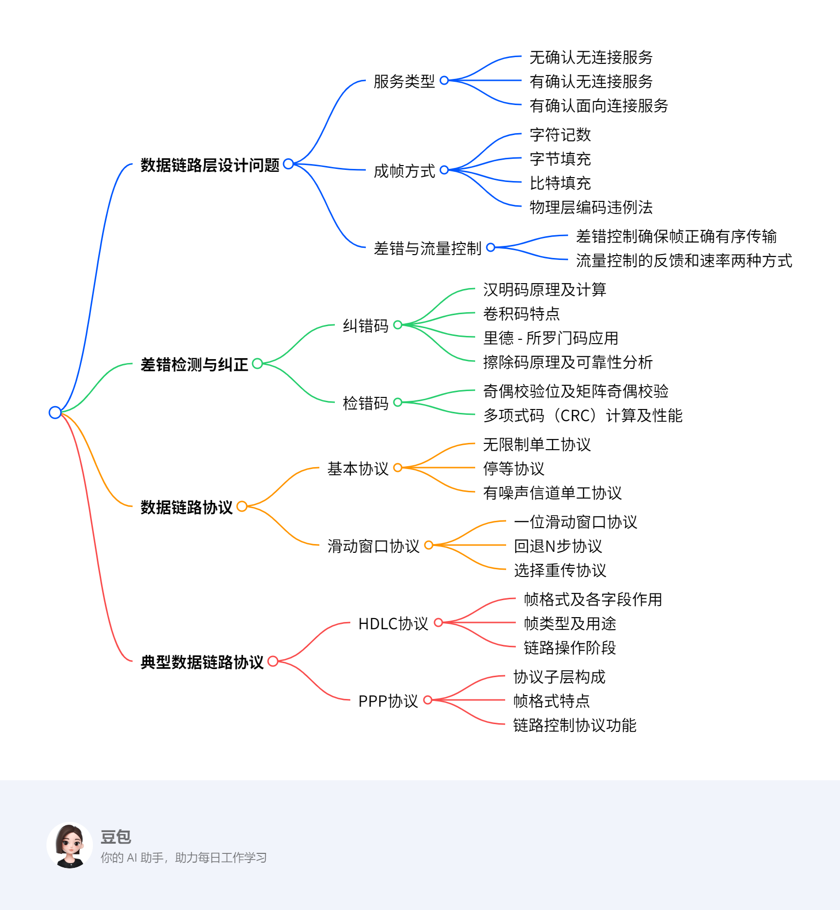
---
3. **详细总结**
    - **数据链路层设计问题**
        - **服务类型**：为网络层提供服务，包括**无确认无连接服务**（如以太网，适用于低误码率场景，实时流量）、**有确认无连接服务**（用于不可靠信道，如WiFi）、**有确认面向连接服务**（适用于长距离不可靠链路，如卫星和长途电话线路）。
        - **成帧方式**：包括**字符记数**（用头部字段指定帧中字符数，如DEC:DDCMP）、**字节填充**（帧起始和结束用特殊字节，如BISYNC、PPP）、**比特填充**（帧起始和结束用特殊位模式01111110，如遇到连续5个1则插入0）、**物理层编码违例法**（利用物理层编码规则，如IEEE:802.3）。
        - **差错与流量控制**：**差错控制**确保所有帧正确有序到达目的地，通过管理定时器和序列号实现。**流量控制**常用反馈式（接收方许可后发送方发送）和速率式（限制发送方传输速率）两种方式。
    - **差错检测与纠正**
        - **纠错码**：包括**汉明码**（通过特定校验位计算和奇偶校验纠正单比特错误，如(11, 7)汉明码）、**卷积码**（输出依赖当前和先前输入位，如NASA在802.11中使用的二进制卷积码）、**里德 - 所罗门码**（用于多场景，如(255, 223)码可纠正16个符号错误）、**擦除码**（通过特定编码和数据分片，提高存储可靠性，如k = 3, n = 6时可从6片中任意3片恢复原始数据）。
        - **检错码**：包括**奇偶校验**（单个奇偶校验位可检测奇数个位翻转错误，矩阵奇偶校验可检测更多错误）、**多项式码（CRC）**（将位串视为多项式计算校验和，如CRC - 16、CRC - CCITT等，能检测多种错误，r位校验位可检测长度≤r的突发错误）。
    - **数据链路协议**
        - **基本协议**：**无限制单工协议**在理想无错信道单向传输数据；**停等协议**用于无错信道但考虑接收方处理能力；**有噪声信道单工协议**通过序号和定时器处理错误和重传。
        - **滑动窗口协议**：**一位滑动窗口协议**双向传输，窗口大小为1；**回退N步协议**基于滑动窗口，接收窗口大小为1，出错时重传错误帧及后续帧，发送窗口最大值为7；**选择重传协议**只重传被拒绝的帧，接收方缓冲后续帧，窗口大小需满足Ws + Wr <= 2^n且Wr = Ws 。
    - **典型数据链路协议**
        - **HDLC协议**：有多种站类型和链路配置，帧格式包含地址、控制等字段。帧类型有**I帧**（传输数据）、**S帧**（用于ACK和NAK）、**U帧**（用于链路控制）。链路操作包括初始化、数据传输和断开连接。
        - **PPP协议**：是互联网数据链路层协议，包含多个子层。支持多种电路类型，帧格式适用于多种模式。LCP用于链路控制，可协商多种选项，如认证、IP地址分配等。

|协议|特点|应用场景|
|---|---|---|
|HDLC|多种站类型和链路配置，丰富的帧类型|广域网通信|
|SLIP|简单，基于字符填充，无过多功能|早期低速串行链路|
|PPP|支持多种协议，有链路控制和网络层协议配置功能|拨号上网、以太网接入等|

---
4. **关键问题**
    - **问题1**：在数据链路层，不同的成帧方式各有什么优缺点？
        - **答案**：字符记数方式简单，但头部字符计数字段出错时会导致帧定界错误；字节填充可明确帧边界，但会增加额外开销；比特填充能有效避免数据中出现与帧定界符相同的位模式，但实现相对复杂；物理层编码违例法利用物理层特性，不增加额外开销，但依赖特定的物理层编码方案。
    - **问题2**：比较回退N步协议和选择重传协议，它们在处理错误帧时有何不同？
        - **答案**：回退N步协议在接收方检测到错误帧后，会丢弃该帧及后续所有帧，发送方需重传错误帧及后续所有帧；选择重传协议仅重传被接收方标记为错误的帧，接收方会缓冲后续正确到达的帧，减少了不必要的重传，但需要更大的接收缓冲区和更复杂的管理。
    - **问题3**：PPP协议中的LCP和NCP分别起什么作用？
        - **答案**：LCP（链路控制协议）主要负责链路的建立、配置和测试，包括协商最大负载大小、认证方式、压缩方案等；NCP（网络控制协议）用于配置和协商网络层协议参数，如为IP协议分配IP地址，支持多种网络层协议。 

## Data Link Layer Design Issues
### Services Provided to the Network Layer
该部分内容主要介绍了数据链路层为网络层提供的服务，具体如下：

- **数据链路层的功能**：为网络层提供服务接口，处理传输错误，调节数据流，防止快速发送方使慢速接收方过载。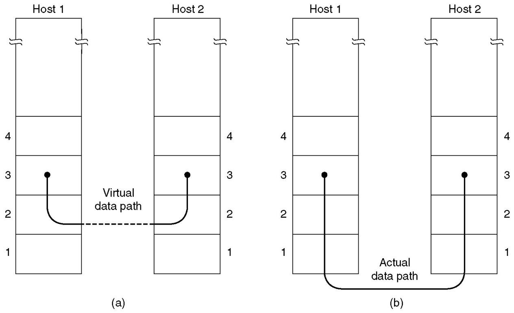
- **服务类型**
    - **无确认无连接服务**：以以太网为代表，其误码率极低，数据恢复由高层负责。适用于实时流量，例如语音，因为对于语音来说，迟到的数据比错误的数据更糟糕。
    - **有确认无连接服务**：在不可靠信道（如无线系统WiFi ）中很有用。发送方可以知道帧是否正确到达或丢失，如果在指定时间间隔内未到达，则会重新发送。
    - **有确认面向连接服务**：适用于长距离、不可靠的链路，像卫星信道或长途电话线路。数据链路层提供确认是一种优化手段，并非强制要求，该服务涉及定时器、序列号和连接建立等机制。 
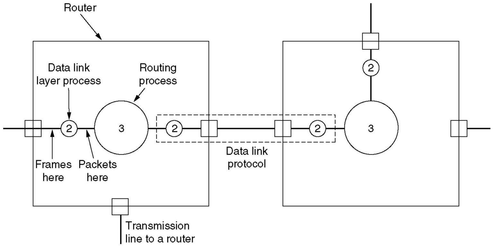
### Framing
该部分内容围绕数据链路层的成帧（Framing）方式展开，具体如下：

- **成帧的目标**：在点到点链路上，从节点A向节点B发送比特（或字节）序列时，节点B需准确识别哪些比特构成一帧。
- **成帧方式**
    - **字符记数（Character Count）**：利用帧头部字段指明帧中字符数量，如DEC的DDCMP协议采用此方式。若头部字符计数字段出错，会导致帧定界错误。 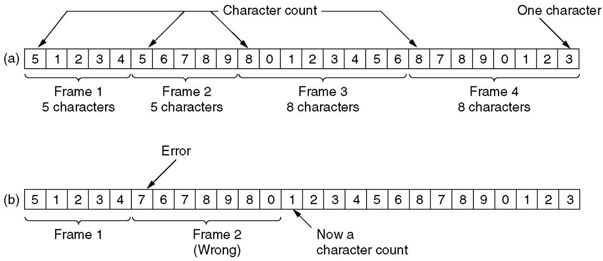
    - **字节填充（Byte Stuffing）**：用特殊字节（标志字节）界定帧的起始和结束 ，像BISYNC、PPP协议。当数据中出现与标志字节相同的字节时，通过填充特殊字节来区分数据和帧边界。
    - **比特填充（Bit Stuffing）**：帧起始和结束用特殊位模式01111110 。发送方数据链路层在数据中遇到连续5个1时，自动在输出比特流中插入一个0，接收方再去除插入的0还原数据。
    - **物理层编码违例法（Physical Layer Coding Violations）**：以IEEE 802.3为例，利用物理层特定编码规则。如规定一个符号周期内电压高变低为1、低变高为0 ，电压恒高或恒低不表示数据，可用作帧定界符。4B/5B编码中，不允许出现连续3个以上0 ，并通过非数据码表示物理层控制信号，如11111表示线路空闲，11000表示帧起始。 
### Error Control & Flow Control
该部分内容主要介绍了数据链路层的差错控制（Error Control）和流量控制（Flow Control），具体如下：
#### 差错控制
- **目的**：确保所有帧正确、有序地交付到目的地 。
- **实现方式**：向发送方反馈接收端情况；由于硬件故障可能导致帧丢失（如帧或确认帧ACK丢失，定时器会超时） ，需管理定时器和序列号，保证每个帧恰好被传递到目的地一次，不多也不少。
#### 流量控制
- **常用方法**：
    - **基于反馈的流量控制**：在接收方明确或隐含给予许可前，禁止发送方发送帧，通过接收方反馈控制发送方发送时机。
    - **基于速率的流量控制**：限制发送方传输数据的速率，直接从发送速率层面进行控制。 
## Error Detection and Correction
### Error Correcting Code(ECC)
该部分内容围绕纠错码（ECC）展开，介绍了相关概念、常见纠错码类型及其特性，具体如下：
#### 纠错码相关概念
- **错误模型**：包括擦除信道（物理层判定比特丢失 ）、突发错误（2个及以上比特改变 ）、孤立单比特错误。
- **汉明距离**：指两个码字不同比特位的数量。如10001001和10110001的汉明距离是3 。检测t个错误需汉明距离为t + 1的码，纠正t个错误需汉明距离为2t + 1的码。
#### 常见纠错码类型
- **汉明码**
    - **原理**：通过特定计算确定校验位，使包括校验位自身的某些比特集合奇偶性为偶数（或奇数 ）。例如对于7位ASCII码消息‘A’（1000001 ），确定4个校验位（位置为2的幂次方 ），组成11位码字。
    - **计算**：如码字中各校验位参与不同比特集合的异或运算，根据运算结果可确定错误比特位置（错误综合征 ）。可用于纠错内存，也可纠正突发错误。
    - **校验位数量确定**：通过公式推导，如m为消息比特数，r为校验比特数，n为码字长度（n = m + r ），需满足m + r + 1 ≤ 2r 。以m = 7为例，得出r = 4 。
- **卷积码**：输出取决于当前和先前输入比特，输出依赖的先前比特数量叫约束长度 ，有速率r和约束长度k参数，如r = 1/2，k = 7 。
- **里德 - 所罗门码**：对于m比特符号，码字长2m - 1个符号 。如m = 8时符号为字节，(255, 223)码在223个数据符号基础上加32个冗余符号，可纠正16个符号错误（即128比特突发错误 ），用于DSL、有线数据传输、卫星通信、光盘等场景。
- **擦除码**
    - **原理**：将原始数据分成k块，编码成n片，n片中任意k片可恢复原始数据，一般k < n ≤ 2k ，常见n = 2k 。如k = 3，n = 6时，通过特定线性方程组，得到编码后数据，任取3片可还原原始数据。
    - **可靠性分析**：与单副本存储相比，存储效率相同（如均为50% ），可靠性更高。以6台服务器为例，单份存放故障率P1 = p，双份存放P2 = p * p，擦除码方式4台及以上服务器故障才会数据丢失，P3远小于P1和P2 。
- **RAID5**：用n块硬盘存储（n - 1）块硬盘容量的数据 ，如n = 5时效率为80% 。通过计算可知，相比无校验情况，降低了故障率，提升了可靠性。 
### Error Detecting Code
该部分内容主要围绕错误检测码展开，介绍了不同错误检测码的类型、计算方法、性能特点及相关应用，具体如下：

1. **错误检测与纠正策略选择**：在可靠信道（如光纤）上，使用错误检测码并对错误块重传成本更低；在易出错的信道（如无线链路）上，为每个数据块添加足够冗余让接收方恢复原始数据更好。以误码率$BER = 10^{-6}$ 、1000比特/块、1M比特数据为例，错误检测与重传开销为2001比特，汉明码开销为10000比特。 
2. **奇偶校验码**
    - **单个奇偶校验位**：能检测奇数个位翻转错误，但无法检测偶数个位翻转错误。
    - **行列奇偶校验**：将数据块视为$k×r$矩阵，每列计算一个奇偶校验位并添加到矩阵最后一行，按行传输。可检测长度≤r的单个突发错误和奇数个反转位的错误，对于长度>r且偶数个反转位的错误，接收错误帧的概率为$2^{-r}$ 。 
3. **多项式码（CRC）**
    - **基本概念**：也叫循环冗余校验（CRC）或帧校验序列（FCS）。把位串看作系数为0和1的多项式，如$k$位帧$110001$对应多项式$x^{5}+x^{4}+x^{0}$ ，多项式运算采用模2运算（加减法等同于异或） ，$G(x)$为生成多项式。 
    - **计算与校验**：发送方在帧末尾添加$r$个零比特，用对应$G(x)$的位串除，将所得余数从位串中减去得到$T(x)$并发送。接收方计算$[T(x)+E(x)]/G(x)$（$E(x)$为错误多项式） ，若$T(x)/G(x)$为0，结果为$E(x)/G(x)$ ，含$G(x)$作为因子的错误会漏检，其他错误能被检测。
    - **性能**：$r$个校验位可检测长度≤r的突发错误、两个孤立单比特错误；选择合适的$G(x)$（如$x + 1$是$G(x)$的因子）可检测奇数个反转位的错误；对于长度>r的突发错误，接收错误帧的概率为$2^{-r}$ 。
    - **生成多项式标准**：如CRC - 16（$x^{16}+x^{15}+x^{2}+1$ ）、CRC - CCITT（$x^{16}+x^{12}+x^{5}+1$ ）、CRC - 32（$x^{32}+x^{26}+x^{23}+x^{22}+x^{16}+x^{12}+x^{11}+x^{10}+x^{8}+x^{7}+x^{5}+x^{4}+x^{2}+x^{1}+1$ ）等。
    - **计算方式**：硬件上可通过简单移位寄存器电路计算和验证校验和，如CRC5的计算；软件上通过预先计算好的表格进行快速计算，如CRC16的软件计算函数。 
4. **其他哈希函数及应用**：CRC算法可计算不定长数据段的固定长度哈希值。哈希值位数越多校验能力越强，64位以上哈希函数用于安全领域实现电子签名。CRC32可用于比较数据，如路由器的OSPF链路状态数据库比较；还有MD5、SHA - 1等哈希函数，以及rsync利用弱哈希函数和强哈希函数进行增量拷贝 。 
## Elementary Data Link Protocols
该部分内容主要介绍了基本的数据链路协议，具体如下：

- 无限制单工协议（An Unrestricted Simplex Protocol）
    - 这是一种在理想（无差错）信道上运行的协议，数据在信道上单向传输。发送方不断地将数据帧发送到信道上，无需考虑接收方的状态或反馈信息，因为假定信道不会出现错误，接收方一定能正确接收所有数据帧。
- 停等协议（A Simplex Stop-and-Wait Protocol）
    - 同样是用于单工通信（数据单向传输）的协议，适用于无差错信道，但考虑到接收方的处理能力。发送方发送一个数据帧后，会停下来等待接收方的确认帧（ACK） 。只有收到接收方返回的确认帧，表明接收方已正确接收该帧，发送方才会继续发送下一个数据帧。这样可以避免接收方因来不及处理过多数据而导致数据丢失。
- 有噪声信道单工协议（A Simplex Protocol for a Noisy Channel）
    - 针对存在噪声（即可能出现传输错误）的信道设计的单工协议 。在这种协议中，发送方发送数据帧后，不仅要等待接收方的确认帧，还需设置定时器。若在定时器超时前未收到确认帧，发送方会认为数据帧在传输过程中丢失或出错，进而重传该数据帧。同时，协议会为数据帧添加序号，以便接收方和发送方能够识别重复帧，保证数据正确、有序地传输。 
### Protocol Definitions
该部分内容围绕基本数据链路协议，介绍了相关假设和库函数程序，具体如下：
#### 基本假设
- **层间独立性**：物理层、数据链路层和网络层是相互独立的进程，意味着各层功能相对独立，可单独设计与实现。
- **可靠连接服务**：机器A要使用可靠的、面向连接的服务向机器B发送长数据流，表明数据传输需保证有序、无错且按序交付。
- **机器稳定性**：假设机器不会崩溃，排除因机器故障导致的协议执行异常情况。
#### 库函数程序
##### 第一部分：数据类型和常量定义
1. **`#define MAX_PKT 1024`**
    - 定义了一个常量`MAX_PKT`，值为1024 ，用于表示数据包的大小（单位为字节 ）。
2. **`typedef enum {false, true} boolean;`**
    - 使用`typedef`定义了一个新的类型`boolean`，它本质是一个枚举类型，包含`false`和`true`两个取值，用于表示布尔值。
3. **`typedef unsigned int seq_nr;`**
    - 定义了`seq_nr`类型，它是`unsigned int`（无符号整数 ）类型，用于表示数据帧的序号或者确认序号。
4. **`typedef struct {unsigned char data[MAX_PKT];} packet;`**
    - 定义了一个结构体类型`packet`，其中包含一个`unsigned char`类型的数组`data`，大小为`MAX_PKT`（即1024字节 ），用于存储网络层数据包的数据部分。
5. **`typedef enum {data, ack, nak} frame_kind;`**
    - 定义了一个枚举类型`frame_kind`，包含`data`（数据帧 ）、`ack`（确认帧 ）、`nak`（否定确认帧 ）三个取值，用于标识帧的类型。
6. **`typedef struct { frame_kind kind; seq_nr seq; seq_nr ack; packet info; } frame;`**
    - 定义了一个结构体类型`frame`，用于表示数据链路层的帧。其中：
        - `kind`表示帧的类型，是`frame_kind`枚举类型。
        - `seq`表示帧的序号，类型为`seq_nr` 。
        - `ack`表示确认序号，类型为`seq_nr` 。
        - `info`是一个`packet`结构体，用于存储网络层的数据包。

##### 第二部分：函数声明和宏定义
1. **函数声明**
    - **`void wait_for_event(event_type *event);`**
        - 函数功能是等待某个事件发生，并将发生事件的类型存储在`event`指针所指向的变量中。
    - **`void from_network_layer(packet *p);`**
        - 从网络层获取一个数据包，存储到指针`p`指向的`packet`结构体中，用于后续在信道上传输。
    - **`void to_network_layer(packet *p);`**
        - 将接收到的帧中的信息传递给网络层，`p`指向包含要传递信息的`packet`结构体。
    - **`void from_physical_layer(frame *r);`**
        - 从物理层获取一个输入帧，并将其复制到指针`r`指向的`frame`结构体中。
    - **`void to_physical_layer(frame *s);`**
        - 将一个帧传递给物理层进行传输，`s`指向要传输的`frame`结构体。
    - **`void start_timer(seq_nr k);`**
        - 启动一个定时器，参数`k`可能与帧的序号相关，同时使能超时事件。
    - **`void stop_timer(seq_nr k);`**
        - 停止一个定时器，参数`k`可能与帧的序号相关，同时禁用超时事件。
    - **`void start_ack_timer(void);`**
        - 启动一个辅助定时器，使能确认超时事件。
    - **`void stop_ack_timer(void);`**
        - 停止辅助定时器，禁用确认超时事件。
    - **`void enable_network_layer(void);`**
        - 允许网络层产生`network_layer_ready`事件。
    - **`void disable_network_layer(void);`**
        - 禁止网络层产生`network_layer_ready`事件。
2. **宏定义**
    - **`#define inc(k) if (k < MAX_SEQ) k = k + 1; else k = 0`**
        - 定义了一个宏`inc`，用于对变量`k`进行循环递增操作。如果`k`小于`MAX_SEQ`（这里未给出`MAX_SEQ`定义 ），则`k`自增1 ；否则，将`k`重置为0 。 

### Protocol 1: Utopia（理想化协议）
这段代码实现了一个简单的数据链路层协议，**无限制单工协议（Unrestricted Simplex Protocol）**（Protocol 1，被称为“Utopia” 协议），用于在理想（无差错）信道上进行单向数据传输（从发送方到接收方） 。以下是代码的详细解释：

#### 协议背景说明
代码开头的注释说明了该协议的特点：

- 仅支持从发送方到接收方的单向数据传输。
- 假设通信信道无差错，且接收方能够无限快速地处理所有输入数据。因此，发送方只需不断地将数据发送到线路上。

#### 代码具体实现
1. **数据类型定义**
    - `typedef enum {frame_arrival} event_type;`：定义了一个枚举类型`event_type`，其中只有一个取值`frame_arrival`，表示可能发生的事件只有帧到达。
2. **包含头文件**
    - `#include "protocol.h"`：包含名为`protocol.h`的头文件，该头文件可能包含了其他相关的函数声明、数据类型定义等内容。
3. **发送方函数 `sender1`**
    - **函数定义**：`void sender1(void)`，该函数无参数，返回值为`void` 。
    - **变量声明**：
        - `frame s;`：声明一个`frame`类型的变量`s`，用于作为输出帧的缓冲区。
        - `packet buffer;`：声明一个`packet`类型的变量`buffer`，用于作为输出数据包的缓冲区。
    - **循环发送数据**：
        - `while (true)`：进入一个无限循环，使发送方持续工作。
        - `from_network_layer(&buffer);`：调用函数从网络层获取要发送的数据，存储到`buffer`中。
        - `s.info = buffer;`：将从网络层获取的数据复制到帧`s`的`info`成员中，准备进行传输。
        - `to_physical_layer(&s);`：将帧`s`传递给物理层进行发送。
4. **接收方函数 `receiver1`**
    - **函数定义**：`void receiver1(void)`，该函数无参数，返回值为`void` 。
    - **变量声明**：
        - `frame r;`：声明一个`frame`类型的变量`r`，用于存储从物理层接收到的帧。
        - `event_type event;`：声明一个`event_type`类型的变量`event`，虽然注释提到它由`wait_for_event`函数填充但在此处未使用。
    - **循环接收数据**：
        - `while (true)`：进入一个无限循环，使接收方持续工作。
        - `wait_for_event(&event);`：等待事件发生，在这个协议中，唯一可能的事件是帧到达（`frame_arrival` ）。
        - `from_physical_layer(&r);`：从物理层获取输入的帧，存储到`r`中。
        - `to_network_layer(&r.info);`：将接收到的帧中的数据传递给网络层。 
### Protocol 2: Stop-and-Wait Protocol for a Error-free Channel

这段代码实现了 **单工停等协议（Simplex Stop-and-Wait Protocol）**，用于控制发送方与接收方的单向数据传输，避免发送方发送数据过快导致接收方处理不及。以下是代码解析：

#### 协议背景说明
代码开头的注释说明了该协议的特点：

- 同样是从发送方到接收方的单向数据传输。
- 假设通信信道无差错，与Protocol 1相同。但接收方缓冲区容量和处理速度有限，因此协议需要防止发送方发送数据的速度超过接收方的处理能力。

#### 代码具体实现
1. **数据类型定义**
    - `typedef enum {frame_arrival} event_type;`：定义了一个枚举类型`event_type`，其中只有`frame_arrival`这一个取值，表示唯一可能发生的事件是帧到达。
2. **包含头文件**
    - `#include "protocol.h"`：包含名为`protocol.h`的头文件，该头文件可能包含了其他相关的函数声明、数据类型定义等内容。
3. **发送方函数 `sender2`**
    - **函数定义**：`void sender2(void)` ，函数无参数，返回值为`void` 。
    - **变量声明**：
        - `frame s;`：声明一个`frame`类型的变量`s`，作为输出帧的缓冲区。
        - `packet buffer;`：声明一个`packet`类型的变量`buffer`，作为输出数据包的缓冲区。
        - `event_type event;`：声明一个`event_type`类型的变量`event`，用于存储发生的事件，在该协议中只有帧到达这一种可能。
    - **循环发送数据**：
        - `while (true)`：进入一个无限循环，使发送方持续工作。
        - `from_network_layer(&buffer);`：从网络层获取要发送的数据，存储到`buffer`中。
        - `s.info = buffer;`：将从网络层获取的数据复制到帧`s`的`info`成员中，为传输做准备。
        - `to_physical_layer(&s);`：将帧`s`传递给物理层进行发送。
        - **wait_for_event(&event);**：等待事件发生，在收到接收方的反馈（此处通过等待事件来实现）之前，发送方不会继续发送新的数据，以此防止发送过快使接收方过载。
4. **接收方函数 `receiver2`**
    - **函数定义**：`void receiver2(void)` ，函数无参数，返回值为`void` 。
    - **变量声明**：
        - `frame r, s;`：声明两个`frame`类型的变量`r`和`s`，`r`用于存储从物理层接收到的帧，`s`可作为临时帧缓冲区（这里用于发送虚拟帧唤醒发送方 ）。
        - `event_type event;`：声明一个`event_type`类型的变量`event`，用于存储发生的事件，在该协议中只有帧到达这一种可能。
    - **循环接收数据**：
        - `while (true)`：进入一个无限循环，使接收方持续工作。
        - `wait_for_event(&event);`：等待事件发生，在该协议中唯一可能的事件是帧到达（`frame_arrival` ）。
        - `from_physical_layer(&r);`：从物理层获取输入的帧，存储到`r`中。
        - `to_network_layer(&r.info);`：将接收到的帧中的数据传递给网络层。
        - **to_physical_layer(&s);**：向物理层发送一个虚拟帧（注释中说是唤醒发送方 ），告知发送方可以继续发送数据。 这种机制实现了发送方和接收方之间的流量控制，确保接收方不会因数据过多而无法处理。 

### Protocol 3: A Simplex Protocol for a Noisy Channel
#### 协议解决问题的思路
 - 发送方发送数据帧（DATA ）后，等待接收方的确认帧（ACK ） 。通过这种方式来确认数据是否正确到达接收方，若未收到ACK则采取相应措施。
#### 传输错误的情况及处理
 - **接收方故障情况（Case 1 ）**
    - **正常传输**：发送方A的网络层将数据包1传递给数据链路层，数据包正确到达接收方B并传递给B的网络层，B向A发送ACK 。
    - **ACK丢失**：ACK在传输过程中完全丢失。A的数据链路层最终会因未收到ACK而超时，随后重发该数据帧。重发的重复帧也会到达B 。
 - **发送方故障情况（Case 2 ）**：涉及到ACK延迟的情况，虽未详细说明，但也是协议需要处理的错误场景之一 。
#### 序号的作用（Sequence Number ）
 - 用于区分新帧和重传帧 。在有噪声信道中，由于可能出现帧丢失、超时重传等情况，通过给帧添加序号，接收方和发送方能够识别哪些是新发送的帧，哪些是因未收到ACK而重传的帧，从而保证数据正确、有序地传输 。 
#### 发送方代码
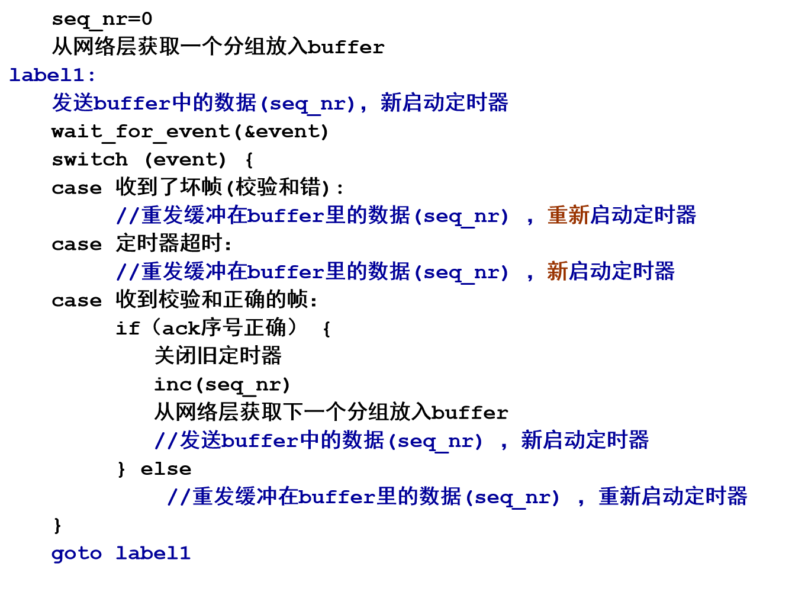
#### 接收方代码
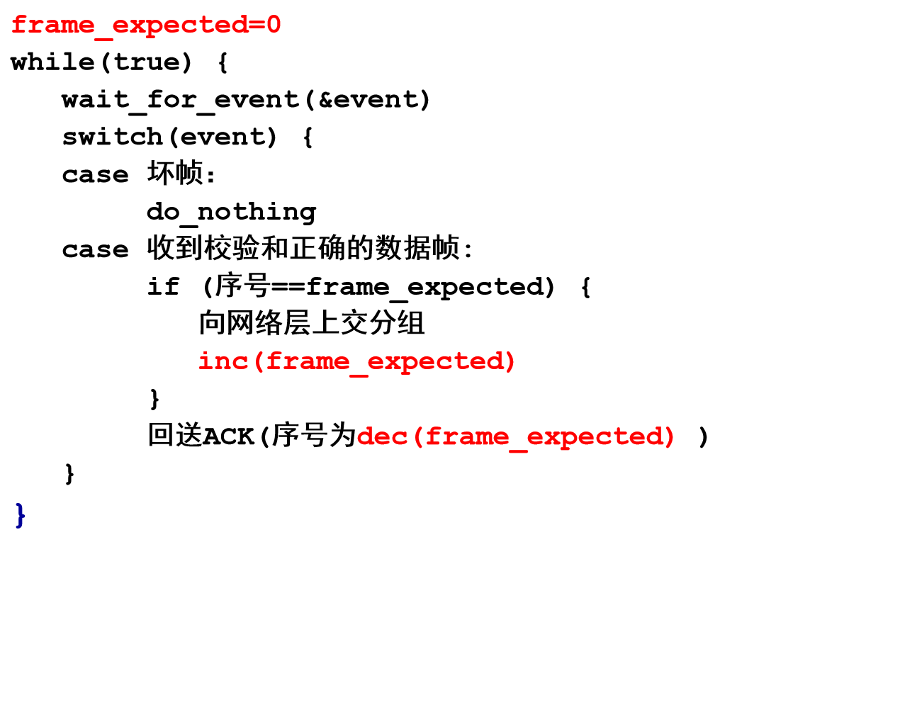
#### 定时器
- **超时机制说明**：在数据链路协议中，发送方发送数据帧后，会启动定时器并等待接收方的确认帧（ACK）。当定时器达到设定的超时时间间隔，若仍未收到ACK ，则会触发相应操作（如重传数据帧 ）。
- **超时时间间隔设置过短的影响**：若超时时间间隔设置过短，发送方可能会在确认帧（ACK）实际还在传输途中时就超时。此时，发送方会重传数据帧，导致传输不必要的帧。虽然这些额外重传的帧不会影响协议最终数据传输的正确性（因为接收方会识别并处理重复帧 ），但会增加网络负载，占用带宽资源，从而降低协议的整体性能 。 
## Sliding Window Protocols
该部分内容围绕滑动窗口协议（Sliding Window Protocols）展开，介绍了捎带确认（Piggybacking）、发送窗口与接收窗口相关概念，以及不同滑动窗口协议类型，具体如下：

- 捎带确认（Piggybacking）
    - **全双工数据传输方式**
        - 可以使用两个独立的通信信道，每个信道用于单工数据流量。
        - 也可以在同一电路上实现双向数据传输。
    - **捎带确认机制**：当接收方收到数据帧时，不立即发送单独的控制帧，而是等待网络层传递下一个数据包。此时，将确认帧（ACK ）附加在即将发出的数据帧上（利用帧头部的ack字段 ）。这种方式能有效减少控制帧的单独发送，提高传输效率。
- 发送窗口与接收窗口
    - **发送窗口（Sending window）**
        - 作用是控制未确认帧的数量。在任何时刻，发送方维护一组与未确认帧对应的序列号，这些帧处于发送窗口内。
        - 存在发送窗口大小的最大值限制，具体大小取决于协议设计。
    - **接收窗口（Receiving window）**：接收方同样维护一个接收窗口，用于限定其允许接收的帧的集合。
    - **窗口大小特性**：窗口大小可以是固定的，也可以在帧的发送和接收过程中动态增长或缩小。 
- 滑动窗口协议类型
    - 包括一位滑动窗口协议（A One - Bit Sliding Window Protocol ）、回退N步协议（A Protocol Using Go Back N ）、选择重传协议（A Protocol Using Selective Repeat ） 。不同协议在效率、复杂度和缓冲区要求等方面存在差异 。 

### One-Bit Sliding Window Protocol
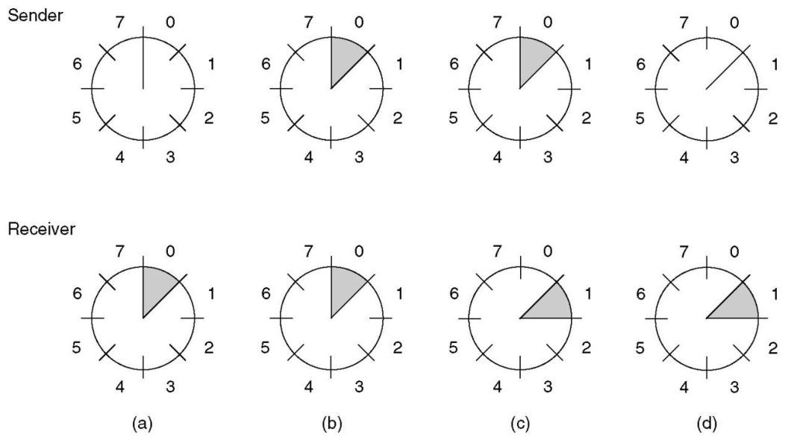
#### Protocol 4: One-Bit Sliding Window
这张图片介绍了Protocol 4（四位滑动窗口协议）的相关概念，包括发送窗口、发送方和接收方的序号以及发送缓冲区等内容。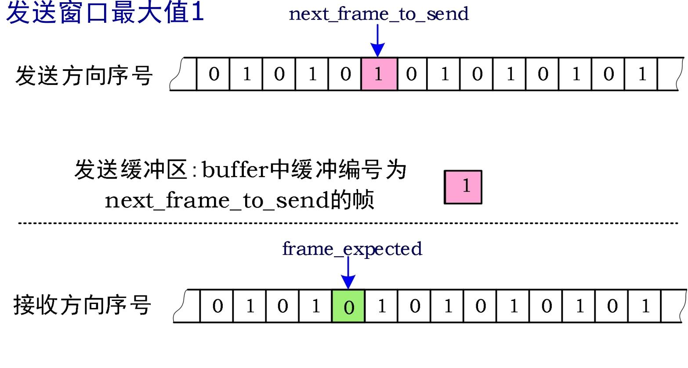

- **发送窗口**：明确发送窗口最大值为1，意味着发送方在未收到确认信息前，最多只能发送1个帧。 
- **发送方向序号**：有一个序号序列，其中`next_frame_to_send`（下一个要发送的帧序号）指向序号为1的位置，表示当前准备发送序号为1的帧。发送缓冲区`buffer`中缓冲的是编号为`next_frame_to_send`的帧，即序号为1的帧 。
- **接收方向序号**：存在另一个序号序列，`frame_expected`（期望接收的帧序号）指向序号为0的位置，说明接收方当前期望接收到序号为0的帧。 
#### 代码
这段代码实现了滑动窗口协议（Protocol 4 ），用于双向数据传输，以下是对代码的详细解释：

##### 协议说明与宏定义
- **协议说明**：注释表明Protocol 4是双向的滑动窗口协议。
- **宏定义**：`#define MAX_SEQ 1` ，限定了协议4中最大序列号为1 ，意味着序列号只能是0或1 。

##### 数据类型定义
- `typedef enum {frame_arrival, cksum_err, timeout} event_type;`：定义了一个枚举类型`event_type`，包含三种事件类型：`frame_arrival`（帧到达 ）、`cksum_err`（校验和错误 ）、`timeout`（超时 ）。

##### 函数定义 `protocol4`
- **变量声明**
    - `seq_nr next_frame_to_send;`：表示下一个要发送的帧的序号，取值只能是0或1 。
    - `seq_nr frame_expected;`：表示期望接收的下一个帧的序号，取值为0或1 。
    - `frame r, s;`：`r`用于存储接收到的帧，`s`用于构建要发送的帧，是临时变量。
    - `packet buffer;`：用于存储从网络层获取的数据包。
    - `event_type event;`：用于存储发生的事件类型。
- **初始化部分**
    - `next_frame_to_send = 0;`：初始化下一个要发送的帧的序号为0 。
    - `frame_expected = 0;`：初始化期望接收的下一个帧的序号为0 。
    - `from_network_layer(&buffer);`：从网络层获取一个数据包。
    - `s.info = buffer;`：将获取的数据包存储到要发送的帧`s`的`info`成员中。
    - `s.seq = next_frame_to_send;`：将下一个要发送的帧的序号设置到帧`s`的`seq`成员中。
    - `s.ack = 1 - frame_expected;`：通过捎带确认机制设置确认序号（若期望接收的帧序号为0 ，则确认序号为1 ，反之亦然 ）。
    - `to_physical_layer(&s);`：将构建好的帧`s`发送到物理层进行传输。
    - `start_timer(s.seq);`：启动针对该帧的定时器。
- **事件处理循环**
    - `while (true)`：进入一个无限循环，持续处理各种事件。
    - `wait_for_event(&event);`：等待事件发生，事件类型包括前面定义的`frame_arrival`、`cksum_err`、`timeout` 。
    - **帧到达事件处理**：
        - 当`event == frame_arrival`时，表示接收到一个无损坏的帧。
        - `from_physical_layer(&r);`：从物理层获取接收到的帧`r`。
        - 若`r.seq == frame_expected`，说明接收到了期望的帧：
            - `to_network_layer(&r.info);`：将帧中的数据包传递给网络层。
            - `inc(frame_expected);`：更新期望接收的下一个帧的序号（在`MAX_SEQ`为1的情况下，从0变为1或从1变为0 ）。
        - 若`r.ack == next_frame_to_send`，说明接收到了对已发送帧的确认：
            - `stop_timer(r.ack);`：停止对应的定时器。
            - `from_network_layer(&buffer);`：从网络层获取新的数据包。
            - `inc(next_frame_to_send);`：更新下一个要发送的帧的序号。
    - **构建并发送新帧**：
        - `s.info = buffer;`：将新获取的数据包存储到要发送的帧`s`的`info`成员中。
        - `s.seq = next_frame_to_send;`：设置帧`s`的序号。
        - `s.ack = 1 - frame_expected;`：设置捎带确认序号。
        - `to_physical_layer(&s);`：将帧`s`发送到物理层。
        - `start_timer(s.seq);`：启动针对新帧的定时器。
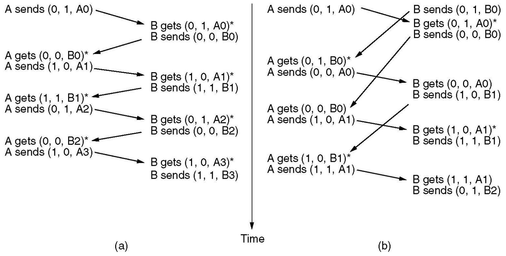
#### 效率
该部分内容围绕线路利用率（Line Utilization）展开，介绍相关参数及计算公式，具体如下：
##### 相关参数
- **Channel capacity（b）**：信道容量，单位为比特每秒（bits/sec），代表信道每秒能传输的比特数。
- **Frame size（l）**：帧大小，单位为比特（bits），即每个数据帧所包含的比特数量。 
- **Round - trip propagation time（R）**：往返传播时间，单位为秒（sec），是数据从发送端到接收端再返回发送端所需的时间。
##### 线路利用率公式推导
线路利用率计算公式为：$\frac{\frac{l}{b}}{\frac{l}{b}+R}=\frac{l}{l + bR}=\frac{1}{1 + \alpha}$ ，其中设$\alpha=\frac{bR}{l}$ 。
- $\frac{l}{b}$表示发送一帧数据所需的时间。
- $\frac{l}{b}+R$表示从开始发送一帧数据到收到确认帧（一个往返过程）所经历的总时间。线路利用率即发送数据时间在整个往返时间中所占的比例。
- $\alpha$表示往返时间以帧长时间归一化后的值，用于衡量往返时间相当于多少个帧长的时间。
##### 效率判断
当$l < bR$时，根据公式可知，线路利用率会小于50% 。这意味着如果帧大小小于信道容量与往返传播时间的乘积，线路的传输效率会较低 。  
### Protocol Using Go Back N
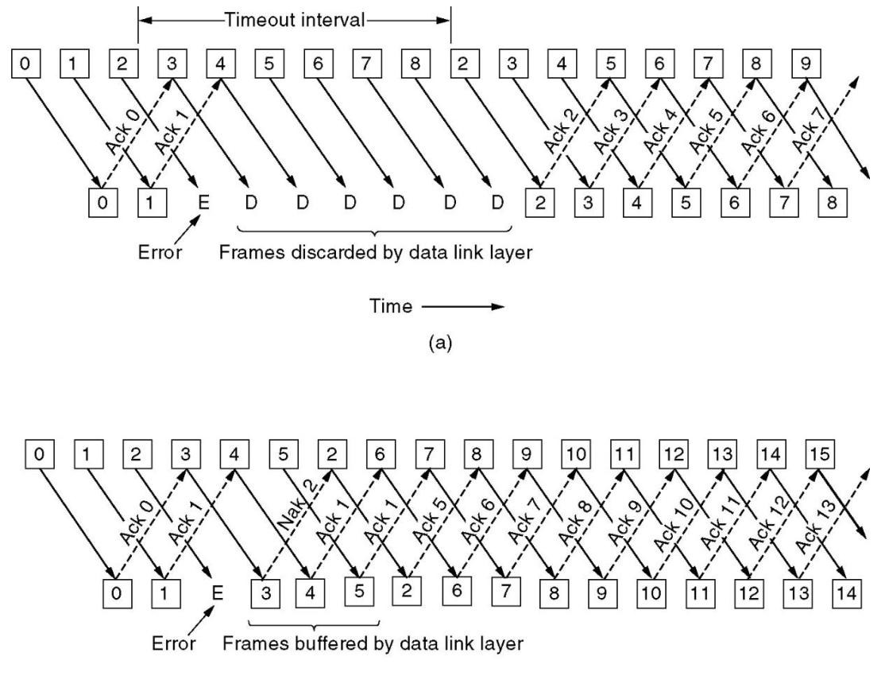
#### Pipelining & Error Recovery
这张图片对比展示了数据链路层中两种不同的可靠传输协议在遇到传输错误时的处理机制，分别是回退N步协议（Go - Back - N）和选择重传协议（Selective Repeat）。
##### 回退N步协议（图a）
- **传输与确认过程**：
    - 发送方从左到右依次发送编号为0、1、2等的数据帧。接收方成功接收到0号帧和1号帧后，分别发送Ack 0和Ack 1作为确认。
    - 当发送2号帧时出现错误（标记为E），接收方无法正确接收该帧。在错误发生后，发送方继续发送3、4、5、6、7、8号帧。
- **错误处理机制**：
    - 由于2号帧未得到确认，接收方的数据链路层会丢弃后续接收到的3 - 8号帧（标记为D）。
    - 发送方设置了一个超时时间间隔（Timeout interval），当超过这个时间仍未收到2号帧的确认时，发送方会从2号帧开始，重传所有未被确认的帧，也就是重新发送2、3、4、5、6、7、8号帧。
    - 接收方正确接收重传帧后，发送相应的确认帧（Ack 2、Ack 3等），发送方继续后续的传输（如发送9号帧）。 

##### 选择重传协议（图b）
- **传输与确认过程**：
    - 同样，发送方先发送0、1、2等数据帧，接收方收到0号和1号帧后，发送Ack 0和Ack 1。
    - 2号帧传输出现错误（标记为E），接收方检测到错误后，发送Nak 2（否定确认）告知发送方2号帧接收失败。
- **错误处理机制**：
    - 与回退N步协议不同，选择重传协议中，接收方会缓存后续正确到达但顺序不对的帧，例如3、4、5号帧。
    - 发送方收到Nak 2后，仅重传2号帧。当2号帧正确到达后，接收方按照顺序处理之前缓存的帧，并对所有正确接收的帧发送确认帧（Ack 1、Ack 2、Ack 5等）。
    - 发送方继续发送后续的6、7、8等帧，整个传输过程继续进行。

该内容主要围绕回退N步（Go Back N）协议展开，涵盖协议基本原理、错误处理、确认机制、窗口大小、协议改进及定时器相关内容。

1. **基本原理**：基于滑动窗口机制，接收窗口大小为1，通过窗口控制未确认帧的数量。
2. **错误处理**
    - **数据帧损坏**：接收方检测到帧错误时，丢弃该帧及后续所有帧，直到正确接收到错误帧；发送方在超时后重传错误帧及后续所有帧。
    - **ACK帧损坏**：若ACK帧丢失，由于ACK具有累积性，后续正确的ACK可能在发送方超时前到达，此时之前丢失的ACK错误可忽略；若发送方超时，则重传相应帧及后续所有帧。
3. **确认机制（ACK）**：ACK是累积的，例如接收方B收到Frame0和Frame1后未及时回送ACK，收到Frame2后回送ACK2 ，若ACK2在发送方对Frame0的超时前到达，那么ACK0和ACK1的错误可忽略。
4. **窗口大小**
    - **最大发送窗口大小**：以3比特序号为例，若发送窗口设为8会出现序号重叠问题，所以发送窗口最大值为7。发送方发完窗口内所有帧且接收方正确接收后，接收窗口向前推移，需保证发送窗口与接收窗口在序号上不重叠。
    - **判断序号位置**：判断序号b是否落在窗口(a,c)内，分a到c不回绕（b位于a~c之间 ）和a到c回绕（b位于a\~7或0\~c - 1 ）两种情况，对应不同的判断条件。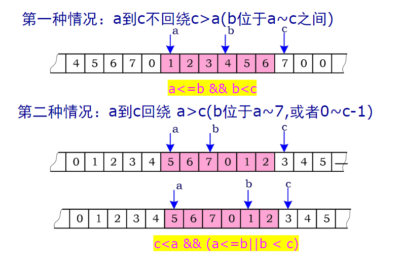
5. **协议改进**
    - **设置ACK帧和ACK定时器**：当发送数据量不是源源不断的分组流，无法及时搭载ACK时，发送短的ACK帧；有用于回送ACK的定时器操作和数据重传所用定时器操作，且两者有区别。
    - **NAK帧**：可激发重传，无需等到超时。
6. **协议参数与线路利用率**：超时定时器时限设计需考虑线路往返时间延迟、ACK定时器时限、对方物理层发送排队时延；滑动窗口（MAX_SEQ）大小会影响效率，太小可能导致无法流水线操作，出现停等现象。
7. **定时器队列**：提到在软件中模拟多个定时器，如在实时时间10:00:00.000 ，有3个超时事件分别在10:00:00.005、10:00:00.013和10:00:00.019 。 
### Using Selective Repeat
这段内容主要介绍了选择性重传（Selective Repeat）协议，包括其工作原理、窗口大小、定时器、否定确认（NAK）、协议存在的问题以及性能等方面，具体如下：

1. **工作原理**
    - **发送方**：仅重传被接收方拒绝的帧，这种方式能最大程度减少重传数量，提升传输效率。
    - **接收方**：接收并缓存后续帧。这要求接收方具备足够大的缓冲区，以便存储未按顺序到达但后续可能有用的帧。
2. **窗口大小**
    - **窗口大小与序号关系**：发送窗口最大值（Ws）和接收窗口大小（Wr）需满足Ws + Wr <= 2^n，且通常Wr = Ws。最大窗口大小最多为序列号范围的一半，这是为了确保在复杂的网络传输环境下，发送方和接收方能够准确处理不同序号的帧，避免序号混淆和错误重传。
    - **缓冲区数量**：接收方所需的缓冲区数量等于窗口大小，而非序列号范围。这是因为接收方只需暂存当前窗口内可能乱序到达的帧，而不是存储所有可能序列号对应的帧。
3. **ACK定时器**：当按顺序的数据帧到达时，接收方会启动辅助ACK定时器。若在定时器到期前没有反向流量（即没有其他数据帧从接收方发回发送方），接收方会单独发送ACK帧确认接收。若有反向流量，ACK定时器则停止，这种机制能有效利用反向流量携带确认信息，减少单独ACK帧的发送，提高传输效率。
4. **NAK**
    - **发送条件**：当接收方怀疑出现错误时，会向发送方发送NAK帧请求重传。怀疑错误的情况有两种：一是接收到损坏的帧；二是接收到的帧不是预期的帧。
    - **避免重复请求**：接收方会记录是否已针对特定帧发送过NAK，避免对同一帧多次请求重传，防止网络资源浪费。
5. **Protocol 6: Selective Repeat**：此协议的发送窗口和接收窗口最大均为4，这是根据上述窗口大小规则结合具体应用场景设定的，在实际应用中需根据网络状况和需求进行调整。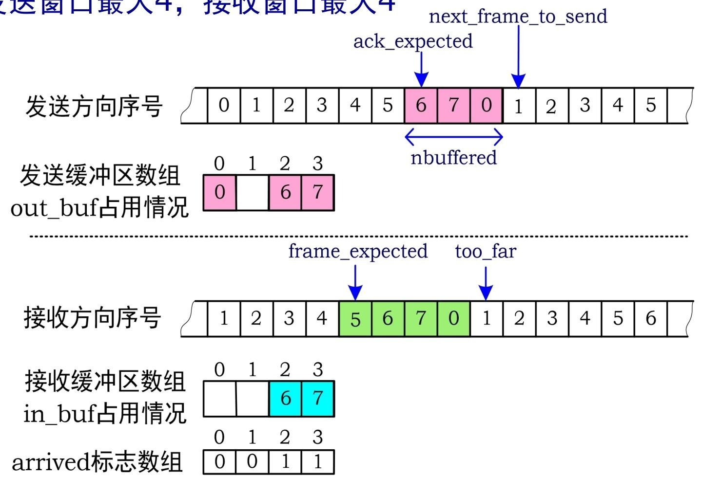
6. **Protocol 6存在的问题**
    - **帧相关问题**：可变长INFO帧、短的控制帧（如ACK/NAK等）以及帧类型序号等字段的长度，这些因素会增加协议实现的复杂性和数据处理的难度。
    - **流量控制与链路管理问题**：存在流量控制问题，并且当线路长久故障导致发送方反复重传时，应向Layer3报告链路故障。同时，必需的链路管理包括建立链接、选定协议参数、主动断开连接和链路断开监控等，这些环节的完善对于协议的稳定运行至关重要。
7. **性能**：提及了带错误处理的停止 - 等待协议的性能，但未详细阐述，表明在性能方面，选择性重传协议与停止 - 等待协议存在关联和对比，后续可能会进一步分析两者性能差异。 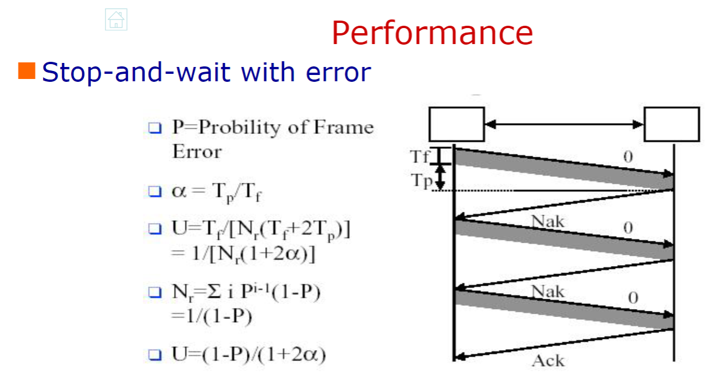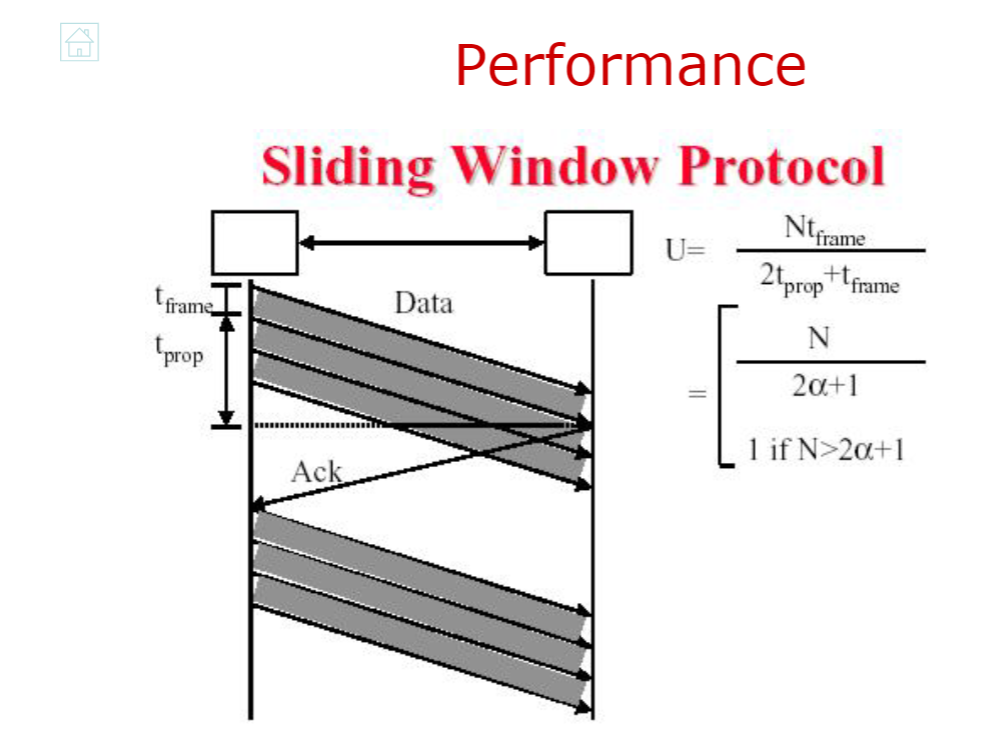
## Example Data Link Protocols
### HDLC(High-level Data Link Control)
HDLC（高级数据链路控制协议）是一种重要的数据链路层协议，在网络通信中发挥着关键作用，其主要内容如下：

1. **历史渊源**：HDLC有多个前身协议。IBM的SDLC（同步数据链路控制）、ANSI的ADCCP（高级数据通信控制程序）为其发展奠定基础。ISO的HDLC和CCITT（现ITU - T）的LAPB（平衡模式链路接入规程 ）、LAPD（ISDN D信道链路接入规程）等，都是在相关技术演进过程中产生的，它们共同构成了HDLC丰富的发展脉络。
2. **站类型**
    - **主站**：负责链路操作的控制，它发出的帧被称为命令帧。同时，主站与每个从站都保持独立的逻辑链路连接，以此实现对从站的管理和数据传输控制。
    - **从站**：处于主站的控制之下，从站发出的帧是响应帧，主要用于回应主站的命令，实现与主站之间的交互。
    - **复合站**：兼具主站和从站的功能，既可以发出命令帧，也能够发出响应帧，这种灵活性使其在特定网络环境中能更好地适应复杂的通信需求。
3. **链路配置**
    - **非平衡配置**：由一个主站和一个或多个从站组成。主站在这种配置中起主导作用，负责管理链路资源和数据传输，从站则按照主站的指令进行操作。
    - **平衡配置**：包含两个复合站，两个复合站之间可以平等地进行数据传输和链路控制，不存在主从之分，这种配置适用于对通信对等性要求较高的场景。
4. **帧格式与类型**
    - **帧格式**：HDLC采用面向比特的协议帧格式，通过特定的比特组合来标识帧的各个部分，确保数据传输的准确性和可靠性。
    - **帧类型**
        - **I帧（信息帧）**：用于传输用户数据。其控制字段的第一位为0，包含3位的发送序号N(S) 、1位的轮询/终止位P/F和3位的接收序号N(R) ，这些字段在数据传输和流量控制中发挥着关键作用。
        - **S帧（监控帧）**：控制字段前两位为10。其中RR（接收就绪）帧用于表示期望接收的N(R)帧，当没有反向流量用于捎带确认时使用；RNR（接收未就绪）帧在确认已接收帧的同时，通知发送方停止发送，实现流量控制。REJ（拒绝）帧表示检测到传输错误，要求发送方从N(R)指定的帧开始重传所有未确认帧；SREJ（选择拒绝）帧则只要求重传N(R)指定的特定帧。
        - **U帧（无编号帧）**：用于链路管理等功能。例如SABM、SABME、SNRM、SNRME用于建立链路，UA用于响应建链请求；DISC用于断开连接；FRMR帧表示接收到校验和正确但语义错误的帧；UI帧是无编号数据帧，可提供“无连接 - 不可靠”的数据传输服务，适用于对可靠性要求不高但对传输效率有一定要求的场景。
5. **P/F位的使用**：P/F位的作用取决于链路配置。在非平衡配置中，Poll用于邀请终端发送数据，Final表示终端发送的帧中，除最后一帧P/F位为1外，其余均为0。在平衡配置中，命令帧的P位为1时，用于向对等站点请求响应；响应帧的F位为1时，表示对请求命令的回应，同时可促使对方立即发送监控帧，避免等待反向流量进行捎带确认。
6. **操作过程**
    - **帧交换**：HDLC通过信息帧、监控帧和无编号帧的交换来实现数据传输和链路管理。信息帧承载用户数据，同时实现流量和差错控制；监控帧在无法进行捎带确认时，执行自动重传请求（ARQ）功能；无编号帧则提供辅助的链路控制功能。
    - **操作阶段**：分为初始化、数据传输和断开连接三个阶段。初始化阶段用于建立链路连接，协商链路参数；数据传输阶段负责用户数据的可靠传输；断开连接阶段则在数据传输完成后，释放链路资源。 
### SLIP(Serial Line IP)
SLIP（Serial Line IP，串行线路网际协议）是一种用于在串行线路上传输IP数据包的数据链路层协议，在早期网络连接中发挥了一定作用，其主要内容总结如下：
1. **协议概述**：SLIP是基于RFC1055标准的协议，主要用于实现串行线路上的IP数据传输，为网络设备通过串行链路进行通信提供支持。
2. **成帧方式**：采用字符填充法进行成帧。具体来说，使用0xC0作为标志字符，用来标识帧的开始和结束。当数据中出现与标志字符相同的字节（0xC0）时，会用0xDB 0xDC进行替换；当数据中出现0xDB时，则用0xDB 0xDB替换，以此来避免数据内容与帧边界标志混淆，确保数据在串行线路上准确传输。
3. **存在问题**
    - **缺乏差错控制**：没有内置的错误检测和纠正机制，这意味着在数据传输过程中，如果出现错误，SLIP无法自行发现和修复错误，数据的准确性和完整性难以保障，可能导致数据丢失或传输错误。
    - **协议支持单一**：仅支持IP协议，这限制了它在多种网络协议环境中的应用，无法满足同时传输多种不同类型网络层协议数据的需求，适用范围相对较窄。
    - **IP地址分配受限**：不具备动态分配IP地址的能力，在实际使用中，每个连接的设备都需要预先手动配置IP地址，这在大规模网络部署或需要频繁更换设备的场景下，会增加管理成本和复杂性。
    - **缺少认证机制**：没有认证功能，无法对连接到网络的设备进行身份验证。这使得网络安全性较差，易受到未经授权的访问和攻击，无法保证网络通信的安全性和可靠性。
    - **版本差异问题**：存在不同版本，这可能导致不同版本之间的兼容性问题。在实际网络环境中，不同版本的SLIP可能无法正常通信，增加了网络配置和维护的难度。 
### PPP(Point to Point Protocol )
PPP（Point to Point Protocol，点到点协议）是互联网数据链路层的重要协议，用于在不同网络设备之间建立、配置和测试数据链路连接，并传输网络层协议数据单元，以下是对其相关内容的总结：

1. **协议层次与封装**：PPP协议包含多个子层，在物理层之上，通过LCP（链路控制协议）和NCP（网络控制协议）实现不同功能。支持多种网络层协议，如TCP/IP、Novell IPX等，通过PPP封装在不同网络层协议数据单元外，使其能在链路中传输 。
2. **协议规范与特点**
    - **规范**：遵循RFC1661、1662、1663等标准，确保了协议的规范性和通用性。
    - **特点**：在物理层支持同步和异步电路，以及不同的链路类型，如PPPoE（以太网承载PPP）、PPPoA（ATM适配层5承载PPP） 。LCP用于链路建立、配置和测试，支持差错检测（采用CRC）、认证功能，并允许在连接时协商IP地址。NCP则负责与不同网络层协议交互，为多种网络层协议提供支持。
3. **帧格式与操作**
    - **帧格式**：PPP的帧格式在无编号模式下与HDLC的UI帧相似，包含标志字段、地址字段、控制字段、协议字段、数据字段和校验和字段，各字段协同工作以确保数据的正确传输。
    - **操作阶段**：PPP的操作可分为多个阶段，如链路建立阶段通过LCP协商链路参数；认证阶段可选PAP（密码认证协议）或CHAP（挑战握手认证协议）进行身份验证；网络层协议配置阶段由NCP协商网络层协议参数。
4. **LCP协商选项**
    - **协商内容**：LCP可协商数据帧的最大有效载荷大小、选择认证协议、确定数据压缩方案（如Stacker、Predictor、Zlib）等 。
    - **字符转义**：在异步传输方式下，采用字节填充法。连接建立时会协商转义字符集ACCM，通过特定规则对控制字符进行转义，如将0x7E转换为0x7D, 0x5E，0x7D转换为0x7D, 0x5D，控制字符C转换为0x7D，C XOR 0x20，接收端可依据此规则恢复数据。通过判断字符是否满足(C < 0x20 && ((1 << C) & ACCM))来确定是否为控制字符。
5. **认证示例与相关协议**
    - **CHAP认证**：CHAP通过挑战握手方式进行认证。如RouterA向用户发送CHAP_REQUEST，包含Challenge-ID和server-name；用户回应CHAP_RESPONSE，包含response和client-name，response是基于Challenge-ID、用户口令和server-name计算的MD5哈希值。RouterA根据计算结果判断认证是否成功。
    - **RADIUS协议**：RADIUS是接入路由器与管理用户账户信息服务器之间的交互协议，基于UDP。采用AAA（认证、授权和计费）概念管理网络访问。Diameter协议是其后续替代协议，用于实现更复杂和高效的网络访问管理功能。 