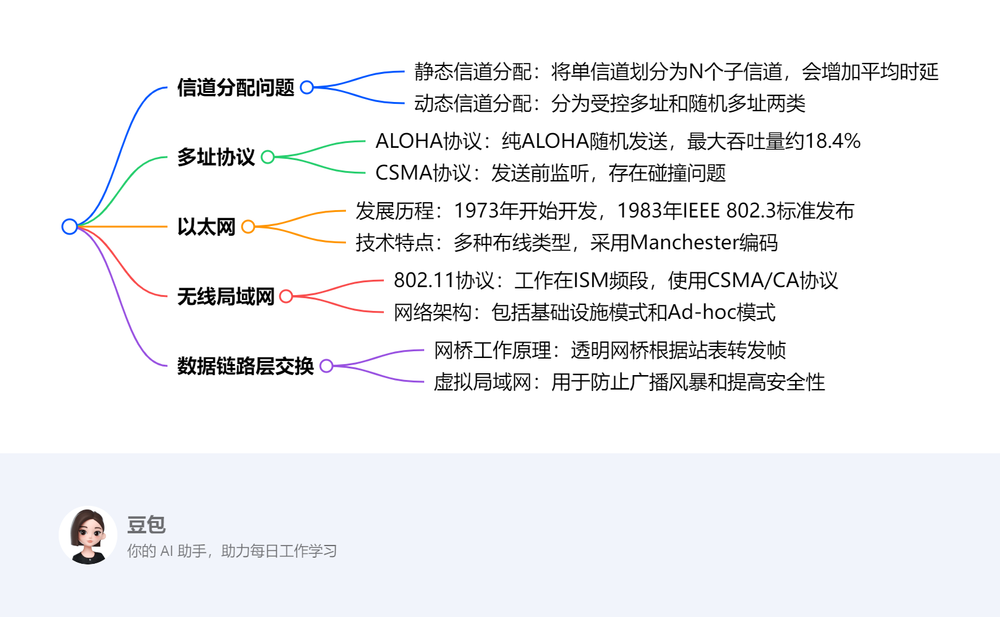
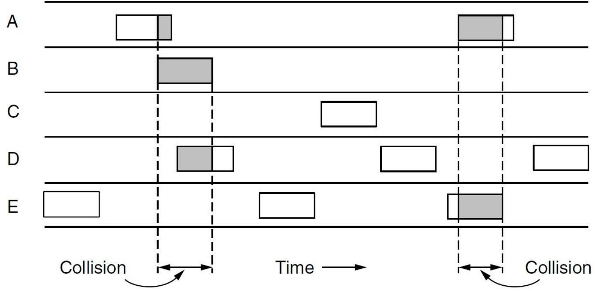
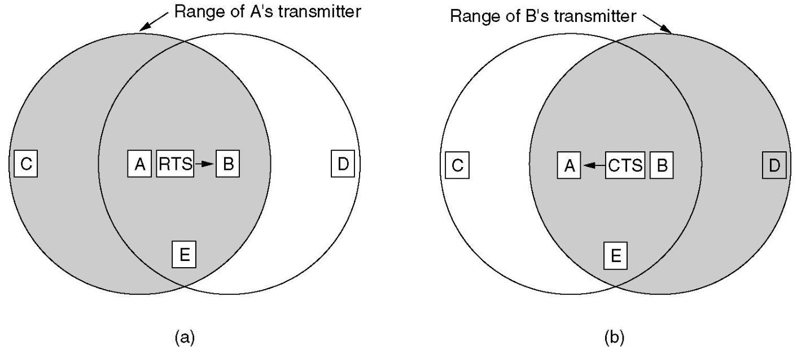
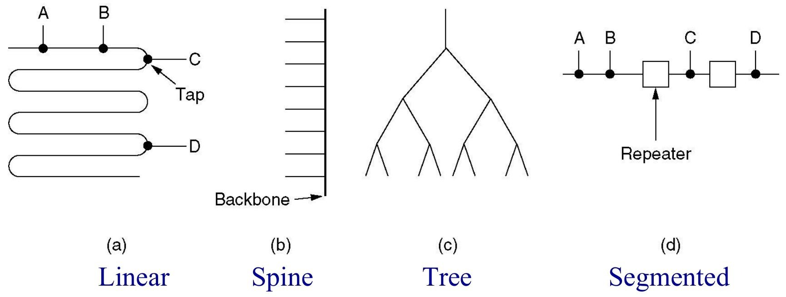
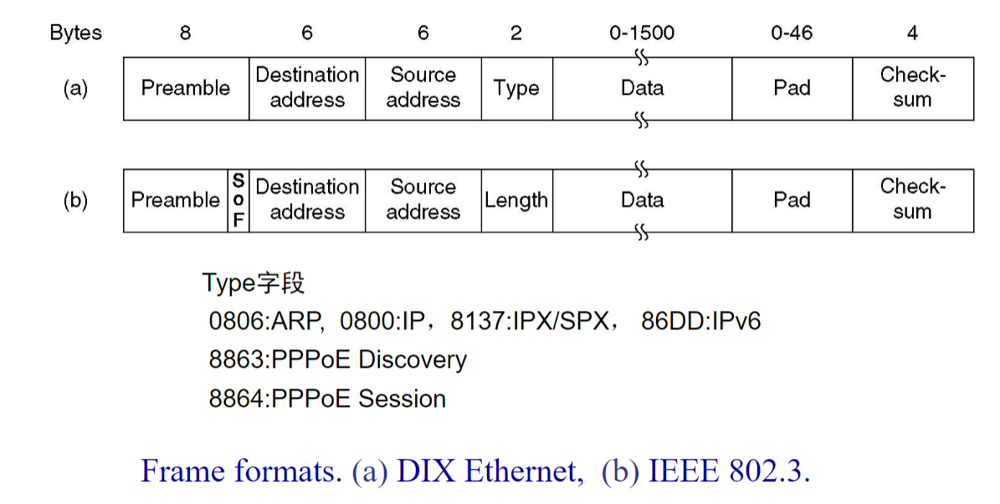
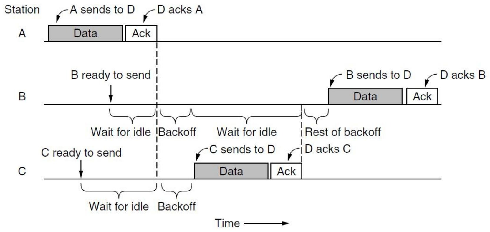
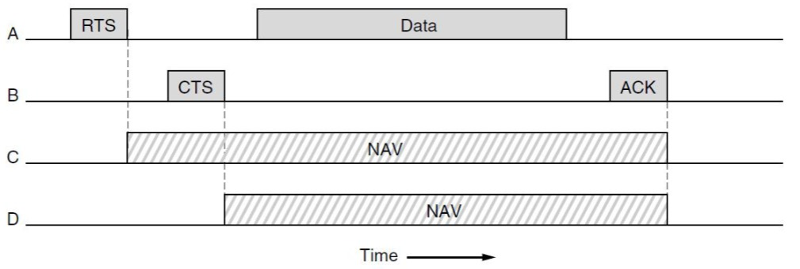
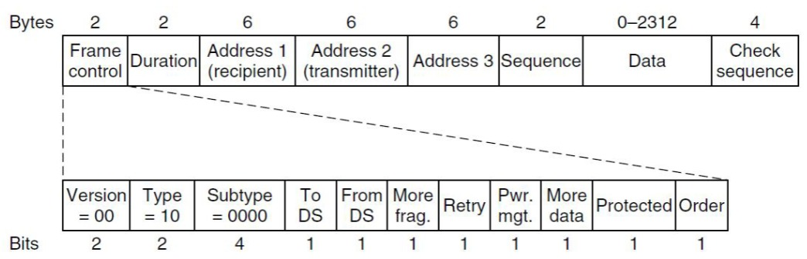
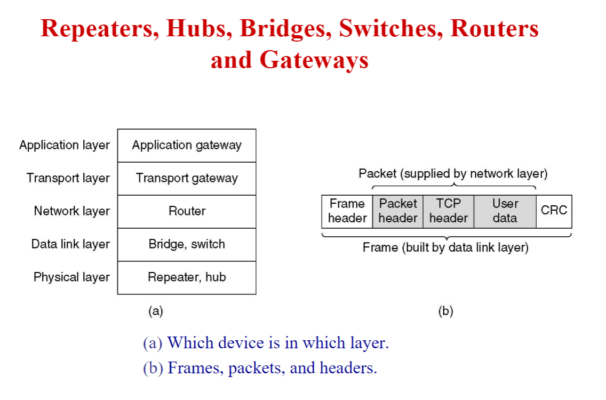

# The Medium Access Control Sublayer
---
### 一段话总结
本文围绕介质访问控制（MAC）子层展开，**介绍了信道分配问题，包括静态和动态分配方式**。阐述了多种多址协议，如ALOHA、CSMA及其相关改进协议。详细讲述了以太网的发展历程、布线、编码、MAC子层协议等，还介绍了快速以太网、千兆以太网的特点。同时涵盖令牌环、802.11无线局域网的相关知识，以及数据链路层交换技术，包括网桥、生成树网桥、虚拟局域网等内容，并给出了相关思考题和作业。

---

---
### 详细总结
1. **信道分配问题**
    - **静态信道分配**：把单信道通过TDM或FDM方式划分为N个独立子信道。根据M/M/1系统公式，单信道平均时延$T=\frac{1}{\mu - \lambda}$，划分后子信道平均时延$T_{sub}=\frac{1}{\frac{\mu}{N}-\frac{\lambda}{N}} = NT$ 。如100Mbps网络，帧长10000比特，$\mu = 10000$帧/秒，$\lambda = 5000$帧/秒时，单信道平均时延为200微秒，划分为10个10Mbps网络后，平均时延变为2毫秒。
    - **动态信道分配**：分为受控多址（集中式如轮询，分散式如令牌环）和随机多址（ALOHA、CSMA、CSMA/CD、CSMA/CA ）。其假设包括单信道、站点模型、碰撞假设、连续时间与时隙时间、载波侦听等。
2. **多址协议**
    - **ALOHA协议**：纯ALOHA中每个站点任意发送帧，若发生碰撞，发送方随机等待后重发。其性能分析基于帧按泊松分布生成等假设，吞吐量$S = G\times e^{-2G}$，当$G = 0.5$时，最大吞吐量约为$18.4\%$ 。
    - **CSMA协议**：发送前监听信道，若忙则等待至空闲后发送。CSMA/CD在检测到碰撞时立即中止传输以节省时间和带宽。而无线局域网中因无法检测碰撞、存在隐藏站和暴露站问题等，CSMA/CD不适用，采用CSMA/CA协议，通过随机退避、发送RTS/CTS帧等方式避免碰撞。
3. **以太网**
    - **发展历程**：1973年Xerox PARC开始开发，1976年成功连接100个工作站，1980年Digital Equipment Corp、Intel Corp和Xerox发布以太网DIX标准，同年IEEE 802标准化进程开始，1983年IEEE 802.3标准发布。
    - **技术特点**：有多种布线类型，如10Base5（厚同轴电缆，最大段长500m ，100个节点/段）、10Base2（细同轴电缆，185m ，30个节点/段）、10Base-T（双绞线，100m ，1024个节点/段 ）、10Base-F（光纤，2000m ，1024个节点/段）。采用Manchester编码，用于识别0/1、时钟同步和碰撞检测。MAC子层协议帧格式包含前导码、目的地址、源地址等字段，Type字段用于标识上层协议。
    - **发展演进**：快速以太网（802.3u）保持原有帧格式等，降低比特时间，缩短最大电缆长度；千兆以太网（802.3z）使以太网速度提升10倍，保持向后兼容，有多种布线类型和编码方式。
4. **无线局域网**
    - **802.11协议**：工作在ISM（900M、2.4G、5.7G）频段，如2.4G频段有13个信道可用。采用CSMA/CA协议，发送前随机退避，通过物理和虚拟传感检测信道。有多种帧间间隔（IFS），如SIFS（10微秒）用于ACK帧等，DIFS（28微秒）用于常规数据帧 。
    - **网络架构**：包括基础设施模式（通过接入点连接网络）和Ad-hoc模式（站点直接通信）。提供多种服务，如关联、重关联、认证、数据传输、隐私服务等。
5. **数据链路层交换**
    - **网桥工作原理**：透明网桥以混杂模式工作，根据站表转发帧。站表通过逆向学习构建，可适应拓扑结构动态变化。生成树网桥通过BPDU（桥协议数据单元）构建无环拓扑，避免环路问题。
    - **虚拟局域网**：用于防止广播风暴和提高安全性，通过VLAN ID标识不同虚拟局域网。IEEE 802.1Q标准定义了带VLAN标签的帧格式，交换机接口有Access模式（帧不带VLAN标签）和Trunk模式（帧带VLAN标签） 。
---
### 关键问题
1. **为什么无线局域网不直接延续CSMA/CD协议？**
    - 答案：无线系统无法在碰撞发生时检测到碰撞，因为接收信号比发送信号弱很多；且无线电发射器有固定范围，部分无线局域网中并非所有站点都在彼此范围内，存在隐藏站和暴露站问题，还会出现干扰在接收端而非发送端的情况，导致无法载波侦听，所以CSMA/CD不适合无线局域网。
2. **以太网的最大帧长度和最短帧长度是如何确定的？**
    - 答案：最大帧长度为1514字节（数据长度1500字节），这是基于1978年收发器需要足够RAM存储一帧，当时RAM昂贵。最短帧长度为64字节，对于10Mbps、最大长度2500米且有4个中继器的LAN，往返时间在最坏情况下为50微秒，加上安全余量51.2微秒（对应64字节），以确保在可能的碰撞发生时发送方仍在发送，防止站点在碰撞前完成传输。
3. **虚拟局域网（VLAN）是如何防止广播风暴的？**
    - 答案：VLAN通过将一个物理LAN划分为多个逻辑LAN，限制了广播域的范围。当一个站点发送广播帧时，该帧只会在其所属的VLAN内传播，不会扩散到其他VLAN，从而避免了广播帧在整个网络中泛滥，防止广播风暴占用过多网络带宽和资源，提高网络性能和安全性。 
## 4.1 The Channel Allocation Problem
该部分内容主要围绕信道分配问题展开，涵盖MAC层地位、信道分配策略、M/M/1系统相关计算，还介绍了动态信道分配的分类、假设等内容，具体如下：

1. **信道分配问题**
    - **MAC层地位与信道分配策略**：MAC层在通信中起着关键作用，负责信道分配。信道分配策略主要有静态信道分配和动态信道分配两种。
    - **M/M/1系统**：是一种排队模型。公式\(P[k]=\frac{(\lambda T)^{k} e^{-\lambda T}}{K!}\)用于计算在时间段\(T\)内到达数量为\(K\)的概率，其中\(\lambda\)为平均到达率 ，平均等待时间\(T=\frac{1}{\mu - \lambda}\)，\(\mu\)为平均服务率。
    - **静态信道分配**：将单信道通过时分复用（TDM）或频分复用（FDM）方式划分为\(N\)个独立子信道。根据公式推导，子信道的平均时延\(T_{sub}=N\times T\) 。例如，在单信道数据传输速率为100Mbps，帧长10000比特，\(\mu = 10000\)帧/秒 ，\(\lambda = 5000\)帧/秒时，平均时延为200微秒；将信道划分为10个10Mbps的子信道后，平均时延变为2毫秒。
2. **动态信道分配**
    - **分类**：分为受控多址和随机多址。受控多址包括集中式的轮询和分散式的令牌环；随机多址包括ALOHA、CSMA、CSMA/CD、CSMA/CA等协议。
    - **假设条件**
        - **站点模型**：有\(N\)个独立站点，每个站点有生成帧用于传输的程序，帧生成后站点会被阻塞，直到帧成功传输。
        - **单信道假设**：所有通信仅使用一个信道，所有站点都能在该信道上收发数据，且站点地位等效，但协议软件可赋予不同优先级。
        - **连续时间与时隙时间**：连续时间下帧传输可在任意时刻开始；时隙时间将时间划分为离散间隔（时隙），帧传输总是在时隙开始时进行，一个时隙可能包含0个（空闲时隙）、1个（成功传输）或多个（碰撞）帧。
        - **载波侦听**：分为有载波侦听和无载波侦听。有载波侦听时站点在使用信道前能判断信道是否被占用，若忙则不尝试使用；无载波侦听时站点直接发送数据，之后才能确定传输是否成功。
        - **碰撞假设**：若两个帧同时传输会产生重叠，导致信号干扰。有线信道可检测碰撞，无线信道通过是否收到ACK帧推断碰撞。发生碰撞的帧需在之后重新传输，这是MAC层的责任。 
## 4.2 Multiple Access Protocols
### ALOHA
该部分内容主要介绍了ALOHA协议和CSMA协议相关内容，具体如下：

1. **ALOHA协议**
    - **纯ALOHA工作机制**：每个站点任意发送帧，通过共享相同的上游频率向中央计算机发送。站点发送帧后，中央计算机重新广播该帧。若发生碰撞，发送方等待随机时间后重发。
    - **性能分析**
        - **假设条件**：帧长度固定，帧时间为\(t\)；新帧和重传帧的产生符合泊松分布。
        - **参数定义**：吞吐量\(S\)指每帧时间内成功传输的平均帧数，范围是\(0\leq S\leq1\)；网络负载\(G\)指每帧时间内的平均帧数，且\(G\geq S\)。
        - **计算公式与结论**：成功传输概率\(P = e^{-2G}\)，吞吐量\(S = G\times e^{-2G}\) 。当\(G = 0.5\)时，吞吐量达到最大值，\(S = \frac{1}{2e} \approx 18.4\%\)。
2. **CSMA协议**
    - **基本原理**：站点在发送前监听载波，若信道忙，则等待至空闲后立即发送帧。
    - **碰撞原因**：由于信号传播存在时延，当两个或多个站点检测到信道空闲并同时开始发送时，就会发生碰撞。例如，站点\(A\)和\(B\)之间存在传播时延\(\tau\) ，可能出现\(A\)和\(B\)都检测到信道空闲而同时发送的情况。
    - **CSMA/CD（带碰撞检测的CSMA）**
        - **工作原理**：站点一旦检测到碰撞，立即中止传输，以节省时间和带宽。当站点检测到信道空闲时，立即发送并持续监听，一旦发生碰撞，马上停止传输。
        - **信道状态**：存在竞争（Contention）、传输（Transmission）和空闲（Idle）三种状态。在竞争阶段，多个站点可能同时尝试访问信道；传输状态表示站点正在发送数据；空闲状态表示信道未被使用。 
### Wireless LAN Protocols
该部分内容围绕无线局域网协议展开，主要介绍了无线局域网存在的问题、MACA协议及其碰撞处理机制，具体如下：

#### 无线局域网存在的问题
- **无线收发特性相关**：无线系统在冲突发生时无法检测，需借助ACK帧来发现冲突；无线电发射器有固定范围，部分无线局域网中站点间并非都能相互通信，干扰出现在接收端而非发送端，导致无法载波侦听，所以CSMA/CD协议不适用。 
- **隐藏站与暴露站问题**
    - 隐藏站（Hidden Station）
        - **定义**：在无线局域网中，一个站点处于其他站点的信号覆盖范围之外，导致它无法监听到其他站点正在进行的通信，从而在不知情的情况下发送数据，进而可能与其他站点的传输产生冲突，这样的站点被称为隐藏站。
        - **举例**：假设有三个站点A、B、C ，A和C都在与B通信，但A和C彼此不在对方的信号覆盖范围内。当A向B发送数据时，C由于听不到A的信号，可能会误以为信道空闲，也向B发送数据，此时就会在B处发生数据冲突。在这种情况下，C对于A来说就是隐藏站 。从网络层面看，隐藏站问题会降低网络的传输效率，因为冲突发生后需要重传数据，浪费了信道资源。 

    - 暴露站（Exposed Station）
        - **定义**：无线局域网中，一个站点能监听到其他站点正在进行的通信，但实际上它自己的发送并不会干扰到正在进行的通信，然而却因为监听到信号而错误地认为自己不能发送数据，这样的站点就是暴露站。
        - **举例**：还是以A、B、C三个站点为例 ，A向B发送数据，C能听到A的信号。但实际上，C如果此时向另一个不在A通信范围内的站点D发送数据，并不会对A到B的通信产生干扰。可C因为听到了A的信号，误以为信道被占用，而放弃向D发送数据，此时C就是暴露站 。暴露站问题会导致信道资源不能被充分利用，降低了网络的吞吐量，因为原本可以同时进行的传输被不必要地阻止了。 

#### MACA协议（避免冲突多路访问）
- **工作流程**
    - **步骤1**：A向B发送RTS帧（30字节，包含数据长度） 。
    - **步骤2**：B回复CTS帧（包含从RTS帧获取的数据长度） 。
    - **步骤3**：A收到CTS帧后开始数据传输。 
- **不同站点处理方式**
    - **暴露站（如C）**：听到RTS但没听到CTS，只要不干扰CTS，在数据帧发送期间可自由传输。
    - **隐藏站（如D）**：听到CTS但没听到RTS，需延迟发送，直到预期帧传输结束。 
    - **同时听到RTS和CTS的站点（如E）**：必须保持静默，直到数据帧传输完成。 

#### MACA协议中的碰撞处理
若两个站点同时向A发送RTS帧，发送不成功（在预期时间间隔内没收到CTS）的站点等待随机时间后重试，采用二进制指数退避算法，与以太网相同。 
## 4.3 Ethernet
### Ethernet Cabling
该部分内容主要介绍了以太网布线的常见类型，具体如下：
#### 以太网布线类型概述
| Name      | Cable        | Max. seg. | Nodes/seg. | Advantages              |
|-----------|--------------|------------|-------------|-------------------------|
| 10Base5   | Thick coax   | 500 m      | 100         | Original cable; now obsolete |
| 10Base2   | Thin coax    | 185 m      | 30          | No hub needed           |
| 10Base - T| Twisted pair | 100 m      | 1024        | Cheapest system         |
| 10Base - F| Fiber optics | 2000 m     | 1024        | Best between buildings  | 

#### 10Base2（细以太网）
- **线缆规格**：使用直径为Φ5的同轴电缆（Coax） ，最大段长185米。
- **连接部件**：采用BNC T型连接头（BNC T - junction connector） 。
- **设备位置**：收发器电子元件位于控制器板上。 
#### 10Base - T
- **连接方式**：站点通过专用电缆（最大长度100米）连接到集线器（HUB），不存在共享电缆 。物理上呈星状结构，逻辑上为总线结构，任意站点发送数据时所有站点都能接收 。
- **HUB功能**：可对媒体信号进行再生（放大和整形） 。
- **接口与线缆**：使用RJ - 45接口和5类非屏蔽双绞线（UTP，Unshielded Twisted Pairs） 。采用两对线，分别用于接收和发送数据，通过差分传输减少电磁干扰，同一线对绞合可减少近端串扰 。此外，还提及了3类UTP以及屏蔽双绞线（STP，Shielded Twisted Pairs） 。 
### Manchester Encoding
该部分内容介绍了Manchester编码的要求，具体如下：

- **识别数据**：要求接收方能够识别0和1，以及区分非0/1的情况 。这是准确获取传输数据信息的基础，只有正确识别，才能保证数据接收的准确性。
- **时钟同步**：编码需实现时钟同步功能。在数据传输中，发送方和接收方的时钟同步至关重要，能确保接收方准确接收和处理数据，避免因时钟不同步导致数据错位、误读等问题。 
- **碰撞检测**：具备碰撞检测功能。在网络传输中，当多个设备同时发送数据时可能产生碰撞，通过Manchester编码的碰撞检测功能，可及时发现这种情况，以便采取相应措施（如重传数据等），保障网络数据传输的可靠性 。 
### Ethernet MAC Sublayer Protocol
该部分内容主要围绕以太网MAC子层协议展开，涵盖帧格式、地址、帧长度、二进制指数退避算法及性能等关键方面，具体如下：

1. **帧格式中的Type字段**
    这部分内容展示的是以太网MAC子层协议的帧格式，分别介绍了DIX以太网（a）和IEEE 802.3（b）两种帧格式各字段的字节数及含义。
    1. **前导码（Preamble）**：长度为8字节，用于使接收端与发送端时钟同步，以便正确接收后续数据。它由特定的比特模式组成，接收端通过识别该模式来锁定发送端的时钟信号，保证数据接收的准确性。
    2. **目的地址（Destination address）**和**源地址（Source address）**：均为6字节，目的地址标识帧的接收设备，源地址标识发送设备，它们采用MAC地址进行编码，全球唯一，确保数据能准确传输到目标设备。
    3. **类型（Type）/长度（Length）字段**：2字节。在DIX以太网帧格式（a）中为Type字段，用于标识上层协议类型，如0806表示ARP协议，0800表示IP协议等；在IEEE 802.3帧格式（b）中为Length字段，用来指示数据字段的长度。
    4. **数据（Data）字段**：长度范围是0 - 1500字节，用于承载上层传递下来的数据包。实际传输数据时，若数据长度小于最小值，需进行填充；若大于最大值，则可能需要分片处理。
    5. **填充（Pad）字段**：长度为0 - 46字节。当数据字段长度不足时，使用填充字段将帧填充到最小长度（64字节），以满足CSMA/CD协议的要求，确保冲突能在数据传输过程中被及时检测到。
    6. **校验和（Check - sum）**：4字节，用于检测帧在传输过程中是否出现错误。发送端根据帧的其他字段计算出校验和值并填入该字段，接收端接收到帧后重新计算校验和并与接收到的校验和值进行比较，若不一致，则说明帧在传输过程中出现错误，需要丢弃或要求重传。 
2. **IEEE 802地址**：即MAC地址，共48位。其中，Bit47（I/G）位用于区分普通地址（0表示单个设备地址）和组地址（1表示多播或广播地址 ）；Bit46（U/L）位区分全球地址（0，由IEEE统一分配 ）和本地地址（1，由网络管理员自行分配 ）；Bit45 - 24位（当Bit47 = 0且Bit46 = 0时）为OUI（组织唯一标识符），由IEEE分配给设备厂商；Bit23 - 0位由厂家为网卡分配具体地址。例如，f8:bc:12:9e:06:bc中，I/G = 0，U/L = 0，OUI = f8:bc:12（对应Dell公司） 。
3. **帧长度**
    - **最大帧长度**：为1514字节，其中数据部分为1500字节。这是因为在1978年，收发器的RAM成本较高，限制帧大小可减少对内存的需求。
    - **最小帧长度**：有效帧至少为64字节。对于10 - Mbps LAN，在最大长度2500米且有4个中继器的情况下，最坏情况下往返时间（rtt）为50微秒，加上安全余量51.2微秒，对应的数据量为64字节。若数据部分小于46字节，需使用Pad字段填充至最小尺寸，以确保在可能发生冲突时，发送站在传输完成前能检测到冲突，这与网络速度和最大电缆长度相关。
4. **二进制指数退避算法**：在网络通信中，当多个站点同时尝试传输数据时就会发生冲突。该算法的基本思想是，每次冲突发生后，站点等待的随机时间会以二进制指数的方式增长。以时间槽（time slots）为单位设置等待时间，这里时间槽长度为512位时间，即51.2微秒。在第1次冲突后，站点会在0到1个时间槽之间随机选择一个等待时间；第2次冲突后，在0到3（$2^2 - 1$）个时间槽之间选择；以此类推，到第9次冲突，在0到511（$2^9 - 1$）个时间槽之间选择。从第10次冲突开始直至第16次冲突，随机等待时间范围固定在0到1023（$2^{10} - 1$）个时间槽 。
5. **IEEE 802.3性能**：信道效率公式为\(\frac{1}{1 + 2eBL/cF}\) ，其中F为帧长度，B为带宽，L为电缆长度，c为信号传播速度，BL/cF是以帧时间长度归一化的单向传播时延α，e为自然常数。该公式反映了帧长度、带宽、电缆长度和信号传播速度等因素对以太网性能的综合影响。 
### Switched Ethernet
#### Hub & Switch
Hub（集线器）和Switch（交换机）是网络设备，在数据传输和冲突域管理方面有不同表现。

1. **Hub（集线器）**：工作在物理层，所有端口共享带宽，属于同一个冲突域。它会将接收到的信号进行简单放大和转发，从一个端口进入的帧会被广播到其他所有端口，不具备根据地址进行智能转发的能力。比如有多个设备连接到集线器，一个设备发送数据时，其他设备都能收到，容易引发冲突，降低网络效率。 
2. **Switch（交换机）**：工作在数据链路层，基于MAC地址转发数据帧。
    - **转发机制**：交换机只将帧输出到目的端口。当端口接收到帧后，会检查帧中的地址字段，确定目标设备的MAC地址。然后通过高速背板将帧转发到对应的目的端口，背板速度通常可达数Gbps，能快速传输数据。
    - **数据传输**：目的端口收到帧后，再将其发送到目标设备。这个过程中，其他非目的端口不会收到该帧，也不知道该帧的存在。这使得数据传输更具针对性，减少了不必要的网络流量，提高了网络性能和安全性。例如，在一个有多个设备连接到交换机的网络中，设备A向设备B发送数据，交换机只会将数据帧转发到连接设备B的端口，其他设备不会受到干扰 。 
#### Collision domain
Collision domain即冲突域，是指在局域网中，多个设备同时发送数据时可能产生冲突的区域。在这个区域内，如果两个或多个设备同时传输数据，它们的信号会相互干扰，导致数据传输错误，下面结合Hub和Switch进行说明：

1. **Hub（集线器）与冲突域**：使用Hub连接的所有站点都处于同一个冲突域。Hub是一种物理层设备，它会将接收到的信号进行广播式转发，从一个端口进入的信号会被发送到其他所有端口。这就意味着当多个站点同时发送数据时，信号会在共享的线路上相互碰撞，产生冲突。为了减少冲突的发生，这种情况下通常采用CSMA/CD（载波监听多路访问/冲突检测）协议，站点在发送数据前先监听信道是否空闲，若空闲则发送数据，并在发送过程中继续监听是否发生冲突，一旦检测到冲突，立即停止发送并等待一段时间后重新尝试。 
2. **Switch（交换机）与冲突域**
    - **独立冲突域**：交换机的每个端口都是一个独立的冲突域。交换机工作在数据链路层，它能够根据数据帧中的MAC地址进行转发决策。当一个端口接收到数据帧时，交换机会检查帧的目的MAC地址，并将其转发到对应的目的端口，而不会向其他无关端口广播。这就使得不同端口之间的数据传输相互隔离，每个端口上的设备在发送数据时不会与其他端口上的设备产生冲突 。
    - **全双工和半双工模式**
        - **全双工模式**：在全双工模式下，连接到交换机端口的站点和端口本身都可以同时发送帧。由于发送和接收可以同时进行，且互不干扰，所以不会产生冲突，也就不再需要CSMA/CD协议。例如，在一个全双工的网络连接中，计算机可以在接收数据的同时发送数据，大大提高了网络的传输效率 。
        - **半双工模式**：在半双工模式下，站点和端口必须通过CSMA/CD协议来竞争传输机会。因为在半双工模式下，同一时刻站点和端口只能进行发送或接收操作，不能同时进行。如果多个站点同时尝试发送数据，就可能会产生冲突，所以需要CSMA/CD协议来协调数据的发送，避免冲突的发生。 
### Fast Ethernet
该部分内容主要围绕快速以太网（Fast Ethernet）展开，涵盖其定义、特性、线缆类型、互连设备及自动配置功能，具体如下：

1. **快速以太网概述**：即802.3u标准，是以太网的升级版本。其发展原因包括需要与现有以太网局域网向后兼容、担心新协议存在未知问题，以及期望在技术变革前完成升级工作 。
2. **技术特点**
    - **保留传统**：保持旧有的帧格式、接口和程序规则，便于与传统以太网共存和交互。
    - **提升速率**：将位时间从100纳秒减少到10纳秒，提高了数据传输速率。
    - **调整线缆**：最大电缆长度缩短为原来的十分之一，且所有快速以太网系统使用集线器和交换机，不再允许使用带有vampire taps或BNC连接器的多分支电缆 。

    | 名称 | 线缆类型 | 最大网段长度 | 优势 |
    | ---- | ---- | ---- | ---- |
    | 100Base-T4 | 双绞线 | 100米 | 采用3类非屏蔽双绞线（UTP） |
    | 100Base-TX | 双绞线 | 100米 | 支持100Mbps全双工传输 |
    | 100Base-FX | 光纤 | 2000米 | 支持100Mbps全双工传输，适合长距离布线 | 

3. **线缆类型 - 100Base - TX**：使用125MHz的信令速度，需要2对5类非屏蔽双绞线（category 5 UTP），一对用于连接到集线器/交换机，另一对用于从集线器/交换机接收数据 。采用4B/5B编码方式，通过计算\(125×4÷5 = 100Mbps\)，实现100Mbps的数据传输速率 。
4. **互连设备**
    - **集线器（Hub）**：工作在半双工模式，所有进线逻辑连接，形成一个280米的冲突域。遵循与传统以太网相同的标准规则，包括二进制指数退避算法，但100Base - FX不允许使用集线器 。
    - **交换机（Switch）**：接收到的帧先进行缓冲，再转发到目的地。由于100Base - FX电缆过长，不适用于冲突算法，所以必须连接到交换机 。
5. **自动配置功能**：803.3u标准提供了一种机制，允许两个站点协商速度（10Mbps或100Mbps）和双工模式（半双工或全双工） 。大多数快速以太网产品利用该功能实现自动配置，方便了网络的部署和管理。 
### Gigabit Ethernet
该部分内容主要介绍了千兆以太网（Gigabit Ethernet）及其相关技术，还提及了令牌环和以太网长寿的原因，具体如下：

1. **千兆以太网（802.3z）**
    - **目标**：速度提升至传统以太网的10倍；保持与现有以太网标准向后兼容；提供支持单播和多播的无确认数据报服务；沿用48位地址方案；维持原有帧格式，包括最小和最大帧尺寸 。
    - **布线类型及编码**：1000Base - SX和1000Base - LX采用8B/10B编码，工作频率1250MHz；1000Base - T需4对5类非屏蔽双绞线（category 5 UTP），采用125MHz的PAM5编码 。

    |名称|线缆类型|最大网段长度|优势|
    |--|--|--|--|
    |1000Base-SX|光纤|550m|使用50、62.5微米的多模光纤|
    |1000Base-LX|光纤|5000m|支持10微米单模或50、62.5微米多模光纤|
    |1000Base-CX|2对屏蔽双绞线（STP）|25m|采用屏蔽双绞线|
    |1000Base-T|4对非屏蔽双绞线（UTP）|100m|使用标准5类非屏蔽双绞线| 

    - **工作模式**
        - **交换机（全双工模式）**：不存在竞争，无需使用CSMA/CD协议，电缆最大长度由信号强度决定 。
        - **集线器（半双工模式）**：模拟传统以太网，内部电气连接所有线路，可能发生冲突，需使用CSMA/CD协议 。存在网络半径仅25米的问题，通过载波扩展（在普通帧后添加填充使帧扩展到512字节，由发送和接收硬件分别添加和移除填充）和帧突发（允许发送方在一次传输中发送多个帧的串联序列 ），可将网络半径维持在200米 。
    - **流量控制**：由于千兆以太网速度高达1Gbps，接收方易出现缓冲区溢出。通过发送特殊控制帧（类型为0x8808的普通以太网帧，数据字段前两字节为命令，后续字节为参数），如PAUSE帧（持续时间512ns - 33.6ms） ，让接收方暂停接收数据，避免缓冲区溢出 。
2. **令牌环**：各站点按预定义顺序依次发送帧，令牌帧和数据帧在环中循环，到达目的站后，需有站点（发送站或接收站）将数据帧从环中移除，防止其无限循环 。
3. **以太网长寿的原因**：遵循KISS原则（保持简单）；可靠性高，如10base2使用BNC接口、10BaseT等；成本低，细以太网和双绞线布线以及接口卡价格便宜；易于维护，无需安装软件和管理配置表，添加新主机简单，直接插入即可 。 
## 802.11 Wireless LANs
该节主要围绕802.11无线局域网展开，涵盖频段规定、架构协议、传输机制、功率管理、帧格式及服务等方面内容，具体如下：

1. **频段规定**：802.11无线局域网使用ISM频段，其中2.4G频段应用广泛。该频段工作频率带宽83.5MHz（2.401 - 2.483GHz），最多有13个信道，所选用频道中心频率间隔不低于25MHz，最多可同时使用三个频道 。
2. **架构与协议栈**：802.11无线局域网有基础设施模式（通过接入点连接网络）和自组网模式。协议栈包含物理层、MAC层和逻辑链路控制层等。
3. **介质访问控制（MAC）**
    - **CSMA/CA协议**：因无线设备半双工特性、接收信号弱导致碰撞检测机制失效，802.11采用CSMA/CA协议避免冲突。发送帧时，除近期未使用信道且信道空闲的情况外，站点先随机退避（0 - 15个时隙），接着在检测到信道空闲（DIFS时长内无信号）后，开始倒计时空闲时隙，期间若有其他帧发送则暂停，计数器为0时发送帧。若收到ACK确认帧则传输成功，未收到则加倍退避周期并重发。
    - **信道检测**：包含物理检测（检查介质是否有有效信号）和虚拟检测（各站通过跟踪网络分配向量NAV记录信道使用情况，每个帧携带NAV，数据帧的NAV包含发送ACK所需时间，还有可选的RTS/CTS机制 ）。
    - **提高传输成功率**：支持速率自适应，根据信号质量调整传输速率，丢帧过多时降低速率，丢帧少时尝试提高速率。还允许将帧拆分为片段，每个片段单独编号和校验，采用停等协议确认。
    - **帧间间隔（IFS）**：802.11定义了多种IFS。SIFS用于ACK帧、RTS/CTS等控制帧序列和片段突发；AIFS1用于PCF、语音等高优先级流量；DIFS用于常规数据帧；AIFS4用于背景流量。不同的IFS时长不同，如802.11g中SIFS/AIFS1/DIFS = 10/19/28us 。
    - **PCF点协调功能**：与DCF分布式协调功能并存，但因未纳入Wi-Fi联盟互操作性标准，仅在少数硬件设备中实现。AP定期（0.1s）发送信标帧，信标帧之间的超帧包含无竞争期（CFP）和竞争期（CP）。CP中使用DCF，CFP中AP按顺序向各站发送轮询报文，给予其发送权限，AP轮询时遵循PIFS < DIFS确保访问优先权，轮询报文和回答都需等待SIFS 。
4. **功率管理**
    - **节能模式**：AP周期性广播信标帧（如每100ms一次），客户端可在发送给AP的帧中设置功率管理位进入节能模式，此时AP会缓存发给该客户端的流量，客户端通过向AP发送轮询消息获取数据。
    - **APSD自动功率节省传输**：AP缓存帧，并在客户端发送帧后立即将缓存的帧发送给客户端。
5. **QoS（服务质量） - TXOP**：传统CSMA/CA机制下，不同速率站点平均分配带宽。而TXOP机制使各站获得相等的空中时间，而非相等的帧数。例如，6Mbps和54Mbps的站点在TXOP机制下，分别能获得3Mbps和27Mbps的速率。
6. **帧类型**：802.11帧分为数据帧、控制帧（RTS、CTS、ACK）和管理帧（信标帧、探测帧、认证和解除认证帧、关联和重新关联帧等）。
7. **数据帧格式**：包含类型、子类型、ToDS和FromDS位（标识帧与分发系统的传输方向）、更多片段位、重试位、功率管理位、更多数据位、保护帧位、持续时间字段、地址字段（数据帧2 - 4个，管理帧1个 ）、序列字段（用于检测重复帧，4位标识片段，12位随新传输递增 ）和数据字段（最大2312字节 ）。
8. **服务**
    - **关联服务**：移动站用于连接AP，可从信标帧或直接向AP询问获取其身份和能力信息，包括支持的数据速率、安全设置、节能能力和QoS支持等。
    - **重新关联服务**：允许站点更换首选AP。 
## 4.4 Data Link Layer Switching
### Local Internetworking
该节内容主要介绍了数据链路层交换中与本地互联网络相关的内容，具体如下：

- **数据链路层交换的需求**：在本地互联网络场景下，数据链路层交换存在多方面需求。一是受物理距离限制，长距离传输信号易衰减，需要进行处理；二是为适应网络负载，将单个局域网分割成多个，形成多个冲突域，以减少冲突发生概率，提升网络性能；三是基于安全考虑，在混杂模式下，网络设备能接收所有经过的帧，可能导致信息泄露，数据链路层交换可对此进行管控。
- **网桥**：作为数据链路层的重要设备，网桥在网络中发挥关键作用。它能够连接多个局域网，通过对帧的接收、处理和转发，实现不同局域网间的通信。其工作原理是依据站表信息，对收到的帧进行判断和转发操作，从而确保数据在不同局域网之间正确传输 。
#### 混杂模式 
混杂模式是网络设备的一种工作模式。在该模式下，网络设备（如网卡、网桥等）会接收并处理所有经过它的网络帧，而不仅仅是发送给自己的帧。

- **工作原理**：正常情况下，网络设备只接收目的地址是自身MAC地址或广播地址、组播地址的帧。但在混杂模式下，设备会捕获网络上传输的所有帧，不管帧的目的地址是什么。例如，在一个以太网中，普通网卡只处理目的MAC地址为自己的帧，而处于混杂模式的网卡会接收总线上传输的所有帧。
- **应用场景**：常用于网络监测和故障排查，网络管理员可以通过将设备设置为混杂模式，使用抓包工具捕获网络中的数据包，分析网络流量，查看是否存在异常的网络活动、故障原因等。在网络安全领域，入侵检测系统（IDS）也可能利用混杂模式来监测网络中的可疑流量，及时发现潜在的安全威胁。
- **潜在风险**：由于可以获取大量网络数据，若被恶意利用，可能导致信息泄露，威胁网络安全。比如，攻击者可以利用处于混杂模式的设备捕获用户的账号密码、敏感文件等信息。 
### Transparent Bridge
该部分内容围绕透明网桥展开，介绍了其工作模式、站表相关机制以及应对动态拓扑的方法，具体如下：
#### 工作模式
透明网桥工作在混杂模式（promiscuous mode） ，能接收其连接的所有局域网中传输的每一帧。
#### 站表（Station table）
 - **功能**：列出每个可能的目的地址，并指明其所属的输出线路（即连接的局域网） 。
 - **初始化**：网桥刚接入网络时，所有哈希表（站表）为空。 
 - **添加表项**：利用混杂模式工作特性，网桥能看到连接局域网中发送的所有帧。通过查看帧的源地址，网桥可确定哪台机器在哪个局域网上可访问，进而添加到站表。 
#### 帧的路由处理流程
 - 若目的局域网（destination LAN）和源局域网（source LAN）相同，丢弃该帧。
 - 若目的局域网和源局域网不同，转发该帧。 
 - 若目的局域网未知，或目的地址为组播/广播地址，采用洪泛法（flooding algorithm） ，即向网桥连接的除接收该帧所在局域网外的所有局域网输出该帧。 
#### 动态拓扑应对
##### 含义
“Dynamic topologies”即动态拓扑，指网络拓扑结构会随着机器（如计算机等设备）和网桥的加电、断电以及位置移动而发生改变 。

##### 存在的问题
当机器和网桥进行加电、断电操作，或者位置发生移动时，网络的拓扑结构会相应改变。这可能导致网桥站表中的信息过时或错误，使得网桥无法准确转发帧，影响网络通信。

##### 解决方案
在网桥的站表中，为每个表项增设“arrival time”（到达时间）域，具体操作如下：

- **记录时间**：每当创建一个新的表项时，在该表项中记录对应帧的到达时间。
- **更新时间**：若源地址已存在于站表中的帧再次到达，用当前时间更新该表项中的到达时间。
- **定期清理**：定期扫描站表，删除存在时间超过几分钟的旧表项。这样做有以下好处：
    - 避免已关机的站点长期占用表项，保证表项能及时反映当前网络中活跃的站点。
    - 当计算机从一个局域网移动到另一个局域网时，几分钟内旧表项会被删除，之后计算机再次发送帧时，网桥会重新学习其新位置并更新站表，从而恢复正常操作。若移动后的站点立刻主动发出数据，网桥能立刻根据新的源地址修正拓扑结构信息。
    - 若一台机器几分钟内没有发送数据，在它下次主动发送帧之前，发往它的流量将采用洪泛法传输，因为此时网桥站表中关于它的信息可能已过时，洪泛法可确保数据能到达该机器 。 
### Spanning Tree Bridges
该部分围绕生成树网桥展开，介绍了拓扑环路问题及解决方案，涉及BPDU等机制，具体如下：
#### 拓扑环路问题
为提高可靠性，部分站点在局域网间并行使用两个或更多网桥，这种方式虽增加可靠性但会在拓扑结构中引入环路，引发网络问题。
#### 生成树网桥解决方案（1983年Radia Perlman提出）
 - **构建生成树**：网桥间相互通信，在实际拓扑结构上构建一棵能覆盖每个局域网的生成树。基于该生成树，每个局域网到其他局域网都仅有一条路径，从而避免环路。构建时会忽略一些局域网间的潜在连接，以形成无环拓扑。
#### 相关机制
Dynamic Topologies指网络拓扑结构的动态变化，在数据链路层交换中，尤其是涉及生成树网桥时，这种动态变化的管理至关重要。其相关概念和机制解释如下：

1. **BPDU（Bridge Protocol Data Unit，网桥协议数据单元）**
    - **定义与功能**：BPDU是一种38字节的消息，用于网桥之间的通信。网桥每隔2秒会向所有端口多播一个BPDU消息，其目的是在网络中传播关于网桥和网络拓扑的信息 。
    - **消息内容**：BPDU包含三个关键信息。一是基于网桥MAC地址生成的ID，用于唯一标识网桥；二是网桥认为的根网桥ID，这是网桥对整个网络根节点的认知；三是该网桥到根网桥的距离，这个距离用于计算最佳路径。
2. **根网桥（Root Bridge of Whole Net）**
    - **选择机制**：在网络中，所有网桥通过交换BPDU消息，选择具有最低ID的网桥作为根网桥。在初始阶段，每个网桥都认为自己是根网桥，但随着BPDU消息的不断交换，所有网桥最终会达成一致，确定唯一的根网桥。
3. **根端口（Root Port of Every Bridge）**
    - **功能与选择原则**：根端口是每个网桥用于记录到根网桥最短路径的端口。当存在多条到根网桥的等效路径时，网桥会选择通过ID最低的网桥的路径所对应的端口作为根端口。这一机制确保了每个网桥都能找到到根网桥的最佳连接。
4. **指定端口（Designated Port of Every LAN）**
    - **判断规则**：对于每个LAN，需要判断其中的网桥端口是否为指定端口。指定端口是离根网桥最近的端口，如果有多个端口到根网桥的距离相等，则选择ID最小的端口作为指定端口。
    - **端口阻塞**：既不是根端口也不是指定端口的网桥端口会被阻塞。被阻塞的端口不会收发数据，这一措施有效避免了网络中的环路，确保数据传输的稳定性。
5. **自动检测与更新机制**：生成树算法在网络正常运行期间持续工作，它会自动检测网络拓扑结构的变化。当有网线断开或新的网桥加入等情况发生时，算法会根据BPDU消息的变化重新计算根网桥、根端口和指定端口，及时更新生成树，保障网络的正常运行 。 
### Repeaters, Hubs, Bridges, Switches, Routers and Gateways
#### Repeaters, Hubs, Bridges, Switches, Routers and Gateways

##### 网络设备的分层
- **物理层（Physical layer）**：包含中继器（Repeater）和集线器（Hub） 。物理层主要负责处理物理介质上的信号传输，中继器用于放大和转发信号，集线器则可看作是多端口的中继器，用于连接多个设备。
- **数据链路层（Data link layer）**：有网桥（Bridge）和交换机（Switch） 。该层负责将物理层接收到的信号组成帧，并进行差错检测和纠正等，网桥和交换机可基于MAC地址对帧进行转发和过滤。 
- **网络层（Network layer）**：路由器（Router）处于这一层。网络层负责对分组进行路由选择，路由器根据IP地址来决定数据包的转发路径。 
- **传输层（Transport layer）**：传输网关（Transport gateway）位于此层。传输层主要为应用程序提供端到端的通信服务，传输网关可对传输层协议进行转换等操作。 
- **应用层（Application layer）**：应用网关（Application gateway）处于该层。应用层为用户的应用程序提供网络服务接口，应用网关可用于实现不同应用协议之间的转换等功能。 

##### 帧、包和头部结构
- 图中展示了一个由数据链路层构建的帧（Frame）结构。帧包含帧头（Frame header）、网络层提供的包（Packet ，包又包含包头Packet header ）、TCP头（TCP header）、用户数据（User data）和循环冗余校验（CRC ） 。这种结构体现了不同层次对数据的封装过程，网络层的包被封装在数据链路层的帧中进行传输。 
#### Hubs, Bridges, Switches
##### 设备图示
展示了集线器（Hub）、网桥（Bridge）、交换机（Switch）的连接示意图：

- **集线器**：所有设备（A - H）直接连接到集线器，集线器作为中心节点，它工作在物理层，只是简单地转发信号 ，连接在集线器上的设备共享同一冲突域。
- **网桥**：将不同主机（A - D）和局域网（LAN，连接E - H ）连接起来，网桥工作在数据链路层，可根据MAC地址对帧进行过滤和转发，隔离冲突域。 
- **交换机**：设备（A - H）连接到交换机，交换机也工作在数据链路层，可看作是多端口的网桥，能基于MAC地址实现更高效的帧转发 。

##### 网桥与交换机特性
- **芯片处理能力**：网桥和交换机采用专用超大规模集成电路（VLSI）芯片 ，能在几微秒内查找和更新站表条目，还涉及专用集成电路（ASIC ） 。这使得它们可以快速处理数据帧，高效地进行转发决策。
- **缓冲区问题**：如果帧进入交换机的速度超过其重传速度，交换机的缓冲区可能会耗尽，进而开始丢弃帧 。这是交换机在数据流量过大时可能面临的问题，会影响数据传输的完整性。 
- **直通式交换机（Cut - through switches）**：仅提及名称，未展开介绍，直通式交换机是交换机的一种工作模式，它在接收到帧的部分内容后就开始转发，而不必等待整个帧接收完毕 。 
### Virtual LANs
在虚拟局域网（VLAN）中，灰色端口和白色端口用于实现隔离，其工作机制如下：

- 基于端口的VLAN划分
    - **端口隔离**：将交换机的端口划分为不同类别，如灰色端口和白色端口，分别归属于不同的VLAN。连接到灰色端口的设备属于一个VLAN，连接到白色端口的设备属于另一个VLAN 。这样，不同VLAN的设备在数据链路层被隔离，无法直接通信 ，从而实现了网络的逻辑分段。
    - **流量控制**：每个VLAN内的广播、组播和单播流量仅在本VLAN内传播，不会扩散到其他VLAN 。例如，灰色VLAN内设备发送的广播帧不会被白色VLAN内的设备接收到，有效控制了网络流量，减少了广播风暴的影响 。
- 帧的处理
    - **VLAN标签**：当交换机接收到一个帧时，会根据端口所属的VLAN为帧添加相应的VLAN标签（遵循IEEE 802.1Q标准 ）。带有灰色VLAN标签的帧只能在灰色VLAN内的端口之间转发，带有白色VLAN标签的帧只能在白色VLAN内的端口之间转发 。
    - **标签识别与转发**：交换机根据帧的VLAN标签来决定转发路径，只将帧转发到相同VLAN标签的端口 。如果一个帧从灰色端口进入，交换机只会将其转发到其他灰色端口，而不会转发到白色端口 。
### 网络管理与安全
 - **灵活管理**：通过对端口的VLAN划分，可以根据不同的部门、业务需求或安全策略，灵活地组建虚拟网络。例如，将企业的财务部门设备连接到灰色端口，研发部门设备连接到白色端口，便于分别管理和维护 。
 - **增强安全**：不同VLAN之间的隔离提高了网络安全性，防止一个VLAN内的设备非法访问其他VLAN的资源 。比如，防止外部攻击者通过接入白色端口所在网络，进而渗透到灰色端口所属的敏感网络区域 。 
#### 虚拟局域网（Virtual LANs，VLAN）
- **应用场景**：在使用集线器和交换机进行集中布线的建筑中应用。
#### 采用VLAN的原因
- **防范广播风暴**：广播/组播帧，或发往不存在地址、未知目的网络的单播帧大量泛洪，占用LAN带宽，且设备处理和丢弃这些广播帧会导致性能下降 。
- **保障安全**：很多部门不希望内部信息外传，VLAN可隔离不同部门网络，保障信息安全。 
#### VLAN的标识（VLAN ID）设定方式
- **基于端口**：交换机配置表指明各端口可接入哪些VLAN，每个端口被分配一个VLAN ID ，但要求端口上所有设备属于同一VLAN。
- **基于MAC地址**：每个MAC地址对应一个VLAN ID ，交换机接收到帧时，提取MAC地址查询表来确定帧所属VLAN。 
- **基于三层协议或IP地址**：为每个三层协议或IP地址分配VLAN ID。 
#### IEEE 802.1Q标准
- **作用**：用于传统以太网向支持VLAN的以太网过渡。
- **交换机接口模式**：Access模式，帧不带VLAN标签；Trunk模式，帧带VLAN标签 。
- **帧格式**：VLAN协议ID（16位，值为0x8100 ）、优先级Pri（3位）、规范格式指示符CFI（1位）、VLAN标识符（12位）；802.1Q最大帧长为1522字节。 