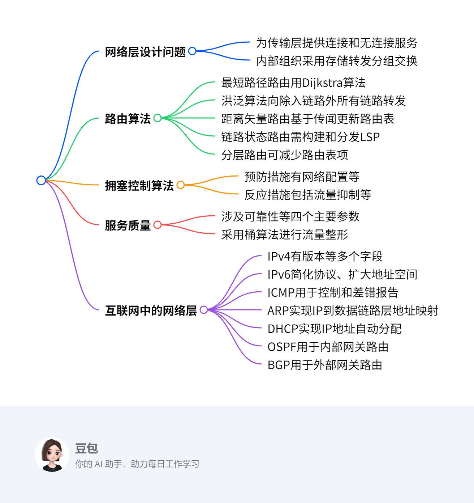
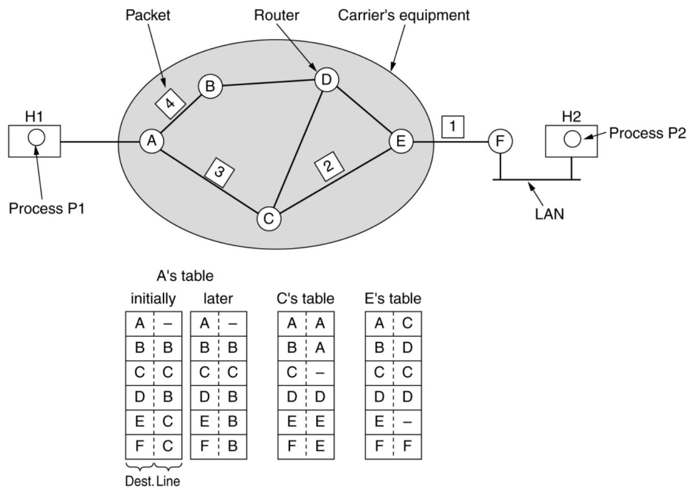
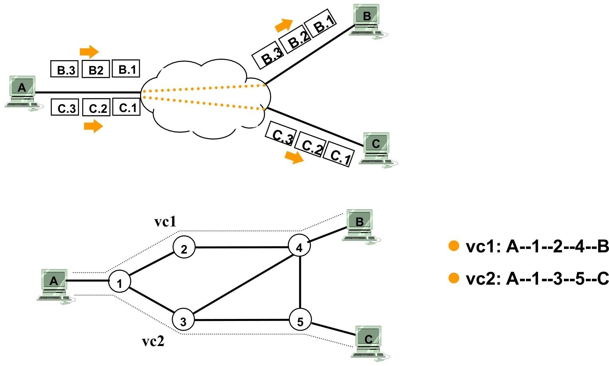
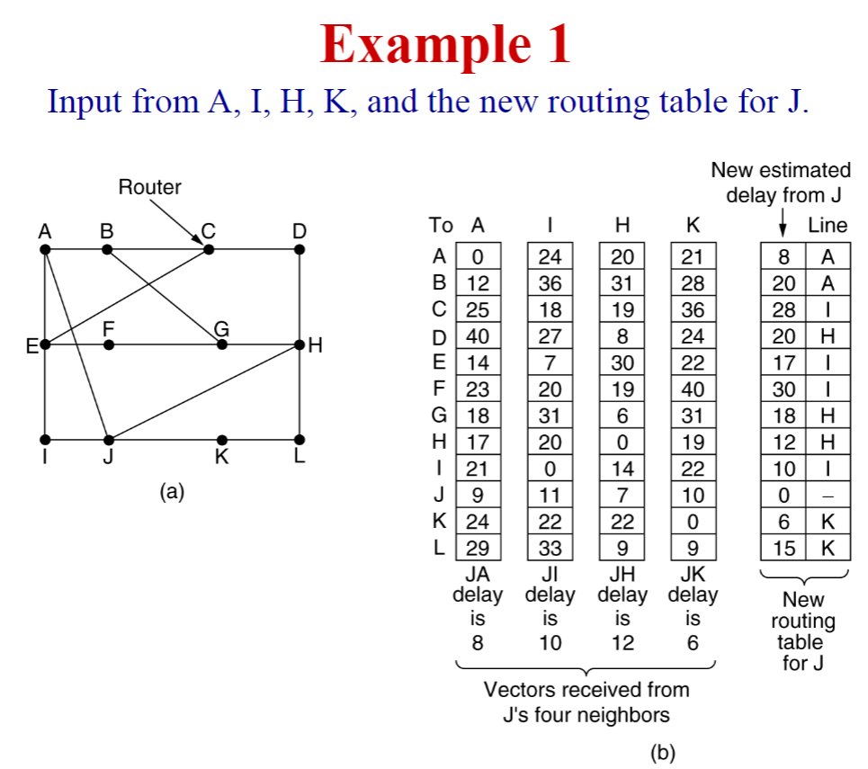
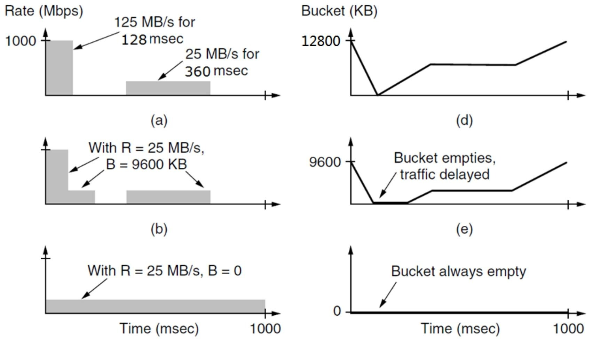
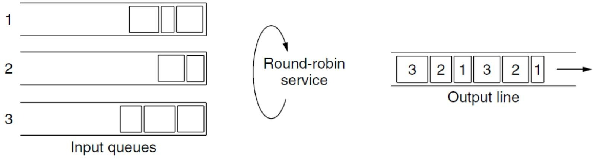
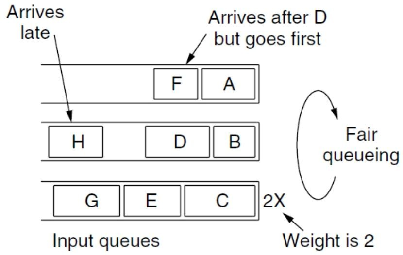
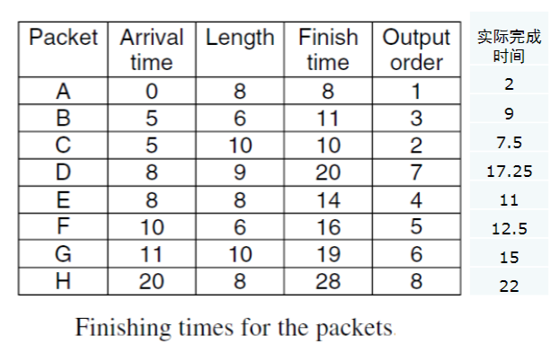
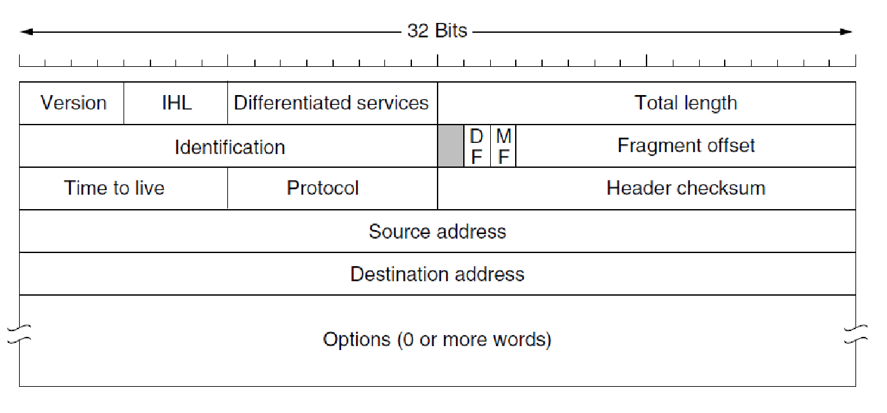
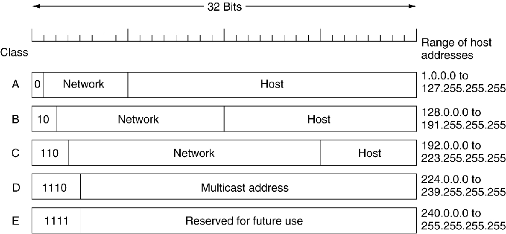

# The Network Layer
## 总览
---
### 一段话总结
网络层是负责端到端传输的底层，其设计问题包括为传输层提供的服务、内部组织等，有数据报和虚电路两种服务类型。路由算法决定数据包传输路径，分为非自适应和自适应算法，如最短路径路由、洪泛、距离矢量路由、链路状态路由和分层路由等。同时，网络层还涉及拥塞控制算法、服务质量保障、网络互联以及互联网中的网络层（如IPv4、IPv6、ICMP、ARP、DHCP、OSPF、BGP等），这些技术共同保障网络高效、稳定运行。

---

---
### 详细总结
1. **网络层设计问题**
    - **服务类型**：为传输层提供两类服务，**连接导向服务（虚电路）** 和 **无连接服务（数据报）**。虚电路在通信前需建立路径，数据沿既定路径传输；数据报则每个数据包独立路由。
    - **内部组织**：采用**存储转发分组交换** 方式，路由器负责存储和转发数据包。
2. **路由算法**
    - **分类**：分为**非自适应算法（静态路由）** 和 **自适应算法**。非自适应算法路由决策不依赖当前流量和拓扑，预先计算并下载路由；自适应算法根据拓扑和流量变化调整路由决策。
    - **具体算法**
        - **最短路径路由**：构建子网加权有向图，用**Dijkstra算法** 计算最短路径。
        - **洪泛**：将数据包转发到除入链路外的所有链路，通过设置跳数计数器、序列号等技术抑制洪泛。
        - **距离矢量路由**：每个路由器维护路由表，通过与邻居交换信息更新，如RIP协议每30秒周期性更新。存在**计数到无穷问题**。
        - **链路状态路由**：路由器需发现邻居、测量链路延迟、构建和分发链路状态分组（LSP），并计算最短路径。
        - **分层路由**：将网络划分为区域和簇，减少路由表项数量。
3. **拥塞控制算法**
    - **预防措施**：包括**网络配置**、**流量感知路由**、**准入控制**、**流量抑制** 等。流量感知路由根据链路负载设置权重；准入控制在网络能承载时建立新虚电路。
    - **反应措施**：如**负载丢弃**，当路由器拥塞时丢弃数据包，RED（随机早期检测）在队列长度超阈值时采取行动。
4. **服务质量**
    - **参数**：涉及**可靠性**、**延迟**、**抖动**、**带宽** 四个主要参数。
    - **流量整形与监管**：采用**漏桶算法** 和 **令牌桶算法**，令牌桶算法可调节数据传输速率和突发度。
5. **互联网中的网络层**
    - **IPv4**：报头包含版本、IHL等多个字段，如版本字段占4位，IHL字段表示报头长度，总长度字段最大为65535字节。
    - **IPv6**：扩大地址空间至128位，简化协议，固定报头长度，去除IHL和协议字段，引入流标签等。
    - **ICMP**：封装在IP数据包中，用于控制和差错报告，如目的不可达、时间超时等。
    - **ARP**：实现IP地址到数据链路层地址的动态映射，通过广播请求获取对应地址。
    - **DHCP**：用于IP地址自动分配，通过四次握手完成地址分配过程。
    - **OSPF**：内部网关协议，支持多种距离度量，动态适应拓扑变化，划分区域减少流量。
    - **BGP**：外部网关协议，根据路由策略选择最佳路由，考虑政治、安全等因素。
---
### 关键问题
1. **数据报网络和虚电路网络在路由决策上有何不同？**
    - 数据报网络中，每个数据包独立进行路由决策，每次决策都需根据当前网络状况选择最佳路径；而虚电路网络仅在建立虚电路时进行路由决策，后续数据沿已建立的路径传输。
2. **距离矢量路由算法中的计数到无穷问题是如何产生的，如何解决？**
    - 当网络中链路状态发生变化，如链路断开，距离矢量路由算法可能因信息更新不及时，导致路由器不断更新路由表中到故障网络的距离，使其不断增大直至无穷。可通过设置最大跳数（如RIP协议中设置为16）、水平分割（路由器从某个接口接收到路由信息后，不再从该接口将此路由信息发送回邻居路由器）等方法缓解。
3. **IPv6相比IPv4有哪些优势？**
    - **地址空间**：IPv6地址空间为128位，相比IPv4的32位，极大地增加了地址数量，可满足未来网络设备增长需求。
    - **协议简化**：IPv6简化了报头，去除部分字段，使路由器处理数据包速度更快。
    - **服务质量支持**：IPv6更注重服务类型，能更好地满足实时数据传输需求。
    - **安全性增强**：增加了认证和加密扩展头，提升网络安全性。 
## Network Layer Design Issues
### Issues
该内容主要介绍了网络层设计问题，涵盖向传输层提供的服务以及网络层内部组织，具体如下：

- **网络层设计问题分类**：网络层设计问题主要包含两个方面，分别是**向传输层提供的服务**以及**网络层的内部组织**，其中网络层内部采用存储转发分组交换方式。
- **向传输层提供的服务**：
    - **设计目标**：传输层应与路由器的数量、类型和拓扑结构相隔离，使其不受这些因素影响；同时，提供给传输层的网络地址要采用统一的编号方案，保证在局域网（LANs）和广域网（WANs）中都能通用。
    - **服务类型**：主要有两类。**面向连接服务（虚电路）** ，在数据传输前需建立一条逻辑连接，数据沿着该连接进行有序传输；**无连接服务（数据报）** ，每个数据报独立传输，它们之间没有固定的顺序和连接关系 。 
### Datagram

### Virtual Circuit

这两张图对比展示了数据报子网和虚电路子网的工作原理：

- **上方图（数据报子网示例）**：
    - 主机A向主机B和主机C发送分组。从A发出的分组（标记为B.1、B.2、B.3 以及C.1、C.2、C.3 ） 各自独立传输。
    - 这些分组在网络（用云状图表示）中分别寻找路径，没有固定的传输路径依赖 ，每个分组都单独进行路由决策，体现了数据报子网中分组独立路由的特点 。
 - **下方图（虚电路子网示例）** ：
    - 定义了两条虚电路vc1和vc2 。vc1的路径是A - 1 - 2 - 4 - B ，vc2的路径是A - 1 - 3 - 5 - C 。
    - 一旦虚电路建立，主机A向主机B、C发送的数据就会沿着预先确定好的虚电路路径传输 。比如发往B的数据会固定沿着vc1路径走，发往C的数据会固定沿着vc2路径走 ，体现了虚电路子网在建立连接后按固定路径传输数据的特性。 

| 比较项目 | 数据报子网（Datagram subnet） | 虚电路子网（Virtual - circuit subnet） |
| ---- | ---- | ---- |
| 电路建立（Circuit setup） | 不需要（Not needed） | 需要（Required） |
| 编址（Addressing） | 每个分组包含完整的源地址和目的地址（Each packet contains the full source and destination address） | 每个分组包含一个短的虚电路号（Each packet contains a short VC number） |
| 状态信息（State information） | 路由器不持有关于连接的状态信息（Routers do not hold state information about connections） | 每条虚电路在路由器中需要占用连接表空间（Each VC requires router table space per connection） |
| 路由（Routing） | 每个分组独立路由（Each packet is routed independently） | 虚电路建立时选择路由，所有分组都沿着该路由传输（Route chosen when VC is set up; all packets follow it） |
| 路由器故障的影响（Effect of router failures） | 除了在故障期间丢失的分组外，无其他影响（None, except for packets lost during the crash） | 所有经过故障路由器的虚电路都将终止（All VCs that passed through the failed router are terminated） |
| 服务质量（Quality of service） | 难以保障（Difficult） | 如果能为每条虚电路预先分配足够资源则较容易保障（Easy if enough resources can be allocated in advance for each VC） |
| 拥塞控制（Congestion control） | 难以实现（Difficult） | 如果能为每条虚电路预先分配足够资源则较容易实现（Easy if enough resources can be allocated in advance for each VC） | 

## Routing Algorithms
该部分内容围绕路由算法展开，主要涵盖以下方面：

- 路由算法的职责
    - **数据包转发路径决策**：负责决定输入数据包应从哪个输出线路传输。
        - **虚电路子网**：**仅在建立新虚电路时进行路由决策**，后续数据包沿已建立的路径传输，即会话路由。
        - **数据报子网**：因最佳路由可能变化，**对每个到达的数据包都要重新进行路由决策**。
    - **区分转发与路由**：虽未详细阐述二者差异，但强调了路由算法在其中的作用。

- 路由算法的目标
    - **正确性**：确保路由决策准确，使数据包能正确传输到目的地。
    - **简单性**：算法应简洁，便于实现、维护和理解。 
    - **鲁棒性**：能在网络出现故障、拥塞等异常情况下正常工作。 
    - **稳定性**：网络**拓扑结构变化后能迅速收敛**，重新计算并确定合适路由。 
    - **公平性**：公平分配网络资源，避免某些节点或链路过度占用资源。 
    - **效率性**：
        - **最小化数据包平均延迟**：减少数据包在网络中传输的时间。
        - **最大化网络总吞吐量**：提高网络单位时间内传输的数据量。

- 路由算法的分类
    - **非自适应算法（静态路由）**：**路由决策不依据当前流量和拓扑的测量或估计**，路由路径在网络启动前提前离线计算好并下载到路由器。
    - **自适应算法**：**能根据拓扑结构和流量变化调整路由决策**，以适应网络动态变化。

- 最优性原理
    - 若路由器J在路由器I到路由器K的最优路径上，那么从J到K的最优路径也在同一路由上。若存在比r2更好的从J到K的路径rx ，将其与r1连接会得到比r1 + r2更优的从I到K的路径，这与r1 + r2是最优路径矛盾。

- 汇聚树
    - **概念**：从所有源节点到目的节点的最优路由构成以目的节点为根的树，**无环路**，保证数据包在有限跳数内送达。
    - **算法目标**：发现并利用所有路由器的汇聚树，但不同路由器对当前拓扑结构的认知可能存在差异。 
### Shortest Path Routing
该部分内容主要介绍了最短路径路由，具体如下：
#### 构建子网图
- **图的构成**：构建一个子网的**加权有向图** 。其中**节点（Nodes）代表路由器** ，**弧（Arcs）代表通信线路** 。
- **权重（Weight）设定** ：
    - **考量因素多样**：权重可以是跳数（Hops） ；也可以是地理距离（单位为千米） ；还可以是平均排队和传输延迟。延迟通过每小时测试，使用标准测试分组确定。此外，权重是距离、带宽、平均流量、通信成本、平均队列长度、测量延迟等因素的函数 。
#### 采用的算法
- **Dijkstra算法** ：用于**寻找给定的一对路由器之间的最短路径** 。 借助该算法，依据构建的加权有向图及设定的权重，可计算出路由器间的最短路径，从而为网络数据包的路由选择提供依据 。 
### Flooding
该部分内容围绕洪泛（Flooding）展开，具体如下：
#### 洪泛基本原理
- **特点**：**无需网络信息** 。将接收到的数据包（除从入站链路接收的）转发到其他所有链路。最终会有若干副本到达目的地。
#### 抑制洪泛的技术
- **存在问题**：会产生大量重复数据包，若不采取措施抑制，数据包数量将趋于无穷。
- **解决措施**：
    - **跳数计数器**：每个数据包头部含**跳数计数器** ，每经过一跳计数器减1 ，减为0时丢弃数据包。发送方初始化跳数计数器为源到目的地路径长度或子网直径。
    - **序列号**：源在每个数据包中放入**序列号** ，每个路由器记录每个源的最大序列号，用于识别已接收过的数据包。 
    - **选择性洪泛**：路由器在数据库记录接收到的数据项，每个数据项有版本号，仅对新数据项进行洪泛。 
#### 洪泛的属性
- **路由尝试全面**：尝试所有可能的路由，**健壮性强** 。
- **最短路径可达**：至少有一个数据包会采用最小跳数路由。
- **节点遍历完全**：所有节点都会被访问，在分发路由信息方面很有用。 
### Distance Vector Routing
该部分内容主要介绍距离矢量路由（Distance Vector Routing），具体如下：

#### 基本原理
- **基于传闻路由**：也叫**Routed by rumor** 。
- **路由表维护**：每个路由器维护一张表，包含**目的（Destination）**、**距离（Cost）**、**接口（Interface）**、**下一跳（Next Hop）** 信息。距离可以是跳数、时延（毫秒）等。
- **信息交换更新**：
    - **发送路由信息**：向邻居发送（目的地，距离）信息。方式有周期性更新（如RIP协议每30秒更新一次 ）和触发更新（表变化时更新） 。
    - **接收路由信息**：收到更好路由时更新本地表（增加和修改表项 ），刷新现有路由。若表项超时（如RIP 180秒 ）则删除。
#### 示例说明
通过多个示例展示路由表更新过程：
**Example 1**：展示从A、I、H、K输入信息后，J的新路由表。
##### 案例背景
本案例围绕距离矢量路由算法展开，目的是根据来自邻居路由器A、I、H、K的信息，构建路由器J的新路由表 。距离矢量路由算法中，路由器通过与相邻路由器交换距离矢量信息（包含到各目的网络的距离等）来更新自己的路由表。 

##### 图示内容
- **图 (a)**：是网络拓扑图，展示了路由器J及其邻居路由器A、I、H、K ，以及其他相关路由器（B、C、D等）的连接关系，各节点通过链路相连，代表物理连接。
- **图 (b)**
    - **左侧表格**：是从J的四个邻居A、I、H、K接收到的延迟矢量信息。行表示目的路由器（A - L） ，列表示信息来源路由器（A、I、H、K），单元格数值代表从相应来源路由器到目的路由器的估计延迟。比如，从A到B的延迟是12，从I到B的延迟是36等。
    - **底部标注**：给出了J到邻居A、I、H、K的延迟，分别是JA = 8、JI = 10、JH = 12、JK = 6 。
    - **右侧表格**：是要构建的J的新路由表，包含两列，分别是从J到各目的路由器的新估计延迟，以及对应的下一跳路由器。 

##### 计算过程示例（以到路由器B为例 ）
要计算从J到B的新估计延迟和下一跳：
1. 利用公式 \(D_{J,B}=\min(D_{J,N}+D_{N,B})\) ，其中 \(D_{J,N}\) 是J到邻居N的延迟， \(D_{N,B}\) 是邻居N到B的延迟。
2. 分别计算通过不同邻居的延迟：
    - 通过A： \(D_{J,A}+D_{A,B}=8 + 12 = 20\) 。
    - 通过I： \(D_{J,I}+D_{I,B}=10 + 36 = 46\) 。
    - 通过H： \(D_{J,H}+D_{H,B}=12 + 31 = 43\) 。
    - 通过K： \(D_{J,K}+D_{K,B}=6 + 28 = 34\) 。
3. 比较得出最小值20，其通过A得到，所以J到B的新估计延迟是20，下一跳是A 。

##### 总结
该案例通过具体拓扑和数据，展示距离矢量路由算法中，路由器如何基于邻居信息构建新路由表，体现了通过计算不同路径延迟，选择最优路径（最小延迟路径）确定下一跳的过程，是网络层路由机制的基础应用示例。 

**Example 2**：详细呈现多轮迭代过程中各节点路由表变化，如节点A、B、C、D在不同迭代阶段对目的地B、C、D的距离和下一跳设置变化，通过计算D(A, D) = D(A, C) + D(C,D) 等公式更新距离值。
#### 存在问题
- **计数到无穷问题（Count - to - infinity Problem）** ：当网络链路状态变化（如链路断开 ），路由器可能因信息更新不及时，不断更新到故障网络的距离，使其增大直至无穷。RIP协议将无穷大设为16 。
- **算法固有问题**：当X告知Y有到某处的路径时，Y无法确定自己是否在该路径上。
#### 相关协议
- **距离矢量路由协议**：如RIP（Routing Information Protocol ）、Cisco EIGRP（Enhanced Interior Gateway Routing Protocol ） 。
- **路径矢量路由协议**：如BGP - 4（Border Gateway Protocol ）、IDRP（Inter - domain Routing Protocol ） 。 
### Link State Routing
该部分内容主要围绕链路状态路由（Link State Routing）展开，详细介绍了其工作原理、具体步骤及相关示例，具体总结如下：

1. **链路状态路由的工作步骤**
    - **发现邻居并获取地址**：路由器通过发送HELLO包来发现邻居。在广播网络中，通过广播HELLO包发现邻居；在非广播式网络中，通过单播HELLO包监测已配置邻居的状态。邻居收到后会回复自身信息，且其名称（网络地址或路由ID）必须全球唯一。当多个路由器通过局域网或其他多接入网络连接时，会简化拓扑结构。
    - **测量链路成本**：测量到每个邻居的延迟，可通过测量往返时间（使用ECHO包）、带宽等方式。但在测量延迟时，是否考虑负载（流量）是个问题，因为考虑负载可能导致路由表振荡，引发不稳定路由和其他潜在问题。
    - **构建链路状态分组（LSP）**：路由器定期（例如每半小时）或在发生重大事件（如链路或邻居状态改变）时构建LSP，LSP包含路由器刚获取的与邻居相关的连接信息。
    - **可靠分发LSP**：通过洪泛算法将LSP分发到所有其他路由器，确保所有路由器拥有相同的路由信息和拓扑结构图。为防止错误，所有LSP都需被确认。LSP包含序列号和年龄（Age）字段，序列号用于判断LSP的新旧、是否重复或过时；Age字段用于处理路由器故障、更改路由器ID或删除LSP等情况。
    - **计算新路由**：路由器收集到完整的LSP集后，构建整个网络的图，图中每条链路会从两个方向表示。然后，在本地运行Dijkstra算法计算到所有可能目的地的最短路径，并将结果安装到路由表中。
2. **链路状态路由的示例**：如IS - IS（Intermediate System - Intermediate System），可支持多种网络层协议，应用于DECnet、ISO CLNP、IP、AppleTalk、Novell NLSP（IPX）等网络；还有OSPF（Open Shortest Path First），它是在IS - IS之后设计的，专门用于IP网络 。 
### Hierarchical Routing
这部分内容主要介绍了分层路由（Hierarchical Routing），通过对比不同情况下路由表的条目数量，突出了分层路由在减少路由表规模方面的优势，具体如下：

1. **分层路由的概念**：将网络划分为不同层次结构，如区域、簇等，以简化路由过程和减少路由表大小。
2. **具体案例分析**：以一个有720个路由器的子网为例：
    - **无分层情况**：**每个路由器的路由表需要包含720个条目**，这意味着每个路由器要维护整个子网所有路由器的路由信息，数据量庞大，管理和查找效率低。
    - **两层分层情况**：子网被划分为24个区域，每个区域有30个路由器。此时，每个路由器的路由表包含**30个本地条目**（即本区域内路由器的路由信息 ）和**23个远程条目**（其他区域路由器的路由信息 ），相比无分层情况，路由表条目数量大幅减少。
    - **三层分层情况**：采用三层分层结构，有8个簇，每个簇包含9个区域，每个区域有10个路由器。这种情况下，每个路由器的路由表包含**10个本地路由器条目**（本区域内 ）、**8个到同一簇内其他区域的条目** 以及**7个到其他簇的条目**，路由表条目进一步减少到25个。 
## Congestion Control Algorithms
### **一、拥塞的定义与成因**  
- **定义**：当网络流量超过承载能力时，会引发**拥塞**，导致性能急剧下降（如延迟增加、丢包率上升）。  
- **核心成因**：  
  - **主要因素**：网络中流量负载过高，超过链路或设备处理能力。  
  - **次要因素**：  
    - 突发流量导致缓冲队列溢出（队列过长或过短均会引发问题）。  
    - 路由器CPU处理速度慢，导致转发延迟，浪费线路容量。  

### **二、拥塞控制与流量控制的区别**  
- **拥塞控制**（**重点**）：  
  - **全局视角**：解决网络中**整体流量过载**问题，涉及所有主机、路由器及链路资源。  
- **流量控制**：  
  - **点对点视角**：确保发送方速率不超过接收方处理能力（如TCP滑动窗口机制）。  

### **三、拥塞控制的核心方法**  
拥塞控制分为 **预防策略（Preventative）** 和 **反应策略（Reactive）**，以下为具体实现：  

#### **1. 预防策略：避免拥塞发生**  
- **网络资源规划（Network Provisioning）**：  
  - 提前扩容链路带宽、升级设备（如路由器），提升网络承载能力。  
- **流量感知路由（Traffic-aware Routing）**（**重点**）：  
  - **传统路由**：仅根据拓扑调整链路权重（如静态跳数），不考虑实时负载。  
  - **改进方案**：动态调整链路权重，综合**带宽、延迟、实时负载、队列延迟**等因素（如公式：权重=带宽倒数+负载系数）。  
  - **风险**：若仅依赖负载调整权重，可能导致路由表剧烈震荡（如链路负载瞬间变化引发路由频繁切换）。  
  - **现状**：互联网路由协议（如BGP、OSPF）通常不实时感知流量负载，仅支持多路径等价路由（Multipath Routing）分摊流量。  
- **准入控制（Admission Control）**（**重点**）：  
  - **应用场景**：虚电路网络（如ATM）中，仅当网络资源充足时建立新连接（如检查带宽、缓冲区是否足够）。  
  - **实现方式**：结合流量感知路由，绕开拥塞热点路径；使用**漏桶/令牌桶算法**描述流量特征（如平均速率、突发容忍度）。  

#### **2. 反应策略：缓解已发生的拥塞**  
- **流量抑制（Traffic Throttling）**（**重点**）：  
  - **拥塞检测**：路由器通过以下指标判断拥塞前兆：  
    - 输出链路利用率超过阈值（如80%）。  
    - 队列缓冲区占用率过高或丢包率上升。  
  - **反馈机制**：  
    - **抑制包（Choke Packet）**：路由器向源主机发送控制报文（如IP的SOURCEQUENCH消息），要求降低发送速率。  
    - **显式拥塞通知（ECN）**：  
      - 路由器在IP报头标记拥塞位（如DS字段的ECN位），目标主机通过ACK报文通知源端。  
      - 源端接收到通知后，通过TCP拥塞控制算法（如慢启动）降低发送窗口。  
- **负载分流（Load Shedding）**（**重点**）：  
  - **核心思想**：当路由器过载时，主动丢弃部分分组以缓解压力。  
  - **丢弃策略**：  
    - **随机丢弃**：无差别丢弃分组（简单但可能影响关键业务）。  
    - **优先级丢弃**：  
      - 优先保留路由控制报文（如OSPF的LSP），丢弃普通数据分组。  
      - 对多媒体流（如MPEG视频），丢弃低优先级帧（如B帧保留I帧/P帧）。  
    - **RED（随机早期检测）**：  
      - 当平均队列长度超过阈值时，随机丢弃新到达的分组，**提前缓解拥塞**（优于缓冲区满后再丢弃）。  
      - **与ECN结合**：RED通过丢包隐式通知拥塞，ECN通过标记显式通知，两者互补（ECN优先用于支持显式信号的主机，RED作为兼容旧设备的 fallback）。  

### **四、关键对比与总结**  
| **策略类型** | **典型方法**       | **核心优势**                              | **适用场景**                |  
|--------------|--------------------|------------------------------------------|-----------------------------|  
| 预防策略     | 流量感知路由       | 避免拥塞发生，优化全局路径               | 大规模网络、实时业务（如VoIP）|  
|              | 准入控制           | 确保连接质量，避免资源过度分配           | 虚电路网络、QoS敏感业务      |  
| 反应策略     | ECN+流量抑制       | 快速响应拥塞，减少端到端延迟             | 互联网TCP业务               |  
|              | RED+负载分流       | 低成本缓解拥塞，兼容新旧设备             | 高突发流量场景（如文件传输） |  

**总结**：拥塞控制需结合预防与反应策略，通过**动态路由优化、流量整形、主动反馈、智能丢弃**等多层次手段，在网络效率与稳定性间取得平衡。**ECN与RED是现代网络中最常用的反应式拥塞控制技术**，而流量感知路由与准入控制则更适用于对QoS要求严格的专用网络。
## Quality of Service 
### **一、QoS 主要参数**  
- **可靠性（Reliability）**：数据传输的准确性和完整性，保证数据无差错、不丢失。
- **延迟（Delay）**：数据从发送端到接收端所经历的时间，延迟过大会影响实时性业务。 
- **抖动（Jitter）**：延迟的变化程度，影响多媒体等实时业务的质量。 
- **带宽（Bandwidth）**：单位时间内网络可传输的数据量，决定传输速率。  

### **二、ATM 网络流量分类（**重点**）**  
根据 QoS 需求，ATM 网络将流量分为四类：

- **恒定比特率（Constant bit rate）**：如电话业务，比特率稳定，对实时性要求极高。 
- **实时可变比特率（Real - time variable bit rate）**：如压缩视频会议，比特率可变且需实时传输。 
- **非实时可变比特率（Non - real - time variable bit rate）**：如网络在线看电影，比特率可变但对实时性要求相对较低。 
- **可用比特率（Available bit rate）**：如文件传输，根据网络状况使用可用带宽。  

### **三、流量处理机制**  
- **缓冲（Buffering）**：通过缓存数据包来平滑输出流，减少流量波动影响。  
- **流量整形与监管**：
  - **问题**：主机不规则发送数据包可能引发网络拥塞。
  - **服务水平协议（SLA）**：用户和子网间的协议。用户进行流量整形以减少拥塞并协助运营商履约；运营商进行流量监管（如承诺访问速率 CAR ）。
  - **流量整形（Traffic shaping）**（**用户端操作**）：调节数据传输的平均速率和突发程度，平滑流量。 
  - **流量监管（Traffic Policing）**（**运营商端操作**）：监测流量，超出约定模式的数据包可能被丢弃或标记为低优先级。  

### **四、流量控制算法**  
- **令牌桶算法（The Token Bucket Algorithm）**：  
  - 用于网络流量监管和主机流量整形，控制平均速率和突发程度。 
  - **最大速率突发时长计算**（**重点公式**）：
    - 令牌桶容量为 B 字节，令牌到达速率为 R 字节/秒，最大输出速率为 M 字节/秒，突发时长 S 秒 ，公式为 B + RS = MS ，推导得 S = B/(M - R ) 。
    - 举例：B = 9600KB ，M = 125MB/s ，R = 25MB/s ，计算出 S = 96 ms 。  

这组图表展示了流量整形中令牌桶算法相关概念 ，通过不同参数设置呈现流量速率和令牌桶状态随时间的变化：

**左列速率（Rate）-时间（Time）图**

- **（a）图**：展示突发流量情况。在开始的128毫秒内，流量速率达到125MB/s ；之后在360毫秒内，流量速率降为25MB/s 。体现流量的不均匀性，有明显突发阶段。
- **（b）图**：引入令牌桶参数 ，R（令牌生成速率）为25MB/s ，B（桶容量）为9600KB 。结合（a）图突发流量，表明在此参数下对流量的处理情况，可看出桶对突发流量的缓冲作用。
- **（c）图**：R仍为25MB/s ，但B = 0 ，即桶容量为0 。此时流量速率平稳保持在25MB/s ，没有突发情况，意味着没有桶对流量进行缓冲，流量被强制整形为恒定速率。

**右列令牌桶（Bucket）容量 - 时间（Time）图**

- **（d）图**：桶容量初始值较高（12800KB ），随着时间变化，桶容量先下降，然后保持一段时间不变，之后又上升 。说明桶在接收和处理流量过程中，容量有变化过程，存在流量填充和消耗阶段。
- **（e）图**：桶初始容量为9600KB ，在某时刻桶被清空（Bucket empties），之后流量产生延迟（traffic delayed） 。表示当桶容量不足以处理流量时，会出现桶空情况，后续流量需等待，产生延迟。
- **（f）图**：桶容量始终为0（Bucket always empty） ，说明在当前设置下，桶一直处于空的状态，没有流量能存入桶中，流量整形效果是流量无缓冲直接通过或被限制。 
### **五、数据包调度**  
- **资源预留**：为不同流量预留带宽、缓存空间、CPU 周期等资源。  
- **调度算法**：
  - **先进先出（FIFO，FCFS）和尾丢弃（tail drop）**：简单按顺序处理数据包，队列满时丢弃新到数据包。 
  - **随机早期检测（RED）算法**：在队列满之前随机丢弃数据包，提前缓解拥塞。 
  - **公平排队（FQ）算法**：公平分配带宽给不同流量。 
  - **优先级排队（PQ）算法**：根据数据包优先级进行排队处理。  

#### 公式  
\[ F_{i} = \max(A_{i}, F_{i-1}) + \frac{L_{i}}{W} \]  

#### 公式含义  
该公式为**加权公平排队（WFQ）算法**中计算数据包完成时间的核心公式，用于实现基于流量权重的带宽公平分配。  
**参数解释**：  

- **\( F_{i} \)**：第 \(i\) 个数据包的**完成时间**（处理完毕的时间点）。  
- **\( A_{i} \)**：第 \(i\) 个数据包的**到达时间**（进入队列的时刻）。  
- **\( F_{i-1} \)**：第 \(i-1\) 个数据包的**完成时间**（前一个数据包处理结束的时间）。  
- **\( L_{i} \)**：第 \(i\) 个数据包的**长度**（单位：字节等，反映处理耗时）。  
- **\( W \)**：对应流量的**权重**（权重越大，分配的带宽优先级越高）。  

#### 计算逻辑  
1. **确定起始时间**：  
   取 \( A_{i} \)（当前数据包到达时间）和 \( F_{i-1} \)（前一个数据包完成时间）中的**较大值**，确保只有当数据包已到达且前序数据包处理完成后，才开始处理当前数据包。  
2. **计算处理耗时**：  
   用数据包长度 \( L_{i} \) 除以流量权重 \( W \)，得到处理当前数据包的**相对耗时**（权重越大，单位长度的处理时间越短，体现带宽分配优势）。  
3. **得出完成时间**：  
   起始时间 + 相对耗时 = 当前数据包的完成时间 \( F_{i} \)。  

**示例**：  

- 已知：\( F_{1}=5 \)（前包完成时间），\( A_{2}=4 \)（当前包到达时间），\( L_{2}=10 \)（包长度），\( W=2 \)（权重）。  
- 计算：  
  - 起始时间：\( \max(4, 5) = 5 \)  
  - 相对耗时：\( 10 \div 2 = 5 \)  
  - 完成时间：\( F_{2} = 5 + 5 = 10 \)  
- **结论**：通过完成时间排序调度数据包，实现加权公平的带宽分配。
- **轮询公平排队及改进**：
  - **轮询公平排队问题**：使用大数据包的主机比使用小数据包的主机获得更多带宽。
  - **加权公平排队（WFQ）**：考虑数据包到达时间（Ai）、完成时间（Fi）、长度（Li）和流量权重（W） ，实现更公平的带宽分配。
  - **实现复杂度**：N 个流量时，每个数据包处理复杂度为 O(logN) 。
  - **赤字轮询（DRR）**：是一种近似算法，每个数据包处理复杂度为 O(1) ，降低处理开销。  

### **六、资源预留与准入控制**  
- **流量协商（Flow negotiation）**：涉及多方参与，共同确定流量相关参数。  
- **流量规格（Flow specification）**：定义流量的具体要求和参数，文中未详述具体示例内容。 
## Internetworking
该节主要围绕网络互联展开，涵盖网络差异、连接方式、相关技术及问题处理等方面：

1. **网络差异**：不同网络在服务类型、地址格式、广播能力、包大小、顺序性、服务质量、可靠性、安全性、参数和计费方式等方面存在差异。
2. **连接不同网络的方式**
    - **设备转换**：构建能将不同网络数据包进行转换的设备。
    - **增加间接层**：在不同网络之上构建公共层，实现网络互联。
3. **网络连接的具体技术**
    - **网桥与路由器**：**网桥**依据MAC地址传输整个帧；**路由器**从帧中提取数据包，并根据第3层地址（IP地址）决定数据包的发送方向 。
    - **隧道技术**：源主机和目的主机在相同类型网络，但中间存在不同网络时使用。通过其他网络连接孤立主机或网络，形成覆盖网络，如虚拟专用网络（VPN）。
4. **MTU相关问题**
    - **MTU的影响因素**：最大传输单元（MTU）受硬件（如以太网帧大小）、操作系统（如缓冲区大小）、协议（如数据包长度字段的位数）、国际标准、减少错误重传以及避免数据包长时间占用信道等因素影响。
    - **隧道技术对MTU的影响**：网络安全头和隧道协议会增加包头，在硬件MTU不变的情况下，使使用隧道传输系统的MTU变小。
5. **分片相关内容**
    - **分片类型**
        - **透明分片**：出口网关需知晓是否收到所有分片，所有数据包必须从同一网关输出，存在重组和重新分片的开销。
        - **非透明分片**：仅在目的主机进行重组，对路由器要求较低，但会增加网络设备和目的主机的总开销，若分片丢失则整个数据包丢失，对主机负担较大。
    - **分片编号**：对分片进行编号，以便目的主机重组数据包。
    - **避免分片的方法**：现代互联网使用路径MTU发现机制，源端发送IP包时设置禁止分片位，路由器收到过大数据包时，向源端返回错误包，源端根据信息重新分片。TCP在建立连接时完成路径MTU协商。 
## Network Layer in the Internet
该节主要介绍了互联网网络层的设计原则以及其基本概念，内容如下：

1. **互联网网络层设计的十大原则（克拉克原则）**
    - **确保可行**：在多个原型成功相互通信之前，不最终确定设计或标准，保证网络设计的可靠性和稳定性 。
    - **保持简单（KISS原则）**：如果一个功能不是绝对必要，就应省略，尤其是当通过组合其他功能能达到相同效果时，避免过度设计，降低系统复杂度 。
    - **明确选择**：当有多种方式做同一件事时，做出明确选择，避免方案混乱。
    - **利用模块化**：将网络层设计为多个模块，便于管理和维护，提高系统的可扩展性和灵活性。
    - **预期异构性**：互联网由多种不同的子网和设备组成，设计时要考虑到这种异构性，确保网络的兼容性。
    - **避免静态选项和参数**：对于像最大数据包大小这类不可避免的参数，最好由发送方和接收方协商确定，而非固定设置，以适应不同的网络环境。
    - **追求良好设计而非完美**：在设计过程中，不必追求绝对完美，找到一个能满足需求的良好设计即可，提高设计效率。
    - **发送严格接收宽容**：发送数据时严格遵守规则，确保数据的准确性和规范性；接收数据时要具有容错能力，能处理一些不规范的数据，增强网络的适应性。
    - **考虑可扩展性**：随着网络规模的不断扩大，设计应具备良好的可扩展性，以适应未来的发展。
    - **兼顾性能和成本**：在设计网络层时，要综合考虑网络性能和成本，在保证性能的前提下控制成本 。
2. **互联网网络层的定义和任务**：互联网是由多个相互连接的子网（自治系统）组成。互联网网络层的任务是提供一种尽力而为的方式，将数据报从源端传输到目的端，不保证数据传输的可靠性、顺序性等，但尽力完成数据的交付 。 
### The IP Version 4 Protocol
该节主要围绕IPv4协议展开，涵盖了IPv4报头字段、校验和算法以及部分IP选项的相关内容：

1. **IPv4报头字段**
    - **版本（Version，4位）**：标识IP协议版本，对于IPv4，该字段值为4。
    - ***互联网报头长度（IHL，4位）***：表示报头长度，以32位字为单位，取值范围5 - 15，对应实际长度20 - 60字节。
    - ***区分服务字段（Differentiated services field）***：原称服务类型字段（TOS），最初包含3位优先级、4个标志（延迟、吞吐量、可靠性、成本）和1位保留位（必须为0） 。现在，前6位用于标记数据包的服务类别，后2位用于携带显式拥塞通知（ECN）信息。
    - **总长度（Total Length，16位）**：表示报头和数据的总字节数，最大值为65,535字节。
    - **标识（Identification，16位）**：目的主机用其判断新到达的分片属于哪个数据报，同一数据报的所有分片该值相同。
    - ***DF（Don't Fragment，1位）***：指示路由器不要对数据报进行分片。最初用于支持无法重组分片的主机，现在用于路径MTU发现过程。
    - **MF（More Fragments，1位）**：用于判断当前分片后是否还有更多分片。
    - **片偏移（Fragment offset，13位）**：以8字节为单位，指示当前分片在数据报中的位置，范围是0 - 8191。
    - **TTL（Time to live，8位）**：限制数据包的生存时间，单位为秒，每经过一跳减1，为0时数据包被丢弃，并向源主机发送警告包。
    - **协议字段（Protocol field，8位）**：指定将数据包交付给哪个传输层协议，如1表示ICMP，6表示TCP，17表示UDP等。
    - **头部校验和（Header checksum，16位）**：仅用于校验报头，每经过一跳都需重新计算。
    - **源地址和目的地址（Source & Destination address，32 + 32位）**：分别标识数据包的发送方和接收方的IP地址。
2. **校验和算法**：采用16位整数算数加法，将进位累加，保证在不同CPU（大头、小头）上计算结果相同，相比CRC，该算法更适用于IPv4报头校验。
3. **部分IP选项**
    - **安全选项（Security option）**：用于指定数据报的保密级别。
    - **严格源路由选项（Strict source routing option）**：给出从源到目的完整的IP地址序列，数据包必须严格按照该序列传输。
    - **松散源路由选项（Loose source routing option）**：要求数据包按指定的路由器列表传输，顺序固定，但允许在途中经过其他路由器。
    - **记录路由选项（Record route option）**：使沿途路由器将其IP地址附加到选项字段。
    - **时间戳选项（Timestamp option）**：类似记录路由选项，但路由器除记录IP地址外，还记录32位时间戳。 
### IP Addresses
该节主要围绕IP地址展开，涵盖了地址分类、特殊地址、前缀、子网、无类别域间路由（CIDR）、地址分配、路由聚合以及路由表等内容，具体如下：

1. **IP地址分类**：IP地址分为A、B、C、D四类，由互联网名称与数字地址分配机构（ICANN）负责分配。A类地址以0开头，B类以10开头，C类以110开头，D类以1110开头，分别用于不同规模的网络和特殊用途（如多播）。
2. **特殊IP地址**：包括本地网络广播地址（路由器不会转发到其他网络）和远程网络广播地址（路由器根据目的网络号，通过路由表转发） 。
3. **前缀和子网**
    - **前缀**：IP地址是层次化的，由可变长度的网络部分和主机部分组成。网络部分对于同一网络中的所有主机相同，网络对应着连续的IP地址空间块。通过前缀表示法（如128.208.0.0/24）和子网掩码（如255.255.255.0）来划分网络和主机部分，**路由器根据地址的网络部分进行数据包转发**。
    - **子网**：子网划分在网络内部进行，外部不可见，有助于提高IP地址的使用效率和网络管理的灵活性。
4. **无类别域间路由（CIDR）**：通过路由聚合，将多个小的前缀合并为一个大的前缀，以减少路由表的大小。如将多个不同的IP地址范围合并成一个更大的地址块进行路由，从而简化路由表。
5. **IP地址分配与聚合**：不同机构或区域被分配特定的IP地址范围，这些地址范围可进一步聚合，以优化路由。如剑桥大学、爱丁堡大学等分别被分配特定的地址范围，这些范围可根据需求进行聚合管理。
6. **最长匹配前缀路由与路由表**
    - **最长匹配前缀路由**：当路由表中有多个条目与目的地址匹配时，选择子网掩码最长的条目，即最精确匹配的条目来确定数据包的转发路径。
    - **路由表**：是一个包含（IP地址、子网掩码、输出线路、下一跳）的数组。查找路由表时，将目的地址与子网掩码进行掩码运算后，与表中的条目进行比较寻找匹配项。为提高地址匹配速度，设计了复杂算法，商业路由器使用定制的VLSI芯片（TCAM）来实现这些算法。 
### NAT
#### **一、核心概念与特点**  
- **定义**：NAT 是一种将私有网络 IP 地址转换为公有 IP 地址的技术，用于实现私有网络与公共互联网的通信。  
- **透明性**：对主机和路由器完全透明，主机无需修改配置即可通过 NAT 设备访问公网。  

#### **二、私有网络地址范围**  
- **三段保留地址**（**重点**）：  
  1. **10.0.0.0/8**：范围为 10.0.0.0 ~ 10.255.255.255，支持约 1600 万主机。  
  2. **172.16.0.0/12**：范围为 172.16.0.0 ~ 172.31.255.255，支持约 100 万主机。  
  3. **192.168.0.0/16**：范围为 192.168.0.0 ~ 192.168.255.255，支持约 6.5 万主机。  

#### **三、动态 NAT 表项机制**  
- **工作流程**（**重点**）：  
  1. **出站（Outgoing）**：  
     - 私有 IP（如 10.0.0.1:3723）访问公网时，NAT 设备将其转换为公有 IP 和端口（如 123.116.156.133:33120），并重新计算 IP 和 TCP 校验和。  
  2. **入站（Incoming）**：  
     - 公网响应数据包通过公有 IP 和端口（如 123.116.156.133:33120）到达 NAT 设备，设备根据表项反向映射回私有 IP（如 10.0.0.1:3723）。  
  3. **表项管理**：  
     - 表项在连接建立时动态创建，连接关闭或长时间未使用后自动删除。  
- **共存性问题**：  
  - **问题1**：不同私有主机（如 10.0.0.1 和 10.0.0.2）访问**不同公网目标**（如 18.7.22.83:80 和 19.7.34.90:80）时，可共享同一公有 IP 的不同端口（如 33120），表项可共存。  
  - **问题2**：同一私有主机访问**同一公网目标的不同端口**（如 18.7.22.83:80 和 18.7.22.83:8080），或不同主机访问**同一公网目标的不同端口**，均可通过端口区分表项，实现共存。  

#### **四、静态 NAT 表项机制**  
- **用途**：固定映射私有 IP 与公有 IP（如 Web 服务器），允许公网主动访问私有网络设备。  
- **示例**：  
  - 静态映射 10.0.0.7:8080 到公有 IP 123.116.156.133:80，公网客户端可通过 123.116.156.133:80 访问私有服务器。  

#### **五、NAT 的局限性（**重点**）**  
1. **违反 IP 设计原则**：破坏“IP 地址唯一标识主机”的特性，导致公网无法主动发起连接。  
2. **连接依赖性**：NAT 设备重启会中断 TCP/UDP 连接（因表项丢失）。  
3. **端到端通信限制**：内网设备无法被公网直接访问，需依赖端口映射。  
4. **协议兼容性问题**：  
   - 不支持非 TCP/UDP 协议（如 ICMP），除非 NAT 专门适配。  
   - 部分应用（如 FTP）在数据报文中携带 IP 地址，NAT 无法修改报文内容，导致地址不匹配。  

#### **六、总结**  
NAT 通过私有地址与公有地址的转换，解决了 IPv4 地址短缺问题，但其透明性和端口复用机制依赖动态表项管理，同时引入了端到端通信限制和协议兼容性挑战。静态 NAT 可支持公网主动访问，动态 NAT 则适用于多数客户端主动发起的场景。
### IPv6
该节主要围绕IP地址展开，涵盖了地址分类、特殊地址、前缀、子网、无类别域间路由（CIDR）、地址分配、路由聚合以及路由表等内容，具体如下：

1. **IP地址分类**：IP地址分为A、B、C、D四类，由互联网名称与数字地址分配机构（ICANN）负责分配。A类地址以0开头，B类以10开头，C类以110开头，D类以1110开头，分别用于不同规模的网络和特殊用途（如多播）。
2. **特殊IP地址**：包括本地网络广播地址（路由器不会转发到其他网络）和远程网络广播地址（路由器根据目的网络号，通过路由表转发） 。
3. **前缀和子网**
    - **前缀**：IP地址是层次化的，由可变长度的网络部分和主机部分组成。网络部分对于同一网络中的所有主机相同，网络对应着连续的IP地址空间块。通过前缀表示法（如128.208.0.0/24）和子网掩码（如255.255.255.0）来划分网络和主机部分，**路由器根据地址的网络部分进行数据包转发**。
    - **子网**：子网划分在网络内部进行，外部不可见，有助于提高IP地址的使用效率和网络管理的灵活性。
4. **无类别域间路由（CIDR）**：通过路由聚合，将多个小的前缀合并为一个大的前缀，以减少路由表的大小。如将多个不同的IP地址范围合并成一个更大的地址块进行路由，从而简化路由表。
5. **IP地址分配与聚合**：不同机构或区域被分配特定的IP地址范围，这些地址范围可进一步聚合，以优化路由。如剑桥大学、爱丁堡大学等分别被分配特定的地址范围，这些范围可根据需求进行聚合管理。
6. **最长匹配前缀路由与路由表**
    - **最长匹配前缀路由**：当路由表中有多个条目与目的地址匹配时，选择子网掩码最长的条目，即最精确匹配的条目来确定数据包的转发路径。
    - **路由表**：是一个包含（IP地址、子网掩码、输出线路、下一跳）的数组。查找路由表时，将目的地址与子网掩码进行掩码运算后，与表中的条目进行比较寻找匹配项。为提高地址匹配速度，设计了复杂算法，商业路由器使用定制的VLSI芯片（TCAM）来实现这些算法。 
### Internet Control Protocols
#### **一、协议定位与封装**  
- **定义**：ICMP 是网络层协议，用于在 IP 主机、路由器之间传递**控制消息**（如网络通断、拥塞、路由错误等）。  
- **封装方式**：ICMP 报文**封装在 IP 数据报中**，作为 IP 层的数据部分，IP 报头的协议字段值为 **1**。  

#### **二、ICMP 报文分类与功能**  
ICMP 报文分为 **差错报告报文** 和 **询问报文** 两类，**加粗部分为重点功能**：  

##### **1. 差错报告报文**  
- **目的不可达（Destination Unreachable）**：  
  - **场景**：路由器无法找到目标地址（如网络不可达、主机不可达），或因 **DF 位（禁止分片）** 导致无法转发（如 MTU 不足）。  
  - **作用**：通知源主机传输失败及原因。  
- **超时（Time Exceeded）**：  
  - **场景**：IP 数据报的 **TTL（生存时间）字段递减为 0**，被路由器丢弃。  
  - **作用**：报告分组生命周期结束，常用于 `traceroute` 路径追踪。  
- **源抑制（Source Quench）**：  
  - **场景**：路由器或主机因拥塞丢弃分组，向源主机发送 **抑制包（Choke Packet）**。  
  - **作用**：要求源主机降低发送速率（已逐渐被 ECN 替代）。  
- **重定向（Redirect）**：  
  - **场景**：路由器发现更佳路由（如更优下一跳），向源主机发送重定向消息。  
  - **作用**：优化路由路径，通知主机更新路由表。  

##### **2. 询问报文**  
- **回显请求与应答（ECHO & ECHO REPLY）**：  
  - **用途**：测试主机间连通性（如 `ping` 命令）。  
- **时间戳请求与应答（Timestamp Request & Reply）**：  
  - **用途**：测量往返时间（RTT），用于网络性能分析。  
- **路由器通告与请求（Router Advertisement & Solicitation）**：  
  - **用途**：主机主动发现附近路由器（如无状态地址自动配置）。  

#### **三、ICMP 报文格式**  
- **统一首部（前4字节）**：  
  - **类型（Type）**：标识报文类型（如 3=目的不可达，8=回显请求）。  
  - **代码（Code）**：细化类型中的具体原因（如类型3的代码1=网络不可达，代码2=主机不可达）。  
  - **校验和（Checksum）**：校验报文完整性。  
- **数据部分**：  
  - **差错报告报文**：包含原 IP 数据报的 **前8字节首部**（用于定位出错分组）及部分数据。  
  - **询问报文**：内容随具体功能（如时间戳、回显数据）而定。  

#### **四、典型应用场景**  
- **路径追踪（traceroute）**：  
  - **原理**：发送 TTL 递增的 UDP 数据报，途经路由器因 TTL=0 回送 **超时（类型11）** 报文，最终目标主机回送 **端口不可达（类型3代码3）** 报文，从而获取完整路径。  
  - **示例**：`tracert` 命令输出各跳路由器的 IP 地址和延迟（如上图 Windows 示例）。  
- **MTU 探测（路径 MTU 发现）**：  
  - **原理**：源主机发送 **DF=1（禁止分片）** 的大分组，路由器因 MTU 不足回送 **目的不可达（类型3代码4）** 报文，携带建议的 MTU 值，源主机据此调整分组大小。  
- **网络诊断**：  
  - **目的不可达**：排查主机或网络是否可达（如服务器未启动）。  
  - **重定向**：优化本地路由（如主机通过 DHCP 获取默认网关后，路由器发送重定向告知更优路径）。  

#### **五、总结**  
ICMP 是 IP 协议的重要补充，通过标准化的控制消息实现网络状态反馈与故障诊断。**重点功能包括差错报告（如目的不可达、超时）和询问（如 ping）**，其报文格式简洁且功能明确，广泛应用于网络调试与性能优化。
### ARP,DHCP
#### **一、ARP（地址解析协议）**  
**核心功能**：将IP地址动态映射为数据链路层地址（如以太网MAC地址），实现网络层与链路层的地址转换。  

##### **1. 工作原理**  
- **动态解析流程**（**重点**）：  
  1. **广播请求**：主机A需发送数据给IP为192.31.65.5的主机B时，先广播ARP请求报文，内容为“我是192.31.65.16（MAC：00-00-C0-15-AD-18），寻找192.31.65.5的MAC地址”。  
  2. **单播响应**：主机B接收到广播后，单播回复ARP响应报文，内容为“我是192.31.65.5，MAC地址为00-06-2B-00-EE-0A”。  
  3. **缓存更新**：主机A与B均将对方的IP-MAC映射存入**ARP缓存**，默认超时时间为几分钟（避免长期占用资源）。  

- **静态解析**：通过系统配置文件手动绑定IP与MAC地址（如`arp -s`命令），适用于需要固定映射的场景（如服务器）。  

##### **2. 优化机制**  
- **ARP缓存**：  
  - 减少重复解析开销，提高转发效率。  
  - 超时机制确保缓存条目失效后重新动态获取（应对主机移动或MAC变更）。  
- **免费ARP（Gratuitous ARP）**：  
  - 主机启动时主动广播自身IP-MAC映射（如“寻找自己的IP地址”），强制更新局域网内其他主机的ARP缓存。  
  - **作用**：检测IP地址冲突（若收到响应，说明存在重复IP）。  
- **代理ARP**：  
  - 路由器代表目标主机响应ARP请求（如主机A与主机B跨网段时，路由器回复自身MAC地址，充当中间转发角色），隐藏子网细节。  

##### **3. 与路由表的关联**  
- **直接交付与间接交付**（**重点**）：  
  - **直接交付**：目标IP与源IP在同一子网（如Host1访问192.32.65.0/24内主机），通过ARP获取目标MAC，直接发送数据帧。  
  - **间接交付**：目标IP与源IP不在同一子网（如Host1访问192.32.63.0/24内主机），需通过默认网关（如192.32.65.1）转发，此时ARP用于获取网关的MAC地址。  
- **路由表项要求**：  
  - 路由表中“下一跳（NextHop）”若为具体IP地址（非`direct`），该IP必须属于出接口所在子网（如Host4的192.32.63.1属于192.32.63.0/24），确保可通过ARP直接解析其MAC。  

#### **二、DHCP（动态主机配置协议）**  
**核心功能**：自动为客户端分配IP地址及网络配置参数，替代传统手动配置（如RARP、BOOTP）。  

##### **1. 工作流程（四次握手）**  
| **步骤** | **报文类型**       | **源地址**       | **目的地址**     | **内容与作用**                                                                 |
|----------|--------------------|------------------|------------------|-----------------------------------------------------------------------------|
| 1        | DHCPDISCOVER       | 0.0.0.0          | 255.255.255.255  | 客户端广播请求配置，包含MAC地址与事务ID（如654）。                            |
| 2        | DHCPOFFER          | DHCP服务器IP     | 255.255.255.255  | 服务器响应，提供可用IP（如223.1.2.4）、租期（3600秒）及配置参数。             |
| 3        | DHCPREQUEST        | 0.0.0.0          | 255.255.255.255  | 客户端确认接受配置，广播请求以通知其他服务器。                                |
| 4        | DHCPACK            | DHCP服务器IP     | 客户端IP         | 服务器确认配置生效，客户端正式获取IP地址及参数。                              |  

##### **2. 关键特性**  
- **配置参数**：  
  - 必选：IP地址、子网掩码、默认网关、DNS服务器地址。  
  - 可选：文件服务器地址、域名等。  
- **地址租期**：  
  - 客户端需在租期到期前（默认50%时）发送DHCPREQUEST续租，若未收到ACK则重新申请地址。  
  - 租期耗尽后，地址被服务器回收，确保资源重用。  
- **中继代理（Relay Agent）**：  
  - 跨网段场景中，中继代理转发DHCP广播请求至其他子网的DHCP服务器（如路由器充当代理），解决广播无法跨网段的问题。  

##### **3. 与ARP的协同**  
- DHCPDISCOVER/REQUEST报文通过广播发送，需依赖ARP解析本地网关的MAC地址（若配置网关）。  
- 客户端获取IP后，通过ARP动态解析同一子网内目标主机的MAC地址，实现数据链路层通信。  

#### **三、总结**  
- **ARP** 是**网络层与链路层的桥梁**，通过动态解析IP-MAC地址实现数据帧的正确转发，优化机制（如缓存、免费ARP）提升效率与可靠性。  
- **DHCP** 通过**自动化配置流程**减少人工管理成本，四次握手机制确保配置可靠分发，中继代理扩展了跨网段应用场景。  
- **重点关联**：两者共同支撑IP网络的连通性——DHCP分配IP，ARP实现IP到MAC的映射，缺一不可。
### OSPF (Open Shortest Path First)
#### **一、协议定位与分类**  
- **所属类别**：**内部网关协议（IGP）**，用于自治系统（AS）内部的路由计算，与RIP、EIGRP、IS-IS等同属IGP体系。  
- **功能对比**：外部网关协议（EGP）如BGP-4用于**AS之间的路由交互**，而OSPF专注于**AS内部的高效路由**。  

#### **二、核心设计要求**  
- **开放性**：基于RFC 2328标准，公开透明，支持多厂商设备互联。  
- **动态适应性**：**自动快速响应拓扑变化**，通过链路状态更新（LSU）实时调整路由。  
- **多度量支持**：可基于带宽、延迟、负载等**多种距离度量**计算路径（区别于RIP仅用跳数）。  
- **分层架构**：支持**区域划分（Area）**，降低路由计算复杂度（**重点**）。  
- **负载均衡**：支持等价多路径（ECMP），流量分摊到多条链路上。  
- **安全性**：提供认证机制（如明文、MD5），确保路由更新的合法性。  

#### **三、区域（Area）划分机制**  
- **定义**：将一个AS划分为多个**逻辑区域（Area）**，每个区域内的路由器维护相同的**链路状态数据库（LSDB）**，独立运行最短路径算法（SPF）。  
- **主干区域（Backbone Area）**：  
  - **唯一标识**：**Area 0**（或Area 0.0.0.0），所有其他区域必须连接到主干区域。  
  - **作用**：负责区域间路由信息的中转与汇总。  
- **区域边界**：  
  - 区域内路由器仅需了解本区域拓扑，**区域间仅传递路由汇总信息**（非详细链路状态），大幅减少路由表规模。  
- **跨区域路由器**：  
  - 连接两个或多个区域的路由器（如Area Border Router，ABR）需维护多个区域的LSDB，并分别运行SPF算法。  

#### **四、路由器类型与功能**  
| **路由器类型**       | **定义与功能**                                                                 |
|----------------------|-----------------------------------------------------------------------------|
| **内部路由器（Internal Router）** | 所有接口均属于**同一区域**，仅维护本区域LSDB，计算本区域内路由。               |
| **区域边界路由器（ABR）**       | **连接主干区域与其他区域**，汇总本区域路由信息并注入主干区域（或反向）。       |
| **自治系统边界路由器（ASBR）**  | **引入外部路由**（如BGP路由）到OSPF域内，外部路由通过ASBR注入并标记为“可达”。 |  

#### **五、关键优势与应用场景**  
- **优势**：  
  1. **快速收敛**：通过洪泛机制同步LSDB，拓扑变化时秒级更新路由（优于RIP的30秒周期）。  
  2. **层次化设计**：区域划分降低路由计算复杂度，支持大规模网络（如数千路由器）。  
  3. **无环路保证**：基于Dijkstra算法生成最短路径树，从数学上避免路由环路。  
- **典型应用**：  
  - 企业园区网、运营商骨干网等需要高可靠性和可扩展性的场景。  
  - 与BGP结合，实现AS内部与外部路由的协同（如ASBR注入BGP路由）。  

#### **六、总结**  
OSPF是IGP中**基于链路状态算法的典型协议**，通过**区域划分、动态拓扑感知、多度量支持**等特性，解决了传统距离矢量协议（如RIP）的收敛慢、路由表臃肿等问题。其核心设计思想是**“分而治之”**，通过分层架构提升网络可管理性，适用于中大型IP网络的路由规划。**重点需关注区域划分规则、路由器角色及SPF算法的应用**。