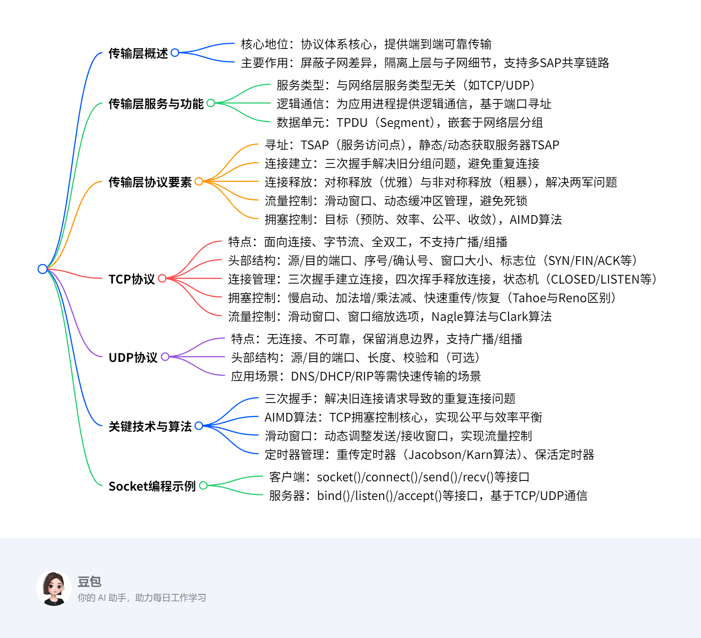

# The Transport Layer
## 总览
---
### 一段话总结
文档围绕传输层展开，**传输层是协议体系的核心**，提供端到端可靠数据传输，屏蔽通信子网差异，隔离上层与子网技术细节，支持多服务访问点共享网络链路。介绍了传输层服务、协议要素（寻址、连接建立与释放、流量控制等）、拥塞控制（如AIMD算法、TCP的慢启动、快速重传等机制），以及互联网传输协议TCP和UDP的特点、头部结构、应用场景等，还包含Socket编程示例和多个思考题。

---
### 思维导图

---
### 详细总结
#### 一、传输层核心功能与地位
- **核心作用**：传输层是协议体系的**核心**，提供**端到端（ETE）可靠数据传输**，屏蔽通信子网的多样性，为上层提供统一接口，隔离上层与子网的技术细节（如链路差异、丢包等）。
- **逻辑通信**：通过**端口（Port）**为应用进程提供逻辑通信，端口号范围0-65535，区分同一主机的不同进程。
- **服务类型**：支持面向连接（如TCP）和无连接（如UDP）服务，**与网络层服务类型无关**（如网络层虚电路/数据报不影响传输层选择）。

#### 二、传输层协议关键要素
1. **寻址与端口**
   - **TSAP（服务访问点）**：传输层通过TSAP（即端口）标识应用进程，如HTTP默认端口80，FTP默认端口21。
   - **获取TSAP方式**：静态分配（如知名端口）、动态查询（通过域名服务器）、进程服务器（如inetd管理非活跃服务端口）。
2. **连接建立与释放**
   - **三次握手**：解决旧分组导致的重复连接问题。例如，若两次握手可能因旧连接请求延迟到达导致错误连接（如主机A重复发送旧SYN，主机B确认后建立无效连接）。
   - **对称释放（四次挥手）**：确保数据完整传输，避免“两军问题”（需双向确认释放）。
3. **流量控制与缓冲**
   - **滑动窗口协议**：发送方根据接收方窗口大小调整发送速率，如TCP通过`Window Size`字段动态控制。
   - **动态缓冲管理**：接收方通过ACK携带缓冲分配信息（如`buf`字段），避免发送方盲目发送导致缓冲区溢出。
4. **拥塞控制**
   - **目标**：预防拥塞、提高带宽利用率（效率）、公平分配带宽、快速适应流量变化（收敛）。
   - **AIMD算法**：TCP核心算法，**加法增（每次RTT增加1个MSS）**、**乘法减（拥塞时窗口减半）**，实现窗口“锯齿形”调整。

#### 三、TCP协议详解
1. **协议特点**
   - **面向连接**：三次握手建立连接，四次挥手释放连接。
   - **字节流**：无消息边界，数据按字节流传输（如4个512字节分段可合并为一个读操作）。
   - **全双工**：双向独立数据流，支持同时发送和接收。
2. **头部结构（20-60字节）**
   | 字段          | 功能描述                                                                 |
   |---------------|--------------------------------------------------------------------------|
   | 源/目的端口   | 标识发送/接收进程，16位，如HTTP端口80                                   |
   | 序号/确认号   | 字节流编号（32位），确认号表示期望接收的下一字节序号                     |
   | 标志位        | SYN（建立连接）、FIN（释放连接）、ACK（确认有效）、PSH（推数据）等       |
   | 窗口大小      | 接收方可用缓冲区大小（16位，通过窗口缩放选项可扩展至65535×2^n字节）       |
   | 校验和        | 校验头部、数据及伪头部，确保传输正确性                                    |

3. **拥塞控制机制**
   - **慢启动**：初始窗口为1-4个分段，每收到一个ACK窗口加倍（指数增长），直至达到阈值后切换为加法增。
   - **快速重传/恢复**：收到3个重复ACK时，立即重传丢失分组，避免超时等待，窗口调整为阈值的一半并进入快速恢复。
   - **Tahoe vs Reno**：Tahoe在丢包后进入慢启动，Reno支持快速恢复，减少带宽浪费。
4. **流量控制优化**
   - **Nagle算法**：合并小分组（如Telnet的1字节数据），减少头部开销，但可能引入延迟。
   - **Clark算法**：接收方避免发送小窗口更新（如小于MSS或缓冲区半满），防止“糊涂窗口综合征”。

#### 四、UDP协议详解
1. **协议特点**
   - **无连接**：无需建立连接，直接发送数据报，延迟低。
   - **不可靠**：不保证交付、不重传、无流量控制，依赖应用层处理错误。
   - **消息边界保留**：发送方写操作与接收方读操作一一对应。
2. **头部结构（8字节）**
   | 字段          | 功能描述                             |
   |---------------|--------------------------------------|
   | 源/目的端口   | 标识进程，16位                       |
   | 长度          | 数据报总长度（包括头部），16位       |
   | 校验和        | 可选，校验数据报正确性（含伪头部）   |

3. **应用场景**：适用于实时性要求高、允许少量丢包的场景，如DNS（53端口）、DHCP、RTP（实时传输协议）。

#### 五、Socket编程与关键示例
- **核心接口**：`socket()`（创建套接字）、`bind()`（绑定地址）、`connect()`（客户端连接）、`listen()`/`accept()`（服务器监听/接受连接）、`send()`/`recv()`（收发数据）、`close()`（关闭连接）。
- **TCP示例**：客户端通过`connect()`发起连接，服务器通过`accept()`阻塞等待连接，基于字节流传输文件（如示例中传输"abc.txt"）。
- **UDP示例**：无连接，直接通过`sendto()`/`recvfrom()`收发数据报。

---
### 关键问题
#### 问题1：三次握手的核心作用是什么？为什么两次握手无法解决旧分组问题？
- **答案**：三次握手的核心作用是**防止旧连接请求分组导致的重复连接**。若采用两次握手，当旧分组（如主机A首次发送的SYN因延迟滞留网络）到达主机B时，主机B会误认为是新请求并返回SYN+ACK，此时主机A可能已无建立连接的意愿，导致**无效连接占用资源**。而三次握手要求主机A必须对主机B的SYN+ACK进行最终确认，确保双方均同意建立连接，避免旧分组引发的错误。

#### 问题2：TCP如何实现拥塞控制？AIMD算法的具体含义是什么？
- **答案**：TCP通过**慢启动、加法增（AI）、乘法减（MD）、快速重传/恢复**等机制实现拥塞控制。  
  - **AIMD算法**：  
    - **加法增**：每经过一个RTT（往返时间），拥塞窗口（cwnd）增加1个MSS（最大分段大小），线性增长以逐步探测网络容量。  
    - **乘法减**：当检测到拥塞（如丢包）时，将cwnd减半（即乘以0.5），快速降低发送速率以缓解拥塞。  
  该算法通过“锯齿形”窗口调整，在公平性与效率间取得平衡。

#### 问题3：UDP与TCP的本质区别有哪些？各自适用于什么场景？
- **答案**：  
  - **本质区别**：  
    1. **连接性**：UDP无连接，TCP面向连接（需三次握手/四次挥手）。  
    2. **可靠性**：UDP不保证交付，TCP通过重传、流量控制等实现可靠传输。  
    3. **数据单位**：UDP保留消息边界（按数据报传输），TCP为字节流（无边界）。  
    4. **头部开销**：UDP头部8字节，TCP头部20-60字节（含可选字段）。  
  - **适用场景**：  
    - **UDP**：实时性要求高、允许丢包的场景，如视频直播、DNS查询、DHCP配置。  
    - **TCP**：可靠性优先的场景，如文件传输（FTP）、网页浏览（HTTP）、电子邮件（SMTP/POP3）。
## 6.1 The Transport Service  
### **传输层的核心地位与功能**  
- **核心地位**：传输层是整个协议体系的**核心**（*the heart of the protocol hierarchy*）。  
- **核心功能**：  
  1. **端到端可靠传输**：提供**端到端（ETE）的可靠数据传输**，确保数据从源到目的的完整交付。  
  2. **屏蔽子网差异**：隐藏通信子网的多样性（如不同链路技术、拓扑结构），为上层提供**统一接口**。  
  3. **隔离上层与子网细节**：使上层（如应用层）无需关注子网的技术、设计缺陷或不完美（如丢包、延迟）。  
  4. **多服务访问点（SAP）共享链路**：支持多个应用进程通过不同端口（Port）共享同一网络链路，实现复用。  

### **传输层的逻辑通信与作用范围**  
- **逻辑通信**：通过**端口（Port）**为**应用进程**提供**逻辑通信**，而非直接基于物理地址。例如，主机A与主机B的应用进程（AP1、AP2等）通过传输层端口建立连接，屏蔽底层网络设备（如路由器、LAN/WAN）的细节。  
- **与网络层的区别**：  
  - **网络层（IP）**：作用于**主机间**（通过路由器转发），处理IP分组的路由与寻址。  
  - **传输层（TCP/UDP）**：作用于**应用进程间**，基于端口实现端到端的直接通信（如TCP/UDP的作用范围覆盖整个端到端路径，而非局限于单个子网）。  

### **传输层服务类型与网络层的独立性**  
- **服务类型**：  
  - 网络层：分为**面向连接**（虚电路）和**无连接**（数据报）服务。  
  - 传输层：同样分为**面向连接**（如TCP）和**无连接**（如UDP）服务，但**传输层服务类型与网络层无关**。例如，TCP可运行在无连接的IP网络上，通过自身机制实现可靠性。  
- **存在必要性**：  
  - 网络层仅提供“尽力而为”的主机间通信，无法满足应用层对可靠性、流量控制、多进程复用等需求。  
  - 传输层通过**端到端控制**（如重传、窗口机制）弥补网络层缺陷，为应用提供更可靠的抽象。  

### **数据单元与封装关系**  
- **传输层数据单元**：称为**传输协议数据单元（TPDU）**，也称为**分段（Segment）**。  
- **封装层次**：  
  - 分段（TPDU）被封装在网络层**分组（Packet，如IP数据报）** 中，分组再被封装在数据链路层**帧（Frame）** 中。  
  - 示例：TCP分段包含头部（源/目的端口、序号等）和数据载荷，封装为IP数据报后在网络中传输。  

### **Berkeley Socket编程示例**  
- **Socket接口作用**：提供应用层与传输层的编程接口，实现进程间通信。  
- **客户端代码逻辑**：  
  1. **创建Socket**：`socket(PF_INET, SOCK_STREAM, IPPROTO_TCP)` 创建TCP套接字（面向连接）。  
  2. **指定服务器地址**：通过`struct sockaddr_in`结构体设置服务器IP（如`192.168.0.176`）和端口（如`12345`）。  
  3. **建立连接**：`connect()` 发起三次握手，与服务器建立连接。  
  4. **数据传输**：通过`write()`发送文件名（如"abc.txt"），通过循环`read()`接收文件数据并写入标准输出。  
  5. **关闭连接**：`close(sock)` 释放资源。  
- **服务器代码逻辑**：  
  1. **创建Socket**：同样使用TCP套接字。  
  2. **绑定地址**：`bind()` 将套接字绑定到本地任意IP（`INADDR_ANY`）和端口`12345`。  
  3. **监听连接**：`listen(5)` 开始监听，允许最多5个连接排队。  
  4. **接受连接**：`accept()` 阻塞等待客户端连接，返回新套接字`data_sock`用于数据传输。  
  5. **文件传输**：读取客户端发送的文件名，打开文件并通过循环`write()`发送数据至客户端。  
  6. **关闭连接**：依次关闭文件和连接套接字。  

### **总结**  
本节从**功能定位、通信模型、服务独立性、数据封装、编程实现**五个维度阐述了传输层的核心概念。重点强调传输层通过**端口抽象**和**端到端控制**，解决了网络层无法满足的应用需求，而Socket编程示例则展示了传输层服务的实际落地方式。