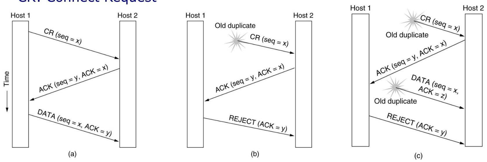
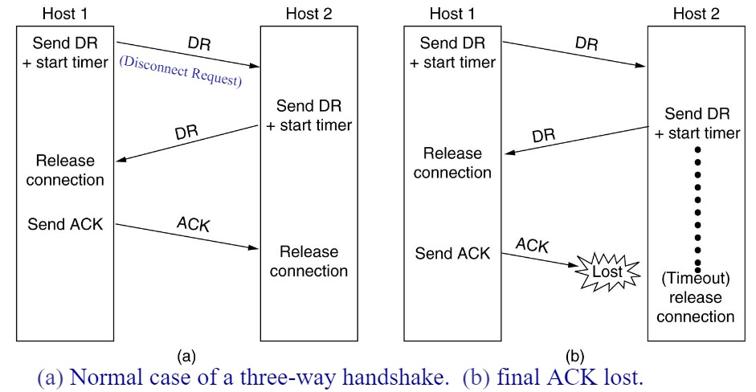
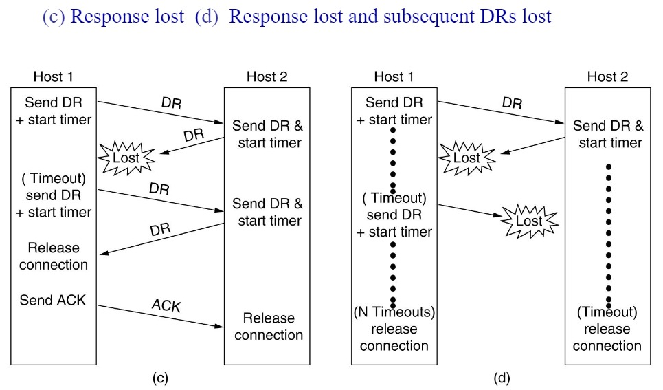

# The Transport Layer
## 总览
---
### 一段话总结
文档围绕传输层展开，**传输层是协议体系的核心**，提供端到端可靠数据传输，屏蔽通信子网差异，隔离上层与子网技术细节，支持多服务访问点共享网络链路。介绍了传输层服务、协议要素（寻址、连接建立与释放、流量控制等）、拥塞控制（如AIMD算法、TCP的慢启动、快速重传等机制），以及互联网传输协议TCP和UDP的特点、头部结构、应用场景等，还包含Socket编程示例和多个思考题。

---
### 思维导图

---
### 详细总结
#### 一、传输层核心功能与地位
- **核心作用**：传输层是协议体系的**核心**，提供**端到端（ETE）可靠数据传输**，屏蔽通信子网的多样性，为上层提供统一接口，隔离上层与子网的技术细节（如链路差异、丢包等）。
- **逻辑通信**：通过**端口（Port）**为应用进程提供逻辑通信，端口号范围0-65535，区分同一主机的不同进程。
- **服务类型**：支持面向连接（如TCP）和无连接（如UDP）服务，**与网络层服务类型无关**（如网络层虚电路/数据报不影响传输层选择）。

#### 二、传输层协议关键要素
1. **寻址与端口**
   - **TSAP（服务访问点）**：传输层通过TSAP（即端口）标识应用进程，如HTTP默认端口80，FTP默认端口21。
   - **获取TSAP方式**：静态分配（如知名端口）、动态查询（通过域名服务器）、进程服务器（如inetd管理非活跃服务端口）。
2. **连接建立与释放**
   - **三次握手**：解决旧分组导致的重复连接问题。例如，若两次握手可能因旧连接请求延迟到达导致错误连接（如主机A重复发送旧SYN，主机B确认后建立无效连接）。
   - **对称释放（四次挥手）**：确保数据完整传输，避免“两军问题”（需双向确认释放）。
3. **流量控制与缓冲**
   - **滑动窗口协议**：发送方根据接收方窗口大小调整发送速率，如TCP通过`Window Size`字段动态控制。
   - **动态缓冲管理**：接收方通过ACK携带缓冲分配信息（如`buf`字段），避免发送方盲目发送导致缓冲区溢出。
4. **拥塞控制**
   - **目标**：预防拥塞、提高带宽利用率（效率）、公平分配带宽、快速适应流量变化（收敛）。
   - **AIMD算法**：TCP核心算法，**加法增（每次RTT增加1个MSS）**、**乘法减（拥塞时窗口减半）**，实现窗口“锯齿形”调整。

#### 三、TCP协议详解
1. **协议特点**
   - **面向连接**：三次握手建立连接，四次挥手释放连接。
   - **字节流**：无消息边界，数据按字节流传输（如4个512字节分段可合并为一个读操作）。
   - **全双工**：双向独立数据流，支持同时发送和接收。
2. **头部结构（20-60字节）**
   | 字段          | 功能描述                                                                 |
   |---------------|--------------------------------------------------------------------------|
   | 源/目的端口   | 标识发送/接收进程，16位，如HTTP端口80                                   |
   | 序号/确认号   | 字节流编号（32位），确认号表示期望接收的下一字节序号                     |
   | 标志位        | SYN（建立连接）、FIN（释放连接）、ACK（确认有效）、PSH（推数据）等       |
   | 窗口大小      | 接收方可用缓冲区大小（16位，通过窗口缩放选项可扩展至65535×2^n字节）       |
   | 校验和        | 校验头部、数据及伪头部，确保传输正确性                                    |

3. **拥塞控制机制**
   - **慢启动**：初始窗口为1-4个分段，每收到一个ACK窗口加倍（指数增长），直至达到阈值后切换为加法增。
   - **快速重传/恢复**：收到3个重复ACK时，立即重传丢失分组，避免超时等待，窗口调整为阈值的一半并进入快速恢复。
   - **Tahoe vs Reno**：Tahoe在丢包后进入慢启动，Reno支持快速恢复，减少带宽浪费。
4. **流量控制优化**
   - **Nagle算法**：合并小分组（如Telnet的1字节数据），减少头部开销，但可能引入延迟。
   - **Clark算法**：接收方避免发送小窗口更新（如小于MSS或缓冲区半满），防止“糊涂窗口综合征”。

#### 四、UDP协议详解
1. **协议特点**
   - **无连接**：无需建立连接，直接发送数据报，延迟低。
   - **不可靠**：不保证交付、不重传、无流量控制，依赖应用层处理错误。
   - **消息边界保留**：发送方写操作与接收方读操作一一对应。
2. **头部结构（8字节）**
   | 字段          | 功能描述                             |
   |---------------|--------------------------------------|
   | 源/目的端口   | 标识进程，16位                       |
   | 长度          | 数据报总长度（包括头部），16位       |
   | 校验和        | 可选，校验数据报正确性（含伪头部）   |

3. **应用场景**：适用于实时性要求高、允许少量丢包的场景，如DNS（53端口）、DHCP、RTP（实时传输协议）。

#### 五、Socket编程与关键示例
- **核心接口**：`socket()`（创建套接字）、`bind()`（绑定地址）、`connect()`（客户端连接）、`listen()`/`accept()`（服务器监听/接受连接）、`send()`/`recv()`（收发数据）、`close()`（关闭连接）。
- **TCP示例**：客户端通过`connect()`发起连接，服务器通过`accept()`阻塞等待连接，基于字节流传输文件（如示例中传输"abc.txt"）。
- **UDP示例**：无连接，直接通过`sendto()`/`recvfrom()`收发数据报。

---
### 关键问题
#### 问题1：三次握手的核心作用是什么？为什么两次握手无法解决旧分组问题？
- **答案**：三次握手的核心作用是**防止旧连接请求分组导致的重复连接**。若采用两次握手，当旧分组（如主机A首次发送的SYN因延迟滞留网络）到达主机B时，主机B会误认为是新请求并返回SYN+ACK，此时主机A可能已无建立连接的意愿，导致**无效连接占用资源**。而三次握手要求主机A必须对主机B的SYN+ACK进行最终确认，确保双方均同意建立连接，避免旧分组引发的错误。

#### 问题2：TCP如何实现拥塞控制？AIMD算法的具体含义是什么？
- **答案**：TCP通过**慢启动、加法增（AI）、乘法减（MD）、快速重传/恢复**等机制实现拥塞控制。  
  - **AIMD算法**：  
    - **加法增**：每经过一个RTT（往返时间），拥塞窗口（cwnd）增加1个MSS（最大分段大小），线性增长以逐步探测网络容量。  
    - **乘法减**：当检测到拥塞（如丢包）时，将cwnd减半（即乘以0.5），快速降低发送速率以缓解拥塞。  
  该算法通过“锯齿形”窗口调整，在公平性与效率间取得平衡。

#### 问题3：UDP与TCP的本质区别有哪些？各自适用于什么场景？
- **答案**：  
  - **本质区别**：  
    1. **连接性**：UDP无连接，TCP面向连接（需三次握手/四次挥手）。  
    2. **可靠性**：UDP不保证交付，TCP通过重传、流量控制等实现可靠传输。  
    3. **数据单位**：UDP保留消息边界（按数据报传输），TCP为字节流（无边界）。  
    4. **头部开销**：UDP头部8字节，TCP头部20-60字节（含可选字段）。  
  - **适用场景**：  
    - **UDP**：实时性要求高、允许丢包的场景，如视频直播、DNS查询、DHCP配置。  
    - **TCP**：可靠性优先的场景，如文件传输（FTP）、网页浏览（HTTP）、电子邮件（SMTP/POP3）。
## 6.1 The Transport Service  
### **传输层的核心地位与功能**  
- **核心地位**：传输层是整个协议体系的**核心**（*the heart of the protocol hierarchy*）。  
- **核心功能**：  
  1. **端到端可靠传输**：提供**端到端（ETE）的可靠数据传输**，确保数据从源到目的的完整交付。  
  2. **屏蔽子网差异**：隐藏通信子网的多样性（如不同链路技术、拓扑结构），为上层提供**统一接口**。  
  3. **隔离上层与子网细节**：使上层（如应用层）无需关注子网的技术、设计缺陷或不完美（如丢包、延迟）。  
  4. **多服务访问点（SAP）共享链路**：支持多个应用进程通过不同端口（Port）共享同一网络链路，实现复用。  

### **传输层的逻辑通信与作用范围**  
- **逻辑通信**：通过**端口（Port）**为**应用进程**提供**逻辑通信**，而非直接基于物理地址。例如，主机A与主机B的应用进程（AP1、AP2等）通过传输层端口建立连接，屏蔽底层网络设备（如路由器、LAN/WAN）的细节。  
- **与网络层的区别**：  
  - **网络层（IP）**：作用于**主机间**（通过路由器转发），处理IP分组的路由与寻址。  
  - **传输层（TCP/UDP）**：作用于**应用进程间**，基于端口实现端到端的直接通信（如TCP/UDP的作用范围覆盖整个端到端路径，而非局限于单个子网）。  

### **传输层服务类型与网络层的独立性**  
- **服务类型**：  
  - 网络层：分为**面向连接**（虚电路）和**无连接**（数据报）服务。  
  - 传输层：同样分为**面向连接**（如TCP）和**无连接**（如UDP）服务，但**传输层服务类型与网络层无关**。例如，TCP可运行在无连接的IP网络上，通过自身机制实现可靠性。  
- **存在必要性**：  
  - 网络层仅提供“尽力而为”的主机间通信，无法满足应用层对可靠性、流量控制、多进程复用等需求。  
  - 传输层通过**端到端控制**（如重传、窗口机制）弥补网络层缺陷，为应用提供更可靠的抽象。  

### **数据单元与封装关系**  
- **传输层数据单元**：称为**传输协议数据单元（TPDU）**，也称为**分段（Segment）**。  
- **封装层次**：  
  - 分段（TPDU）被封装在网络层**分组（Packet，如IP数据报）** 中，分组再被封装在数据链路层**帧（Frame）** 中。  
  - 示例：TCP分段包含头部（源/目的端口、序号等）和数据载荷，封装为IP数据报后在网络中传输。  

### **Berkeley Socket编程示例**  
- **Socket接口作用**：提供应用层与传输层的编程接口，实现进程间通信。  
- **客户端代码逻辑**：  
  1. **创建Socket**：`socket(PF_INET, SOCK_STREAM, IPPROTO_TCP)` 创建TCP套接字（面向连接）。  
  2. **指定服务器地址**：通过`struct sockaddr_in`结构体设置服务器IP（如`192.168.0.176`）和端口（如`12345`）。  
  3. **建立连接**：`connect()` 发起三次握手，与服务器建立连接。  
  4. **数据传输**：通过`write()`发送文件名（如"abc.txt"），通过循环`read()`接收文件数据并写入标准输出。  
  5. **关闭连接**：`close(sock)` 释放资源。  
- **服务器代码逻辑**：  
  1. **创建Socket**：同样使用TCP套接字。  
  2. **绑定地址**：`bind()` 将套接字绑定到本地任意IP（`INADDR_ANY`）和端口`12345`。  
  3. **监听连接**：`listen(5)` 开始监听，允许最多5个连接排队。  
  4. **接受连接**：`accept()` 阻塞等待客户端连接，返回新套接字`data_sock`用于数据传输。  
  5. **文件传输**：读取客户端发送的文件名，打开文件并通过循环`write()`发送数据至客户端。  
  6. **关闭连接**：依次关闭文件和连接套接字。  

### **总结**  
本节从**功能定位、通信模型、服务独立性、数据封装、编程实现**五个维度阐述了传输层的核心概念。重点强调传输层通过**端口抽象**和**端到端控制**，解决了网络层无法满足的应用需求，而Socket编程示例则展示了传输层服务的实际落地方式。

## 6.1 传输层服务  
### 传输层的核心地位与功能  
传输层是整个协议体系的**核心**，其核心作用包括：  
1. **端到端可靠数据传输**：提供进程间**端到端（ETE）的可靠数据传输服务**，确保数据准确到达。  
2. **屏蔽子网差异**：隐藏通信子网的多样性（如不同链路技术、拓扑结构），为上层应用提供**统一接口**。  
3. **隔离上层与子网**：使上层无需关注子网的技术细节（如链路类型、路由算法）和缺陷（如丢包、延迟），即**隔离上层与子网的技术、设计及不完美性**。  
4. **支持多服务访问点（SAP）**：通过**端口（Port）**区分不同应用进程，实现多个SAP共享同一网络链路（如同一主机上的HTTP和FTP服务）。  

### 传输层的逻辑通信与协议作用范围  
- **通信对象**：实现**应用进程间的逻辑通信**，而非主机间直接通信。  
- **与网络层的区别**：  
  - **网络层（IP协议）**：作用范围为“主机-路由器-主机”，实现主机间通信。  
  - **传输层（TCP/UDP协议）**：作用范围为**端到端（End-to-End）**，直接关联两端应用进程，不依赖中间路由器。  
- **服务类型独立性**：传输层服务类型（如TCP面向连接、UDP无连接）与网络层（如虚电路/数据报）**无关**。例如，TCP可运行在无连接的IP网络上。  

### 数据单元与封装结构  
- **传输层数据单元**：称为**段（Segment）**，即传输协议数据单元（TPDU）。  
- **封装关系**：  
  - 段（Segment）被封装进网络层的**数据包（Packet）**，数据包再被封装进数据链路层的**帧（Frame）**，形成“帧头+包头+段头+数据”的嵌套结构。  

### Berkeley Socket编程模型  
#### 核心接口功能  
| 函数 | 功能 |  
|------|------|  
| `socket()` | 创建通信端点，指定协议族（如PF_INET）、套接字类型（如SOCK_STREAM表示TCP）和协议（如IPPROTO_TCP）。 |  
| `bind()` | 将本地地址（IP+端口）绑定到套接字，用于服务端标识自身监听的地址和端口。 |  
| `connect()` | 客户端主动发起连接请求（仅面向连接协议如TCP需要）。 |  
| `listen()` | 服务端开始监听连接请求，设置最大连接队列长度（如`listen(sock, 5)`表示最多缓存5个连接请求）。 |  
| `accept()` | 服务端接受客户端连接请求，返回新套接字用于与客户端进行数据通信。 |  

#### 示例代码解析  
- **客户端流程**：  
  1. 创建TCP套接字，指定服务端IP（192.168.0.176）和端口（12345）。  
  2. 调用`connect()`建立连接，发送文件名“abc.txt”，通过循环`read()`接收文件数据并写入标准输出。  
- **服务端流程**：  
  1. 绑定本地任意IP（`INADDR_ANY`）和端口12345，开始监听连接。  
  2. 接受连接后，读取客户端请求的文件名，打开文件并通过循环`write()`逐块发送数据到客户端。  

### 关键问题：为何需要传输层？  
- **网络层的局限性**：仅提供主机间“尽力而为”的通信，无法实现**进程级编址、可靠性传输、流量控制、拥塞控制**等应用层需求。  
- **传输层的必要性**：填补网络层空白，为应用提供**端到端的可靠通信服务**，确保数据正确、有序、高效传输，是协议体系中实现进程间通信的关键层。  

### 总结  
本节围绕传输层的**核心地位、功能、与网络层的差异及Socket编程实现**展开，强调传输层通过端口机制实现进程间逻辑通信，通过统一接口屏蔽子网复杂性，并通过具体代码示例展示了客户端与服务端的通信流程。核心结论：传输层是连接应用层与网络层的桥梁，其端到端的可靠服务是上层应用正常运行的基础。

## 6.2 传输层协议的要素  
**传输层协议与数据链路层协议的共性与差异**  
**共性**  
传输层协议与数据链路层协议均需处理 **错误控制（确保数据正确传输）**、**顺序控制（保证数据有序到达）**、**流量控制（协调收发双方速率）**。  

**差异场景**  
1. **编址范围**  
   - 数据链路层：处理**相邻节点间的直接通信编址**（如MAC地址），仅关注链路两端设备。  
   - 传输层：处理**端到端的进程级编址**，通过**端口号（TSAP，服务访问点）** 标识目标应用进程，并依赖网络层IP地址（NSAP）定位目标主机。  

2. **连接建立机制**  
   - 数据链路层：通常基于物理链路特性简化建立（如PPP协议的两次握手），假设链路环境稳定。  
   - 传输层：需应对复杂网络环境（如延迟、重复包），采用**三次握手等可靠机制**（如TCP），确保连接初始化的准确性。  

3. **资源管理复杂度**  
   - 数据链路层：仅管理单一链路的缓冲区和带宽，资源竞争较少。  
   - 传输层：需协调**跨多个子网的动态资源**（如路由器缓存、多连接共享带宽），处理大量并发连接的资源竞争（如带宽波动导致的拥塞）。  

**传输层协议的核心要素**  
**1. 编址（Addressing）**  
- **目标**：唯一标识端到端的应用进程，实现进程级通信寻址。  
- **关键概念**：  
  - **TSAP（服务访问点）**：由**主机IP地址+端口号**组成，用于定位具体应用进程（如80端口对应HTTP服务）。  
  - **NSAP（网络层服务访问点）**：即主机IP地址，用于定位目标主机。  
- **编址方式**：  
  - **静态分配**：知名端口（如21端口用于FTP、80端口用于HTTP），固定映射标准服务。  
  - **动态分配**：通过目录服务（如DNS）或进程服务器（如inetd）动态获取服务端TSAP，适用于非标准服务。  

**2. 连接建立（Connection Establishment）**  
- **核心挑战**：解决网络中**延迟的重复包**（如旧连接的SYN段）导致的错误初始化问题。  
- **解决方案**：  
  - **三次握手机制**：  
    1. 客户端发送SYN段（含初始序号x），请求建立连接；  
    2. 服务端回复SYN+ACK段（含序号y，确认序号x+1），确认请求并同步自身序号；  
    3. 客户端回复ACK段（确认序号y+1），完成连接建立。  
  - **初始序号（ISN）随机化**：每次连接生成不同的初始序号，避免新旧连接的序号冲突。  

**3. 连接释放（Connection Release）**  
- **两种模式**：  
  - **非对称释放**：单方主动断开连接（如调用close()），可能导致未接收数据丢失，属于“暴力”释放。  
  - **对称释放**：双方独立释放单向连接（如TCP的四次挥手），确保双向数据传输完成后再断开，属于“优雅”释放。  
- **典型问题**：  
  - **两军问题**：释放连接时需确认双方均完成数据传输，避免因ACK丢失导致残留连接，通过**超时重传机制**解决。  
  - **半开连接**：若一方异常断开（如主机崩溃），另一方通过**保活定时器（Keepalive Timer）** 检测并终止无效连接。  

**4. 流量控制与缓冲管理（Flow Control and Buffering）**  
- **目标**：避免发送方速率超过接收方处理能力或网络拥塞，保障传输效率。  
- **关键机制**：  
  - **滑动窗口协议**：接收方通过**窗口大小字段**通知发送方允许发送的数据量（如TCP的Window Size字段），动态调整传输速率。  
  - **动态缓冲分配**：  
    - 发送方缓存未确认数据，用于重传；  
    - 接收方根据剩余缓冲区大小动态调整窗口（如TCP的窗口扩展选项）。  
- **流量控制 vs. 拥塞控制**：  
  - 流量控制：解决**端到端的速率匹配问题**（接收方→发送方）；  
  - 拥塞控制：解决**网络全局的资源竞争问题**（网络层→传输层）。  

**总结**  
本节对比了传输层与数据链路层在协议设计上的核心差异，重点阐述传输层的四大要素：**编址（区分进程）**、**连接建立（应对网络延迟）**、**连接释放（确保数据完整）**、**流量控制（协调收发速率）**。其中，**三次握手**和**滑动窗口**是传输层协议（如TCP）的核心机制，通过解决网络环境的复杂性，确保端到端通信的可靠性与效率。
### Addressing
#### 关键概念
- **TSAP（服务访问点）** 和 **NSAP（网络层服务访问点）**：TSAP 用于标识传输层的应用进程，NSAP 通常指主机 IP 地址用于定位目标主机 ，两者与传输连接相关。
#### 获取服务器TSAP的方式
- **静态方式**：**知名TSAP（Well - known TSAP）** ，是固定指定给某服务的TSAP ，如常见网络服务（如HTTP、FTP等）对应固定端口号 ，这种方式为静态分配。
- **动态方式**：通过查找**名称服务器（name server）** 或**目录服务器（directory server）** ，根据服务名来确定TSAP ，此为动态分配方式。
#### 进程服务器（Process Server）
- 当存在许多服务器进程，且其中大部分很少被使用时，让每个进程都处于活跃状态是资源浪费行为 。例如**inetd（Internet daemon）** ，它作为进程服务器，可按需激活相应服务器进程，避免资源浪费。 
### Connection Establishment
#### 问题（Problem）
建立连接看似简单，即发送**连接请求传输协议数据单元（CONNECTION REQUEST TPDU）** 至目标端并等待**连接确认（CONNECTION CONFIRM）** 回复。但实际存在问题，网络可能出现数据包**丢失、存储和重复** 的情况。

#### 解决方案（Solution）
- **使用一次性传输地址**：降低旧连接相关地址引发问题的风险。
- **设置等待时间**：要求传输实体在恢复后闲置**T秒（T = 120s）** ，使旧的段（segments）失效，避免其干扰新连接。 
- **初始序号随机化**：每个连接使用**不同的初始序号（ISN）** 开始对段进行编号，防止新旧连接序号混淆。

#### 三次握手（The Three - way Handshake）
介绍了使用三次握手建立连接的三种协议场景：
- **正常操作（Normal operation）**：连接建立按标准三次握手流程顺利进行。
- **旧的连接请求意外出现（Old CONNECTION REQUEST appearing out of nowhere）**：处理旧连接请求干扰新连接建立的情况。 
- **重复的连接请求和重复的确认（Duplicate CONNECTION REQUEST and duplicate ACK ）**：解决因重复请求和确认带来的连接建立问题。 

这组图展示了主机1（Host 1）和主机2（Host 2）之间建立连接的三种场景，涉及连接请求（CR）、确认（ACK）、数据传输（DATA）和拒绝（REJECT）等过程，时间轴方向为从上到下。

**（a）正常操作（Normal operation）**
1. **连接请求**：Host 1 向 Host 2 发送连接请求 `CR (seq = x)` ，其中 `seq = x` 表示序号为x 。
2. **连接确认**：Host 2 收到请求后，回复 `ACK (seq = y, ACK = x)` ，`seq = y` 是Host 2 的序号，`ACK = x` 表示确认收到Host 1 序号为x的请求 。
3. **数据传输**：Host 1 再发送 `DATA (seq = x, ACK = y)` ，开始传输数据，序号为x并确认收到Host 2 序号为y的确认 。此为正常的三次握手建立连接并进行数据传输流程。

**（b）旧的连接请求意外出现（Old CONNECTION REQUEST appearing out of nowhere）**
1. **旧连接请求干扰**：一个旧的重复连接请求 `Old duplicate CR (seq = x)` 从Host 1 发向Host 2 。
2. **错误确认**：Host 2 未识别出是旧请求，回复 `ACK (seq = y, ACK = x)` 。
3. **拒绝请求**：Host 1 发现这是错误的确认，发送 `REJECT (ACK = y)` 拒绝该连接 ，避免建立错误连接。

**（c）重复的连接请求和重复的确认（Duplicate CONNECTION REQUEST and duplicate ACK ）**
1. **旧连接请求干扰**：一个旧的重复连接请求 `Old duplicate CR (seq = x)` 从Host 1 发向Host 2 。
2. **错误确认**：Host 2 回复 `ACK (seq = y, ACK = x)` 。
3. **旧数据干扰**：又一个旧的重复数据 `Old duplicate DATA (seq = x, ACK = z)` 从Host 1 发向Host 2 。
4. **拒绝请求**：Host 2 发送 `REJECT (ACK = y)` 拒绝，防止错误连接和数据传输 。

这组图主要说明在网络连接建立过程中，旧的重复数据包可能导致连接错误，通过相应的确认和拒绝机制来保证连接建立的正确性 。 
### Connection Release
#### 两种释放方式
- **非对称释放（Asymmetric Release）** ：也称为“暴力”释放。**当一方挂断时，连接即断开** 。这种方式较为突然，可能导致数据丢失 。
- **对称释放（Symmetric Release）** ：又称“优雅”释放。**将连接视为两个独立的单向连接** ，要求分别对每个单向连接进行释放 。

#### 两军问题（The Two - army Problem）

这两张图展示了主机1（Host 1）和主机2（Host 2）之间通过三次握手释放连接的两种场景 ，涉及断开请求（DR, Disconnect Request）、确认（ACK）等过程，时间轴方向隐含为从上到下。

**（a）正常情况（Normal case of a three - way handshake）**
1. **发起断开请求**：Host 1 发送断开请求 `DR` ，并启动定时器（`Send DR + start timer`） 。
2. **响应断开请求**：Host 2 收到 `DR` 后，也发送断开请求并启动定时器（`Send DR + start timer`） 。
3. **释放连接**：Host 1 收到Host 2 的 `DR` 后，释放连接（`Release connection`） 。
4. **发送确认**：Host 1 发送确认 `ACK` 给Host 2 。
5. **完成释放**：Host 2 收到 `ACK` 后，释放连接（`Release connection`） ，完成正常的三次握手连接释放过程。

**（b）最终ACK丢失情况（final ACK lost）**
1. **发起断开请求**：与（a）类似，Host 1 发送断开请求 `DR` ，并启动定时器（`Send DR + start timer`） 。
2. **响应断开请求**：Host 2 收到 `DR` 后，发送断开请求并启动定时器（`Send DR + start timer`） 。
3. **释放连接**：Host 1 收到Host 2 的 `DR` 后，释放连接（`Release connection`） 。
4. **确认丢失**：Host 1 发送的确认 `ACK` 在传输过程中丢失（`Lost`） 。
5. **超时释放**：Host 2 未收到 `ACK` ，在定时器超时（`Timeout`）后，释放连接（`release connection`） 。

这组图主要说明在连接释放的三次握手过程中，正常情况下连接可顺利释放，而当最终的确认 `ACK` 丢失时，接收方会在超时后释放连接 。 

这两张图展示了主机1（Host 1）和主机2（Host 2）在连接释放过程中，因响应和后续断开请求（DR, Disconnect Request）丢失而出现的不同情况 ，涉及断开请求（DR）、确认（ACK）等过程，时间轴方向隐含为从上到下。

**（c）响应丢失（Response lost）**
1. **发起断开请求**：Host 1 发送断开请求 `DR` ，并启动定时器（`Send DR + start timer`） 。
2. **响应丢失**：Host 2 发出的响应 `DR` 丢失（`Lost`） 。
3. **超时重发**：Host 1 定时器超时（`(Timeout) send DR + start timer`），重新发送 `DR` 。
4. **再次响应**：Host 2 收到重发的 `DR` 后，发送 `DR` 并启动定时器（`Send DR & start timer`） 。
5. **释放连接**：Host 1 收到Host 2 的 `DR` 后，释放连接（`Release connection`） 。
6. **发送确认**：Host 1 发送 `ACK` 给Host 2 。
7. **完成释放**：Host 2 收到 `ACK` 后，释放连接（`Release connection`） 。

**（d）响应丢失且后续DR丢失（Response lost and subsequent DRs lost）**
1. **发起断开请求**：Host 1 发送断开请求 `DR` ，并启动定时器（`Send DR + start timer`） 。
2. **响应丢失**：Host 2 发出的响应 `DR` 丢失（`Lost`） 。
3. **超时重发**：Host 1 定时器超时（`(Timeout) send DR + start timer`），重新发送 `DR` ，但该 `DR` 也丢失（`Lost`） 。
4. **多次超时**：Host 1 经历多次（N次）超时（`(N Timeouts)`） 。
5. **最终释放**：Host 1 在多次超时后，释放连接（`release connection`） 。
6. **Host 2 超时释放**：Host 2 在自身定时器超时（`(Timeout)`）后，也释放连接（`release connection`） 。

这组图主要说明在连接释放的三次握手过程中，当响应和后续断开请求丢失时，双方如何通过超时机制来处理并最终释放连接 。 
#### 半开连接（Half - open Connection）
- **问题描述**：若初始断开请求（DR）和N次重传都丢失，**发送方会放弃并释放连接，而另一方对此毫不知情** 。
- **解决方法**：使用**虚拟传输协议数据单元（Dummy TPDU）** ，如保活（keepalive）、心跳（heartbeat ，默认7200秒）机制，防止对方断开连接 。 
### Error Control and Flow Control
#### 错误控制（Error Control）
- **检测手段**：采用**错误检测码**，如CRC或校验和，用于检测数据传输过程中是否出现错误。
- **重传机制**：运用**自动重传请求（ARQ）** 。
  - **停等协议（Stop - and - wait）** ：发送方发送一个数据帧后，需等待接收方的确认帧，收到确认后才发送下一个数据帧。
  - **滑动窗口协议（sliding window protocol）** ：允许发送方在未收到确认的情况下，连续发送多个数据帧，以此提升传输效率。

#### 源缓冲与目的缓冲（Source Buffering & Destination Buffering）
- **缓冲策略**：研究**源缓冲和目的缓冲之间的最佳缓冲方式** 。
  - **发送方缓冲**：用于**缓存可能需要重传的数据** 。
  - **接收方缓冲**：用于暂存接收到的数据。
- **机制分离**：将缓冲管理与确认机制分离，即**解耦缓冲与确认** ，增强传输灵活性。
- **动态管理**：实现**可变窗口大小的动态缓冲区管理** 。
  - 发送方和接收方需依据实际情况**动态调整缓冲区分配** 。
  - 接收方通过反向流量将确认信息和缓冲区分配信息一起反馈（类似HDLC的RR/RNR机制实现**流量控制** ）。

#### 动态缓冲区分配（Dynamic buffer allocation）
涉及使用**4位的序号/确认号（4-bit seq/ack）** ，用于标识和管理数据帧的传输与确认。

#### 动态滑动窗口大小（The Dynamical Sliding Window Size）
- **影响因素**：
  - **接收方缓冲区空间**：通过显式窗口指示实现**流量控制** ，接收方告知发送方当前可接收的数据量。
  - **子网容量**：发送方监测网络承载能力，进行**拥塞控制** ，防止网络拥塞。 
## 6.3 Congestion Control
### Desirable Bandwidth Allocation
#### 拥塞控制（Congestion Control）
##### 责任归属
- 拥塞控制是**网络层和传输层的共同责任** 。因为拥塞发生在路由器处，所以由**网络层进行检测** 。而唯一有效的解决方式是传输层协议**降低向网络发送数据包的速率** 。在互联网中，**传输层（如TCP）在拥塞控制方面起到关键作用** 。

##### 算法目标
- **避免拥塞（Prevention）** ：提前采取措施防止网络拥塞的发生。
- **效率（Efficiency）** ：合理分配带宽，**充分利用所有可用带宽** 。
- **公平性（Fairness）** ：在相互竞争的传输实体间公平分配资源。
- **收敛性（Convergence）** ：能够**快速追踪流量变化** 。

#### 最大 - 最小公平性（Max - Min Fairness）
##### 带宽分配问题
- 网络不会为每个流或连接进行严格的带宽预留，在IP路由器中，所有连接往往**竞争相同的带宽** 。
- **最大 - 最小公平性原则** ：在不减少其他不大于当前带宽分配流的带宽的情况下，一个流的带宽不能增加。
- 存在关于公平性衡量层面的问题，比如是基于主机 - 主机层面，还是基于传输层（L4）连接层面。

#### 收敛性（Convergence）
- 目标是快速收敛到**公平且高效的带宽分配状态** 。由于网络的理想运行点会随时间变化，拥塞控制算法应能**迅速收敛到理想运行点** ，并在其随时间变化时持续追踪 。 

### Regulating the Sending Rate 调节发送速率
#### 发送速率的限制因素
发送速率主要受两方面因素限制：
- **流量控制**：基于接收方的缓冲区容量，通过接收方告知的窗口大小来限制发送方的数据发送量，避免接收方缓冲区溢出。例如，当接收方处理数据较慢时，会通过减小窗口大小通知发送方降低速率。
- **拥塞控制**：基于网络整体的负载情况，防止网络中出现过多数据导致拥塞。当网络出现拥塞迹象时，发送方需要降低发送速率以缓解网络压力。

#### 网络反馈机制
- **显式精确信号**：若网络提供了明确且精确的拥塞信号（如XCP协议中直接告知发送速率），发送方会根据该信号直接调整至新的工作点。
- **控制法则（隐式信号）**：当没有拥塞信号时，发送方应逐渐增加速率；当接收到拥塞信号（如TCP中的丢包）时，发送方应降低速率。例如，TCP在未检测到丢包时逐渐增大拥塞窗口，检测到丢包时则减小窗口。

#### 带宽调整方式
- **加法增大（Additive Increase）**：以线性方式逐步增加发送速率，如每次往返时间（RTT）将拥塞窗口增加一个固定大小。例如，TCP在拥塞避免阶段，每经过一个RTT，拥塞窗口增加1个MSS（最大段大小），呈线性增长（类似45°斜线）。
- **乘法减小（Multiplicative Decrease）**：当检测到拥塞时，以乘法因子大幅降低发送速率。例如，TCP在丢包时将拥塞窗口大小减半，快速降低发送量以缓解拥塞（如从窗口大小为16减半至8）。

#### AIMD控制法则
- **定义**：**加法增大乘法减小（Additive Increase Multiplicative Decrease, AIMD）**是一种通过线性增加和指数级减少发送速率来平衡网络效率与公平性的算法。该算法能使网络收敛到既公平又高效的最佳工作点，确保各连接合理共享带宽。
- **特点**：
  - **公平性**：各连接通过竞争逐步达到带宽的公平分配。
  - **高效性**：避免网络拥塞的同时充分利用带宽。

#### AIMD在TCP中的应用
- **实现方式**：TCP不直接调整发送速率，而是通过调整**滑动窗口大小（拥塞窗口cwin）**间接控制速率。发送速率公式为：**速率 = 窗口大小（W）/ 往返时间（RTT）**。例如，若窗口大小为8KB，RTT为100ms，则发送速率为8KB/0.1s=80KB/s。
- **优势**：
  - 与流量控制（窗口机制）自然结合，通过ACK反馈控制发送节奏。
  - 发送方根据ACK定时发送数据，避免突发流量导致拥塞。
- **局限性**：RTT差异会导致不公平性。例如，近距离主机（RTT短）的连接在相同窗口大小下速率更高，比远距离主机（RTT长）获取更多带宽。
- **影响**：非TCP协议需设计为“TCP友好”，以确保与TCP连接公平竞争带宽（如P2P协议需遵循类似的拥塞控制规则）。

### TCP Congestion Control TCP拥塞控制
#### 背景与核心问题
- **起源**：1986年互联网因流量激增首次出现**拥塞崩溃**，需在不改变现有协议格式的前提下增强TCP拥塞控制能力。
- **核心矛盾**：
  - **兼容性**：新TCP需与旧版本兼容，不修改消息格式。
  - **信号机制**：以**丢包**作为拥塞信号（依赖链路层低误码率，如802.11通过重传降低误码），并通过精确测量RTT（往返时间）及其方差动态调整超时时间（RTO）。

#### 实践中的挑战与优化
1. **突发流量问题**
   - **案例**：主机通过1-Gbps以太网发送64KB窗口数据（0.5ms完成），但路径中1-Mbps的ADSL链路会被堵塞500ms，引发拥塞。
   - **解决方案**：**ACK Clock机制**，根据ACK返回节奏控制发送速率，使数据发送与瓶颈链路速率匹配，避免队列堆积。
2. **初始窗口大小问题**
   - **理想窗口**：带宽×延迟（BDP），如10Mbps链路（RTT=100ms）的理想cwin为100个1250字节包（10Mbps×0.1s=1MB）。
   - **极端情况**：
     - 若cwin从1包开始，需100个RTT（10秒）才能达到理想速率，效率低下。
     - 若初始窗口设为50包，对低速链路可能导致瞬时拥塞。

#### 核心算法：慢启动与AIMD
1. **慢启动（Slow Start）**
   - **机制**：连接建立时初始化cwin为1-4个段，每收到一个ACK，cwin加1（**指数增长**）。
   - **案例**：初始cwin=1，第1个RTT后cwin=2，第2个RTT后=4，第3个RTT后=8，快速填充网络管道。
   - **阈值控制**：设置**慢启动阈值（ssthresh）**，当cwin超过阈值时切换至**加法增大（线性增长）**模式，避免过度拥塞。
2. **拥塞避免（加法增大）**
   - **线性增长**：每经过一个RTT，cwin增加1个MSS（最大段大小）。例如，cwin=16时，每个RTT增加1，逐步逼近网络容量。
3. **拥塞响应（乘法减小）**
   - **丢包处理**：检测到丢包（如超时或3次重复ACK）时，将ssthresh设为当前cwin的一半，并触发**快速重传/恢复**。
   - **快速重传**：收到3次重复ACK后，立即重传丢失包，无需等待超时。例如，发送包1-5，若包3丢失，接收方连续返回3次ACK=3，发送方重传包3。
   - **快速恢复**：新ssthresh设为cwin/2，进入线性增长阶段，避免重新慢启动。例如，cwin从32减半至16，逐步恢复至32，形成**锯齿形增长（AIMD）**。

#### TCP版本演进与扩展机制
1. **主要版本差异**
   | **版本** | **核心特性** | **典型场景** |
   |----------|--------------|--------------|
   | **Tahoe** | 慢启动、拥塞避免、快速重传（丢包后进入慢启动） | 早期网络环境 |
   | **Reno** | 增加快速恢复（丢包后直接进入线性增长） | 高带宽延迟网络 |
   | **NewReno** | 支持多包丢失时的部分ACK恢复 | 高误码率场景 |
   | **CUBIC TCP** | 基于三次函数调整窗口（Linux默认） | 超高速骨干网络 |
2. **优化选项**
   - **选择性确认（SACK）**：允许接收方告知已接收的非连续数据块（如ACK=1000，SACK=1200-1500），发送方仅重传真正丢失的包，减少冗余重传。
   - **显式拥塞通知（ECN）**：通过IP层标记（ECE/CWR位）传递拥塞信号，避免丢包触发拥塞控制。例如，路由器标记拥塞包→接收方用ECE通知发送方→发送方用CWR确认并减小cwin。

#### 总结
TCP拥塞控制通过**慢启动（指数增长）、拥塞避免（线性增长）、快速重传/恢复（乘法减小）**实现AIMD算法，结合ACK Clock、SACK、ECN等机制动态适应网络变化。从Tahoe到Reno的演进逐步提升效率，而CUBIC等新版本进一步优化高速网络性能，确保互联网在不同环境下的稳定性与公平性。
## 6.4 The Internet Transport Protocols
### UDP (User Datagram Protocol) 用户数据报协议
#### 协议定位与核心特性
- **协议层级**：位于TCP/IP协议栈的传输层，与TCP并列，基于IP协议提供服务。
- **连接类型**：**无连接协议**（Connectionless Protocol），无需建立或释放连接即可直接发送数据报。
- **数据单位**：以**用户数据报（User Datagram）**为单位传输，保留**消息边界**（Message Boundary），即发送方的每个write操作对应一个独立的数据报，接收方读取时需按相同边界解析。

#### 关键功能与特点
1. **无状态与轻量级**
   - **无流控/错误控制**：不实现流量控制、错误检测重传机制（如收到错误段直接丢弃），依赖应用层自行处理可靠性问题。
   - **适用场景**：适用于**实时性要求高、允许少量丢包**的场景，如语音通话（VoIP）、视频直播（RTP）。
2. **多路复用与广播支持**
   - **端口寻址**：通过**源端口和目的端口**（16位）实现**多路复用**（Demultiplexing），允许多个应用进程共享IP层服务。例如，DNS服务使用UDP 53号端口，DHCP使用67/68号端口。
   - **广播与多播**：支持向多个目标同时发送数据（如局域网内的设备发现协议），而TCP仅支持单播。

#### 报头结构与校验机制
1. **报头格式（8字节固定长度）**
   | 字段         | 长度（位） | 说明                                                                 |
   |--------------|------------|----------------------------------------------------------------------|
   | **源端口**   | 16         | 可选，发送方应用端口（无需求时设为0）                                |
   | **目的端口** | 16         | 必选，接收方应用端口（如DNS的53端口）                               |
   | **长度**     | 16         | UDP数据报总长度（含报头和数据），最小值为8（仅报头）                 |
   | **校验和**   | 16         | 可选，用于检测数据报传输错误（计算时包含**伪首部**，见下文）          |
2. **校验和机制**
   - **计算方式**：对报头、数据及**伪首部（Pseudo Header）**进行16位反码求和，结果取反（全0时存为全1）。
   - **伪首部作用**：包含IP层的源/目的IP地址、协议号（UDP为17）等字段，用于检测数据报是否发往错误主机或端口。例如，若IP层路由错误导致目的IP与伪首部IP不一致，校验和可检测出该错误。

#### 典型应用场景
1. **实时通信**
   - **RTP（实时传输协议）**：用于音视频流传输（如Zoom、腾讯会议），允许少量丢包但要求低延迟。
   - **优势**：无连接开销，传输延迟低于TCP（如直播场景中延迟可控制在秒级以内）。
2. **简单请求-响应协议**
   - **DNS（域名系统）**：客户端发送UDP查询包至DNS服务器，服务器返回解析结果。例如，访问网页时浏览器通过UDP向DNS服务器请求域名解析，单次请求-响应即可完成，无需TCP的三次握手。
   - **DHCP（动态主机配置协议）**：主机通过UDP广播请求IP地址，DHCP服务器响应配置信息。
3. **分布式系统与P2P网络**
   - **RPC（远程过程调用）**：如NFS（网络文件系统）通过UDP实现跨主机文件访问，允许部分请求失败后重试（应用层处理）。
   - **P2P网络（如Kademlia协议）**：节点间通过UDP快速交换路由信息，构建分布式哈希表（DHT）。

#### 总结
UDP是一种**无连接、轻量级、不可靠**的传输层协议，通过端口实现多路复用，支持广播/多播，适用于实时性和简单性优先的场景。其报头仅8字节，校验和可选（依赖应用层容错），典型应用包括DNS、DHCP、音视频流和P2P网络。与TCP相比，UDP的设计哲学是“最小化协议开销，让应用层主导可靠性”，在需要低延迟或简单交互的场景中不可替代。

### TCP（传输控制协议）
#### TCP服务模型与知名端口
- **服务模型**  
  - **套接字（Socket）**：由IP地址和端口（16位，即TSAP）组成套接字地址，每个TCP连接由一对套接字（源端与目的端）唯一标识。例如，客户端通过`192.168.1.100:8080`连接服务器`10.0.0.1:80`，形成唯一连接标识。  
  - **全双工与端到端**：支持双向同时通信，且连接仅存在于两个端点之间，**不支持多播或广播**（如无法同时向多个主机发送数据）。  
  - **字节流特性**：数据无消息边界，类似UNIX文件。例如，发送方分4次写入512字节数据，接收方可能通过一次读取操作获得全部2048字节，不保留写入边界。  
- **知名端口**  
  固定端口分配给标准服务（RFC1700），如：  
  - **80端口**：HTTP协议（Web服务器），浏览器通过该端口请求网页。  
  - **25端口**：SMTP（发送邮件），邮件客户端通过此端口发送邮件至服务器。  

#### TCP段头部与关键字段
- **头部结构**  
  - **固定长度20字节**，可包含选项（最长60字节），包含以下核心字段：  
    - **序号（32位）**：标识字节流中的位置，按字节计数而非段。例如，发送方发送1000字节数据，首个字节序号为500，则后续字节序号依次为501-1499。  
    - **确认号（32位）**：期望接收的下一字节序号，如接收方返回确认号1500，表示已成功接收前1499字节数据。  
    - **标志位**：  
      - **SYN**：建立连接时置1（如三次握手中的初始请求）。  
      - **FIN**：释放连接时置1（如四次挥手中的结束请求）。  
      - **ACK**：确认号有效时置1（除三次握手首次外，其余报文均需置1）。  
    - **窗口大小（16位）**：接收方告知发送方当前可用接收缓冲区大小，通过**窗口缩放选项**可扩展至超过64KB（如实际窗口大小=字段值×缩放因子）。  
- **校验与机制**  
  校验范围包括头部、数据和**伪首部**（包含IP层源/目的地址等），用于检测数据报是否发往错误主机。例如，若IP层路由错误导致目的IP与伪首部不一致，校验和可识别该错误。  

#### 连接管理：建立与释放
- **三次握手建立连接**  
  1. **客户端**发送SYN段（SYN=1，序号=x），请求建立连接。  
  2. **服务器**返回SYN+ACK段（SYN=1，ACK=x+1，序号=y），确认请求并同步自身序号。  
  3. **客户端**返回ACK段（ACK=y+1），连接正式建立。  
  **例子**：浏览器访问网页时，客户端（浏览器）与服务器通过三次握手建立TCP连接，确保双方准备就绪。  
- **四次挥手释放连接**  
  1. **主动关闭方**发送FIN段（FIN=1，序号=m），请求关闭连接。  
  2. **被动关闭方**返回ACK段（ACK=m+1），确认收到关闭请求，继续处理剩余数据。  
  3. **被动关闭方**处理完数据后，发送FIN段（FIN=1，序号=n），请求关闭另一方向连接。  
  4. **主动关闭方**返回ACK段（ACK=n+1），并等待两倍最大报文寿命（TIME_WAIT状态），确保所有旧报文已消失。  
  **例子**：文件传输完成后，客户端与服务器通过四次挥手释放连接，避免资源占用。  

#### 流量控制与拥塞控制相关机制
- **流量控制：滑动窗口**  
  通过接收方窗口大小动态限制发送方数据量。例如，接收方缓冲区剩余10KB，返回窗口大小10240，发送方最多可发送10KB数据，避免缓冲区溢出。  
- **Nagle算法**  
  解决小分组问题（如Telnet每次传输1字节数据，产生40字节头部开销）。算法要求发送方仅当以下条件之一满足时发送数据：  
  1. 收到前一个段的ACK。  
  2. 缓冲区数据达到半窗口大小或最大段大小（MSS）。  
  **例子**：用户在Telnet中输入连续字符时，数据会被缓存合并为一个段发送，减少分组数量。  
- **持久化定时器（Persistence Timer）**  
  防止接收方窗口为0时的死锁。例如，接收方缓冲区满返回窗口0，若后续窗口更新报文丢失，发送方通过持久化定时器发送1字节探测报文，触发接收方重新告知窗口大小。  

#### 定时器管理
- **重传定时器（Jacobson算法）**  
  动态计算超时时间（RTO）：  
  - **平滑往返时间（SRTT）**：通过加权平均（α=7/8）计算，公式为 `SRTT = α×SRTT + (1-α)×R`（R为实际测量的RTT）。  
  - **超时时间**：`RTO = SRTT + 4×RTTVAR`（RTTVAR为方差估计值），适应网络延迟波动。  
- **Karn算法**  
  避免重传段的ACK误判RTT。例如，段超时重传后，若收到ACK，不更新RTT，仅将超时时间加倍，直至段首次成功传输。  
- **保活定时器（Keepalive Timer）**  
  默认7200秒无数据传输时，发送探测报文检测对端是否存活，防止半开连接（如服务器崩溃后未释放连接）。  

#### 总结  
TCP是面向连接的可靠传输协议，通过**三次握手建立连接、四次挥手释放连接**，利用**滑动窗口实现流量控制**，结合**Nagle算法、定时器机制**优化传输效率。其核心特点包括字节流传输、全双工通信、端到端可靠性，广泛应用于HTTP、邮件等需要稳定传输的场景。通过动态调整超时时间、窗口大小及重传策略，TCP在复杂网络环境中确保数据准确、高效传输。