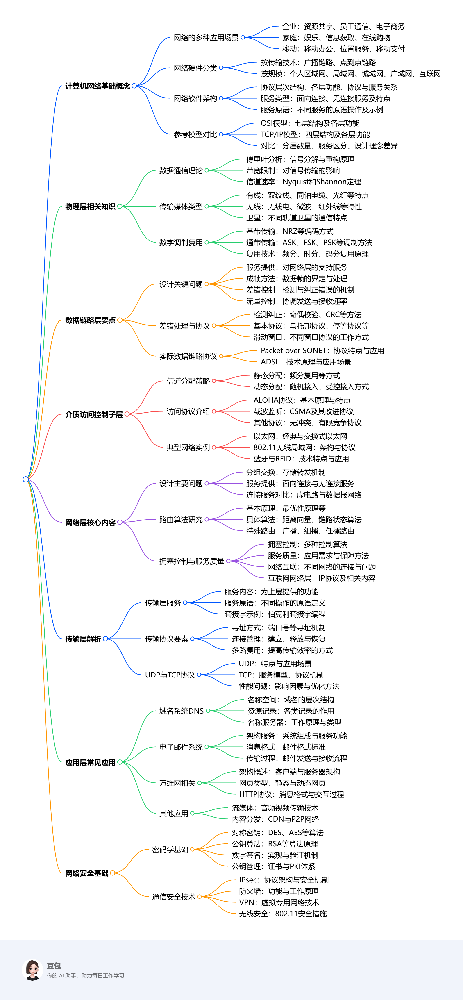

# 课程总览
## 学习要点（2025.2.24）
计算机网络是一门理论与实践结合的课程，想要拿高分，需要理解概念、掌握原理并结合实际应用。以下从学习方法、学习要点、参考北邮考题特点以及学长学姐学习经验四个方面，为你提供学习建议：

1. **学习方法**
    - **构建知识体系**：计算机网络知识繁杂，可按{++照课程章节或参考模型（如OSI、TCP/IP模型）梳理各层功能、协议和技术++}，制作思维导图或总结笔记，把握整体框架和各部分联系 。比如，以TCP/IP模型为脉络，理解网络层IP协议如何实现数据包传输，传输层TCP和UDP协议如何提供不同类型服务，以及应用层常见协议（如HTTP、SMTP等）的工作原理。
    - **理论联系实际**：计算机网络在生活中应用广泛，像家庭网络、手机上网等。学习时将理论知识与实际场景结合，能更好理解抽象概念。如学习无线局域网（WLAN）时，可思考家中无线路由器的工作方式、信号覆盖范围及影响因素；学习网络安全时，分析网络购物时如何保障支付安全。
    - **多做练习题**：通过做课后习题、在线练习题及历年考试真题，巩固知识、熟悉题型、了解考试重点和命题规律。做题时注重思考解题思路和涉及的知识点，总结错题，查漏补缺。
    - **实践操作**：条件允许的情况下，进行网络实验，如搭建简单网络环境、配置路由器和交换机、使用网络抓包工具分析网络流量等。实践能加深对理论知识的理解，提高动手能力和解决问题的能力。例如，使用Packet Tracer等网络模拟软件，模拟网络拓扑结构，配置网络设备，观察网络运行情况。
2. **学习要点**
    - **基础概念**：准确理解计算机网络的基本概念，如协议、服务、带宽、时延、吞吐量等，这些是学习后续知识的基础。例如，协议是通信双方的约定，规定了数据格式和交互规则；服务是某一层向其上层提供的功能集合。
    - **分层结构**：重点掌握OSI和TCP/IP参考模型的分层结构、各层功能及层间关系。理解不同层次协议的作用和协同工作方式，如网络层负责路由选择，传输层负责端到端的可靠或不可靠传输。
    - **关键协议**：深入学习各层关键协议的工作原理和特点，如网络层的IP协议（包括IPv4和IPv6）、路由协议（如RIP、OSPF），传输层的TCP和UDP协议，应用层的HTTP、FTP、SMTP等协议。以TCP协议为例，要掌握其连接建立（三次握手）、数据传输、连接释放（四次挥手）过程，以及流量控制和拥塞控制机制。
    - **网络设备**：熟悉常见网络设备（如路由器、交换机、集线器等）的功能和工作原理，了解它们在网络中的作用和相互协作方式。例如，路由器用于网络层的数据包转发，根据路由表选择最佳路径；交换机用于数据链路层的帧交换，基于MAC地址转发数据。
    - **网络安全**：掌握网络安全的基本概念和常用技术，如加密算法（对称密钥算法和公钥算法）、数字签名、防火墙、虚拟专用网络（VPN）等。理解如何利用这些技术保障网络通信的保密性、完整性和可用性。
3. **北邮往年考题特点分析**
    - **覆盖面广**：涵盖计算机网络各个章节知识点，包括基本概念、原理、协议和应用等。如考查网络模型的层次结构、协议的工作流程、网络设备的功能等。
    - **注重原理理解**：很多题目要求深入理解原理，如解释某个协议的工作机制、比较不同协议的优缺点、分析网络故障原因等。例如，分析TCP协议和UDP协议在传输可靠性和效率方面的差异及适用场景。
    - **结合实际应用**：部分考题会结合实际网络场景，要求考生运用所学知识解决实际问题，如网络配置、故障排除、网络性能优化等。比如，给出一个简单网络拓扑，要求配置路由器实现不同网络段之间的通信；或者分析网络速度慢的可能原因并提出解决方案。
    - **题型多样**：可能包括选择题、填空题、简答题、计算题和论述题等。选择题和填空题主要考查基础知识的记忆；简答题和论述题考查对知识点的理解和综合运用能力；计算题可能涉及网络性能指标计算（如带宽、时延、吞吐量等）、协议相关计算（如TCP窗口大小计算）等。 
4. **学长学姐学习经验**
    - **扎实基础**：重视基础知识学习，确保对每个概念和原理都理解透彻。对于重点和难点，反复研读教材和参考资料，多向老师和同学请教。比如在学习网络层路由算法时，通过多种方式理解距离向量算法和链路状态算法的原理、计算过程及优缺点。
    - **多做真题**：认真研究历年考题，了解考试重点和题型分布，针对常考知识点重点复习。通过做真题熟悉答题思路和技巧，提高答题速度和准确性。做完真题后，仔细分析答案，总结解题方法和易错点。
    - **实践巩固**：积极参加实验课程，通过实际操作加深对理论知识的理解。在实验中遇到问题，尝试自己解决，锻炼动手能力和问题解决能力。也可自己搭建简单网络环境，进行网络配置和测试，增强对网络运行的直观感受。
    - **总结归纳**：定期总结所学知识，{++制作知识总结卡片或思维导图++}，便于复习和记忆。将相似知识点进行对比归纳，如对比不同传输媒体的特点、不同路由协议的工作原理等，加深理解和记忆。 
## 课程框架
1. **计算机网络概述**：介绍计算机网络在企业、家庭、移动场景中的应用，探讨网络使用引发的社会问题。阐述网络硬件分类，如按传输技术和规模划分的不同网络类型。引入网络软件概念，包括协议层次结构、服务类型、服务原语等，对比OSI和TCP/IP参考模型。
2. **物理层**：研究数据通信理论基础，如傅里叶分析、带宽限制信号及信道最大数据速率。介绍各类传输媒体，包括有线的磁介质、双绞线、同轴电缆、电力线、光纤，无线的无线电、微波、红外线、光传输，以及卫星通信。探讨数字调制与复用技术，如基带传输、通带传输、频分复用、时分复用、码分复用，以实现数据在物理信道上的有效传输。
3. **数据链路层**：分析数据链路层的设计问题，如为网络层提供的服务、成帧、差错控制和流量控制。介绍差错检测与纠正方法，以及基本的数据链路协议和滑动窗口协议。结合实际协议，如Packet over SONET和ADSL，理解数据链路层的工作原理。
4. **介质访问控制子层**：研究信道分配问题，包括静态和动态分配方式。介绍多种访问协议，如ALOHA、载波监听多路访问协议等。以以太网、802.11无线局域网等为例，分析不同网络的特点和工作机制，还涉及蓝牙、RFID等技术及数据链路层交换相关内容。
5. **网络层**：探讨网络层的设计问题，如存储转发分组交换、为传输层提供的服务等。研究路由算法，包括最优性原理、最短路径算法等多种算法。讨论拥塞控制算法和服务质量保障方法。介绍互联网的网络层相关内容，如IP协议、路由协议等。
6. **传输层**：分析传输层的服务，如为上层提供的服务、服务原语等，以伯克利套接字为例进行说明。探讨传输协议的要素，包括寻址、连接建立与释放等。详细介绍互联网传输协议UDP和TCP，分析它们的特点、应用场景及性能问题。
7. **应用层**：介绍域名系统DNS，包括域名空间、资源记录和名称服务器。探讨电子邮件的架构、服务、消息格式和传输过程。研究万维网的架构、网页类型、HTTP协议等。此外，还涉及流媒体、内容分发网络等应用层相关内容。
8. **网络安全**：学习密码学基础，包括对称密钥算法和公钥算法。研究数字签名、公钥管理方法。探讨通信安全技术，如IPsec、防火墙、虚拟专用网络等。分析不同网络安全机制在保障网络安全方面的作用和应用场景。 
