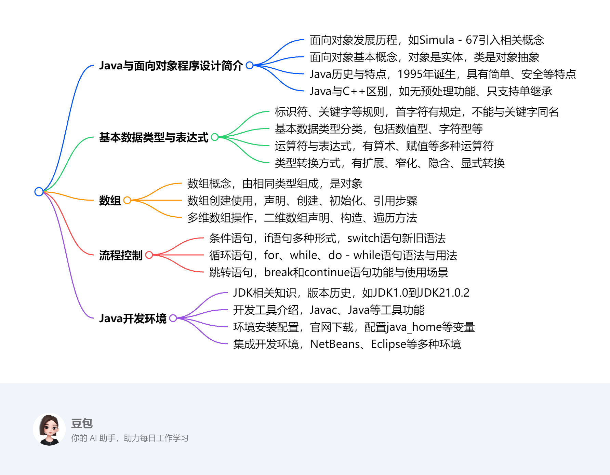
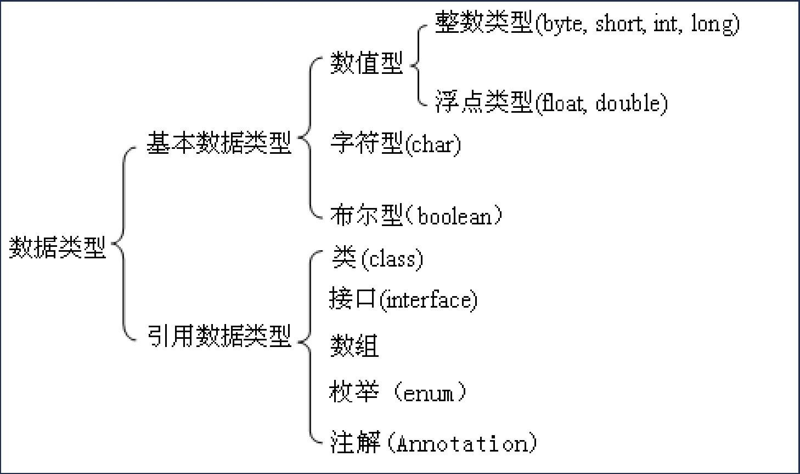

# 第一章：Java语言基础知识

该文档围绕Java语言基础知识展开，涵盖了Java与面向对象程序设计简介、基本数据类型与表达式、数组、流程控制等方面内容。

1. **Java与面向对象程序设计简介**
    - **面向对象发展历史**：第一门面向对象编程语言是Simula - 67，引入类、对象、继承等概念；Smalltalk使面向对象技术实用化，其80版本是重要里程碑；之后多种面向对象语言涌现，推动技术商业化，UML统一相关概念。
    - **Java历史**：1995年诞生于SUN公司，最初叫Oak，后更名Java。随着网络兴起而发展，现被Oracle收购，应用广泛，是热门开发语言。
    - **Java特点**：面向对象，还具备安全性、平台无关性等优点，遵循简单、面向对象、分布式等特性口号。
    - **Java与C++区别**：Java无预处理功能、特定数据结构和多重继承等，使用import语句、单重继承等。
2. **基本数据类型与表达式**
    - **标识符与关键字**：标识符用于命名，有特定规则，不能与关键字同名；Java有众多关键字，用于定义语言结构。
    - **变量与常量**：变量需先定义后使用，可改变值；常量初始化后不可变。
    - **数据类型**：包括基本数据类型（数值型、字符型、布尔型）和引用数据类型，各有特点和取值范围。
    - **运算符与表达式**：有多种运算符，各有运算规则和优先级，表达式会根据运算符进行计算。
    - **类型转换**：分为扩展和窄化转换，也有隐含和显式转换，转换不当可能导致问题。
3. **数组**
    - **数组概念**：由相同类型元素组成，是对象，有length属性表示元素个数。
    - **数组使用**：需声明、创建、初始化后使用，通过下标引用元素，下标从0开始，要避免越界。
    - **多维数组**：可看作数组的数组，声明、构造和使用有多种方式，每行长度可不同。
4. **流程控制**
    - **条件语句**：if语句有多种形式，可使用条件运算符简化；switch语句实现多分支，Java 14起有新语法和表达式形式。
    - **循环语句**：for循环功能强、使用广，可嵌套，有增强for循环用于遍历；while和do - while语句用于循环，执行过程有差异。
    - **跳转语句**：break用于跳出循环或switch语句；continue用于停止本次迭代，两者都有带标号和不带标号的使用方式。 
## JAVA与面向对象程序设计简介
### 提示语
1. **什么是面向对象程序设计?举例说明**：面向对象程序设计将客观事物看作具有状态和行为的对象，通过抽象找出同一类对象的共同状态和行为，构成类。例如，在一个图形绘制程序中，把圆形、矩形等都视为对象，它们有各自的状态（如圆心坐标、半径、边长等）和行为（如绘制自身、计算面积等）。圆形类可以定义圆心坐标和半径作为属性（状态），定义计算面积和绘制圆形的方法（行为）。创建一个圆形对象时，就可以调用这些方法来实现相应功能。
2. **面向对象设计程序有什么好处?举例说明**：面向对象设计程序具有可重用性和可靠性。以开发一个游戏为例，游戏中的角色（如战士、法师等）可以设计成不同的类。这些类具有各自的属性（如生命值、魔法值等）和方法（如攻击、防御等）。当需要创建多个相同类型的角色时，直接使用已定义好的类进行实例化即可，提高了开发效率，体现了可重用性。同时，通过封装将数据和操作数据的方法绑定在一起，外部只能通过特定接口访问数据，保证了数据的安全性和程序的稳定性，增强了可靠性。例如战士类，外部不能随意修改其生命值，只能通过类中定义的受保护的方法来进行相关操作。
3. **我是一个初学者，感觉用面向对象设计程序比面向过程好像更复杂了，为什么?**：对于初学者而言，面向对象设计涉及更多概念，如类、对象、封装、继承、多态等，理解和掌握这些概念需要花费一定时间和精力。相比之下，面向过程编程按照步骤顺序执行，逻辑较为直观。在面向对象编程中，创建对象、管理对象之间的关系等操作相对复杂。在一个简单的计算程序中，面向过程可能只需按照计算步骤依次编写代码；而面向对象则需要先定义相关的类，再创建对象并调用方法，初学者可能会觉得繁琐。 
4. **既然更复杂了，面向对象设计的好处是怎样体现的?**：虽然面向对象设计在初期学习和开发时可能显得复杂，但在大型项目中优势明显。在大型企业级应用开发中，系统功能复杂，模块众多。使用面向对象设计，通过类的封装可以隐藏内部实现细节，降低模块间的耦合度，使得各个模块可以独立开发、维护和扩展。例如，一个电商系统中，商品管理、用户管理、订单管理等功能可以分别设计成不同的类。当需要修改商品管理模块的功能时，只要接口不变，不会影响其他模块的正常运行。继承和多态特性则进一步提高了代码的复用性，减少重复代码编写，提高开发效率和程序的可维护性。 
5. **介绍一下面向对象的发展史**：第一门面向对象的编程语言是Simula - 67（1967年） ，它首先引入了类、对象、继承等概念；Smalltalk（1972 - 1981年）使面向对象技术进入实用化，其80版本的问世被认为是面向对象语言发展史上最重要的里程碑，提供了比较完整的面向对象技术解决方案；此后，Objective C、C++、Eiffel和CLOS等语言大量涌现，C++语言的广泛应用使得面向对象技术真正从实验室阶段走到了商业化阶段；同时，面向对象的软件工程迅速发展，UML将不同方法中使用的各种概念进行统一，并被对象管理组织采纳为规范。 

该节主要介绍了面向对象程序设计的发展历史、基本概念，以及Java语言的相关信息，包括历史、特点、与C++的区别等内容。

### **面向对象程序设计**
- **发展历史**：第一门面向对象编程语言是1967年的Simula - 67，它引入了类、对象、继承等概念。1972 - 1981年的Smalltalk使面向对象技术实用化，其1980年版本是重要里程碑，提供了完整的面向对象技术解决方案。后来，Objective C、C++等多种面向对象语言涌现，C++的广泛应用推动面向对象技术商业化。同时，UML统一了相关概念，促进面向对象软件工程发展。
- **基本概念**：对象是具有状态、行为和标识符的实体，比如一个具体的人就是一个对象，他有自己的年龄（状态）、会说话（行为） 。类是拥有共同结构、行为和语义的一组对象的抽象，如人类就是对所有具体人的抽象。抽象是找出事物本质特征、忽略不相关部分的过程，从对象到类就是抽象的体现。封装是隐藏具体实现细节，只暴露接口，比如手机内部复杂的电路和软件实现被封装起来，用户只需通过屏幕等接口使用。继承是类之间的“是”关系，子类可共享父类结构和行为，例如苹果类继承水果类，就拥有水果类的一些特性。多态是一个接口有不同实现行为，如不同动物都有“叫”这个行为接口，但实现方式不同。
    1. **对象**：对象是一个实体，具有状态、行为和标识符，是面向对象编程的基本单元。在现实世界中，如一辆汽车，它的颜色、型号等是状态，行驶、刹车等是行为，车辆识别码可作为标识符。在程序中，对象是类的实例，不同对象有各自的属性值和行为表现。
    2. **类**：类是一组具有共同结构、行为和语义的对象的抽象。它定义了对象的属性和方法，是创建对象的模板。以“汽车”类为例，可定义品牌、颜色等属性，启动、加速等方法。所有汽车对象都基于“汽车”类创建，具有类中定义的属性和方法。
    3. **抽象**：抽象是揭示事物区别于其他事物本质特征的过程，目的是忽略不相关部分，提取关键信息。从具体对象到类的过程就是抽象。将各种具体的汽车抽象为“汽车”类时，只关注汽车共有的本质特征，如都能行驶、都有基本构造等，而忽略每辆车的独特细节。
    4. **封装**：封装是对客户隐藏具体实现细节，客户仅依赖接口进行操作，实现信息隐藏和数据抽象。就像手机，用户无需了解内部复杂电路和软件代码，通过屏幕、按键等接口就能使用打电话、发短信等功能。在程序中，通过将数据和操作数据的方法封装在类中，控制对数据的访问，提高安全性和可维护性。
    5. **泛化（继承）**：泛化是类之间的“是”关系，通过继承实现。子类可共享父类的结构和行为，从而建立类的层次结构。分为单一继承（一个子类只有一个直接父类）和多重继承（一个子类有多个直接父类，Java不支持多重继承，但可通过接口实现类似功能）。如“轿车”类继承“汽车”类，“轿车”类就拥有“汽车”类的属性和方法，同时还可添加自身特有的属性和方法，如轿车的座位数等。
    6. **多态**：多态是指在统一外表（接口）下隐藏不同实现的能力，即一个接口可以有不同的实现行为，这是面向对象技术的本质特征。以“动物”类的“叫声”方法为例，不同子类（如“狗”类、“猫”类）继承“动物”类后，对“叫声”方法有不同的实现，狗叫和猫叫的声音不同，但都通过“叫声”这个统一接口表现。 
### **Java语言**
- **历史**：1995年诞生于SUN公司，最初为消费类电子产品嵌入式芯片设计，名为Oak，后更名Java，现被Oracle收购。随着网络兴起，Java得到广泛应用，拥有大量开发人员，在众多设备上运行。
- **特点**：是面向对象的程序设计语言，还具有安全性、平台无关性、支持多线程、内存管理等优点，遵循简单、面向对象、分布式等特性。
- **与C++区别**：Java没有#include和#define等预处理功能，用import语句包含其他类和包；没有structure、union及typedef；不支持不属于类成员的函数、指针和多重继承，只支持单重继承；禁用goto，但保留该关键字；没有操作符重载；没有全局变量，通过在类中定义公用、静态数据成员实现类似功能。 
## 基本数据类型与表达式
该节主要围绕Java语言的基本数据类型与表达式展开，涵盖标识符、关键字、变量与常量、数据类型、运算符、类型转换以及Java类的基本结构和输入输出等内容。

### **标识符、关键字、变量与常量**
- **标识符**：由程序员定义，用于给程序中的数据、方法等命名。首字符需是特定字符，后续字符也有规定，且区分大小写，不能与关键字同名，命名应反映所代表内容的含义。
- **关键字**：是Java语言预定义的特殊单词，有特定用途，如定义类、控制流程等，Java SE 15 Edition中有众多关键字。
- **文字量**
- **变量与常量**：变量是命名的存储单元，有类型且值可变，使用前需先定义；常量初始化后值不可改变。
### **基本数据类型**
- **分类**：分为基本数据类型和引用数据类型。基本数据类型包括整数类型（byte、short、int、long）、浮点类型（float、double）、字符型（char）和布尔型（boolean）；引用数据类型包含类、接口、数组、枚举、注解等。
 - **特点**：各基本数据类型有不同的长度、取值范围和文字量表示形式。数值型数据有固定的字节长度和取值区间，字符型用Unicode编码，布尔型只有true和false两个值。
#### 字符串
Java中字符串相关内容丰富，主要涵盖定义、类型、拼接及输入输出等方面：

1. **字符串定义与表示**：字符串由零个或多个字符组成，以双引号括起，每个字符可用转义序列表示。如`"This is a string"` 是包含16个字符的字符串，`"This is a " + "string"`是由两个字符串常量组成的字符串常量表达式。空字符串是`""`。
2. **字符串类型**
    - **String类**：是JDK标准类集合的一部分，用于表示常量字符串类型。一旦初始化，内容不可改变。例如`String animal = "walrus";`，之后无法直接修改`animal`所指向的字符串内容。所有字符串文字常量，如`"abc"`，都属于String类型。
    - **StringBuffer类**：其对象内容可变。与String类相比，在频繁修改字符串场景下，性能更优。比如需要不断拼接字符串时，使用StringBuffer可减少内存开销和提高效率。
3. **字符串拼接**：通过`+`运算符进行。数字与char拼接，相当于和其ASCII编码相加；数字与String拼接，结果为String；当数字同时与char和String拼接时，取决于先拼接的对象。无论何种类型与String拼接，结果都是String。例如`String s1 = 1234 + '_' + "test";`，先计算`1234 + '_'`（实际是`1234 + 95`，`'_'`的ASCII码值为95 ），结果再与`"test"`拼接。
4. **字符串输入输出**：在输入方面，使用`Scanner`类读取字符串时需注意，`sc.next()`读取的字符串不能包含空格，`sc.nextLine()`可读取含空格的字符串，但如果在`nextInt`、`nextDouble`等方法后使用`nextLine`，可能会读取到回车符，必要时需创建新的`Scanner`对象。在输出方面，除了`System.out.println()`，还可使用`System.out.printf()`和`String.format()`进行格式化输出。 
### **表达式与运算符**
- **运算符类型**：包含算术运算符、赋值运算符、关系运算符、逻辑运算符、位运算符和条件运算符，每种运算符有特定的运算规则。
- **优先级与结合性**：运算符具有不同的优先级和结合性，决定了表达式的计算顺序。
### **类型转换**
分为扩展转换（如从byte到int）和窄化转换（如从double到float），前者通常不损失信息，后者可能丢失信息。也可分为隐含转换（如赋值转换、方法调用转换）和显式转换（强制转换） 。
### **Java类的基本结构**
Java文件以.java为扩展名，一个文件中最多有一个public class，其类名需与文件名一致。类是Java的基础逻辑单位，一个class最多有一个main方法，它是程序的入口，有固定的修饰符和形参写法。
### **标准输入输出**
Java通过System.in和System.out进行标准输入输出。Scanner类常被用于获取用户输入，可将输入解析成各种基本数据类型，使用时要注意其方法的特点和可能出现的问题。此外，还可使用格式化输出函数（如System.out.printf() ）进行格式化输出。
### **注释**
Java源程序支持单行注释、多行注释和文档注释三种类型。 
## 数组
该节主要围绕Java中的数组展开，涵盖数组的概念、创建与使用、复制以及多维数组等方面，具体内容如下：

1. **数组概念**：数组是将同一类型的对象或基本数据封装在同一个标识符（数组名称）下的数据结构，它是对象，可以赋值给Object类型的变量，能调用类Object的所有方法。每个数组都有一个由public final修饰的成员变量length，用于表示数组中元素的个数。数组中的变量被称为数组元素，通过数组名和非负整数下标值引用，下标从0开始计数。
2. **数组的创建和使用**
    - **声明**：声明数组时无需指明数组元素个数，也不为数组元素分配内存空间，有“Type[] arrayName;”和“Type arrayName[];”两种声明方式，如“int[] intArray;”和“int intArray[];” 。
    - **创建**：使用关键字new构成数组创建表达式来指定数组类型和元素个数，元素个数可以是常量或变量。基本类型数组的元素是基本类型变量，引用类型数组的元素是对象引用。例如“int[] ai = new int[10];” 。也可在一条声明语句中创建多个数组，如“String[] s1 = new String[3], s2 = new String[8];” 。
    - **初始化**：声明数组时可给出初始值，程序会利用初始值创建数组并初始化元素，如“int a[] = {22, 33, 44, 55};” 。若创建数组时未指定初始值，数组元素会被赋予默认值，基本类型数值数据默认值为0，boolean类型数据默认值为false，引用类型元素默认值为null 。之后也可改变数组元素值。
    - **使用**：通过“arrayName[index]”引用数组元素，下标必须是int、short、byte或char类型，且不能越界，否则会产生数组越界异常（ArrayIndexOutOfBoundsException） 。
3. **数组的复制**：使用“System.arraycopy(Object source, int srcIndex, Object dest, int destIndex, int length)”方法可复制数组或数组的部分元素。例如“char[] copyFrom = {'d', 'e', 'c', 'a', 'f', 'f', 'e', 'i', 'n', 'a', 't', 'e', 'd'}; char[] copyTo = new char[7]; System.arraycopy(copyFrom, 2, copyTo, 0, 7);”，将copyFrom数组从下标2开始的7个元素复制到copyTo数组从下标0开始的位置 。
4. **多维数组**：以二维数组为例，声明和构造方式多样，如“int[][] gradeTable;”声明一个二维数组引用；“int[][] myArray = new int[3][5];”定义引用时同时构造数组并初始化引用，数组元素初始值为零；“int[][] myArray = {{8,1,2,2,9}, {1,9,4,0,3}, {0,3,0,0,7}};”定义引用、构造数组并初始化数组元素 。还可以先声明数组，再分别为每行分配空间并赋值。二维数组有行和列的概念，通过“数组名.length”可获取行数，通过“数组名[行下标].length”可获取指定行的列数 。 
## 流程控制
该部分内容主要围绕Java语言的流程控制语句展开，具体如下：

### 流程控制语句类别
介绍了Java中常见的流程控制语句，包括if语句、switch语句、for语句、while语句和do - while语句，并提出了一些相关问题，如Java中switch语句和C语言的不同，使用if语句的易错点等。
### if语句
 - **基本形式**：有只有if分支（`if (boolean-expression) { // statement1; }`）、if - else语句（`if (boolean-expression) { // statement1 ; } else { // statement2 ; }`）以及if - else的特殊形式（多个else if分支）。
 - **条件运算符替代**：简单的if - else语句可以用条件运算符重写，如`if (a>b) System.out.println("The larger one is: "+a); else System.out.println("The larger one is: "+b);`可写成`System.out.println("The larger one is: " + (a>b)?a:b);` 。
 - **示例**：通过`DaysInMonth`类计算每个月的天数，展示了if - else语句的使用，假设不考虑闰年，2月为28天，4、6、9、11月为30天，其他月份为31天。 
### switch语句
 - **语法形式**：
    - **旧语法**：`switch (switch-expression) { case value1: statements for case1; break; … default: statements for default case; break; }`，其中`switch-expression`和常量值需为整形、字符型、枚举型或String类型，表达式值与某case值相同则从此处执行，直到break，default可有可无 。
    - **新语法**：`switch (switch-expression) { case value1-> statements for case1; … default -> statements for default case; }` 。
 - **switch表达式**：可通过switch结构返回一个值赋给变量，如计算每月天数的示例`days = switch (month) { case 2 -> 28 ; case 4 , 6 , 9 , 11 -> 30; default -> 31 ; } ;` 。
### for语句
 - **语法格式**：`for (start-expression; check-expression; update-expression) { //body of the loop; }`，`start-expression`用于初始化，`check-expression`是布尔条件表达式判断循环是否继续，`update-expression`修整循环变量 。
 - **特点与使用**：功能较强且使用广泛，可嵌套，如显示九九乘法表的示例；还介绍了逗号运算符在for循环控制表达式的初始化和递增部分的使用 。
 - **增强for循环**：用于遍历数组或集合对象，语法为`for (Type name : 数组或集合类型对象) { //循环体; }`，如打印星期一到星期天的示例 。
### while语句
 - **语法形式**：`while (check-expression) { //body of the loop; }` 。
 - **执行过程**：先判断`check-expression`的值，为真则执行循环体，执行完后再判断，为假则跳过循环体执行后续语句 。 
### do - while语句
 - **语法形式**：`do { //body of the loop; } while (check-expression);` 。
 - **执行过程**：先无条件执行一遍循环体，再判断条件表达式，为真则继续执行循环体，否则跳出循环，其特点是循环体至少执行一次 。 
### break和continue语句
 - **break语句**：可跳出循环，在switch结构中终止switch语句执行；在循环结构中，无标号时终止最内层循环，有标号时跳出标号标识的循环，也可用于跳出指定代码块 。
 - **continue语句**：用于循环结构，不带标号时终止本轮循环剩余语句，进入下一轮；带标号时使程序流程转入标号标明的循环层次 。 