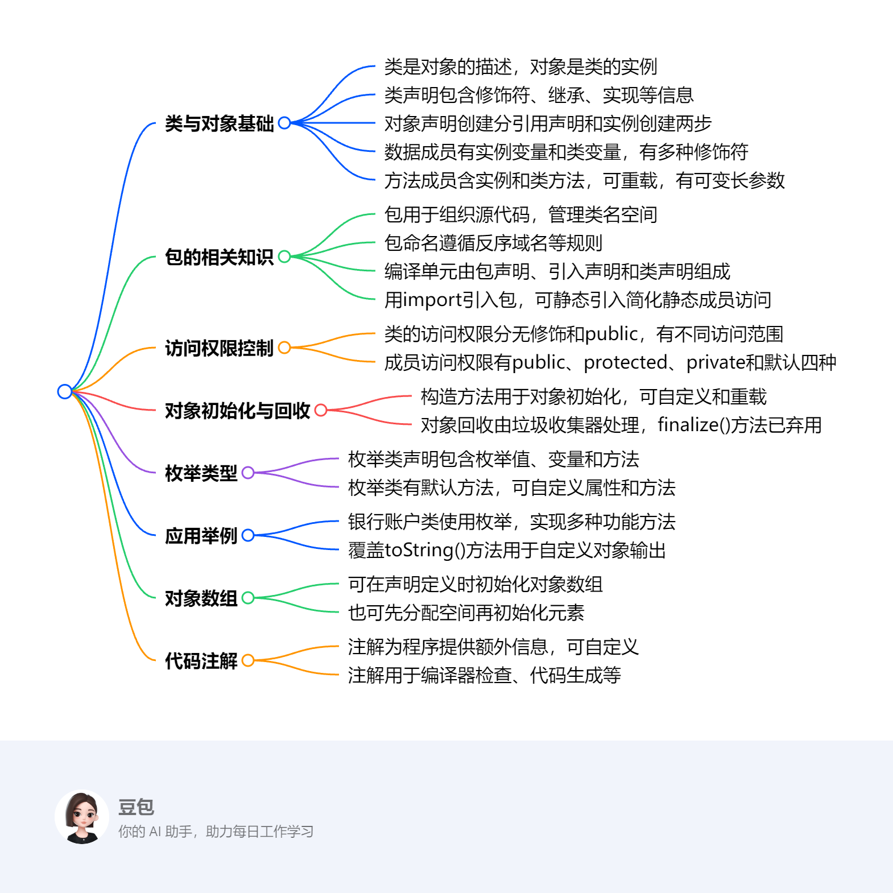

# 第二章：类与对象
该文档围绕Java语言中类与对象展开，涵盖基础概念、对象操作、枚举类型、应用实例、对象数组及代码注解等内容，是Java编程基础的重要知识总结。

1. **类与对象基础**
    - **类与对象关系**：类是对一类对象的描述，对象是类的具体实例。
    - **类声明**：格式为`[public] [abstract | final] class类名称 [extends父类名称] [implements接口名称列表]{...}`，`extends`用于继承父类，`implements`用于实现接口 。`public`、`abstract`、`final`分别表示公有类、抽象类、终结类。
    - **对象声明与创建**：声明引用变量`类名 引用变量名;`，创建对象使用`new <类名>()`，`new`用于分配内存空间并返回对象引用，引用变量可赋值为`null`。
    - **数据成员**：表示对象状态（实例变量）或类共享数据（类变量）。声明语法`[访问控制符][static][final][transient][volatile]数据类型变量名[=变量初值]` 。实例变量无`static`修饰，类变量用`static`修饰。
    - **方法成员**：语法`[访问控制符][static][final][abstract][native][synchronized]返回类型方法名([参数列表]) [throws exceptionList]{方法体}`。实例方法表示特定对象行为，类方法表示类中对象共有行为，可通过类名或实例调用。方法重载指一个类中多个同名方法，参数不同。可变长参数用省略号表示，本质是数组。
2. **包**
    - **作用**：组织相关源代码文件，管理类名空间，提供封装和存取权限。
    - **命名**：建议反序机构Internet域名作为前导，遵循一定规则处理特殊字符。
    - **编译单元**：由包声明、`import`声明、类和接口声明组成，一个编译单元最多有一个`public`类，且类名与文件名相同。
    - **引入包**：使用`import`语句，`java.lang`包自动引入。静态引入用于简化静态成员访问。
3. **类和成员的访问权限控制**
    - **类访问权限**：无修饰时同一包内可访问，`public`修饰时不同包也可访问。
    - **成员访问权限**：`public`可被任意方法访问；`protected`可被子类和同一包中其他类访问；`private`仅同一类中可访问；默认权限仅同一包内可访问。
4. **对象初始化和回收**
    - **构造方法**：方法名与类名相同，无返回类型，通常`public`修饰，用于对象初始化。可自定义构造方法，可重载，若未显式声明，编译器生成默认构造方法。
    - **对象回收**：无用对象（离开作用域或无引用指向）由垃圾回收器回收内存，回收前会调用`finalize()`方法（Java 9开始弃用），建议实现`AutoCloseable`接口的`close`方法替代。
5. **枚举类型**
    - **声明**：`[public] enum枚举类型名称 [implements接口名称列表]{枚举值;...}`，枚举定义实际是定义类，继承自`java.lang.Enum`，构造方法为包内私有或私有。
    - **默认方法**：`values()`获取枚举值数组，`toString()`返回字符串描述，`valueOf()`将字符串转为枚举对象，`ordinal()`获取位置索引。
6. **应用举例**：以银行账户类为例，展示了枚举类型的应用、方法覆盖、存取款方法实现、数据格式化以及静态工厂方法的使用等。
7. **对象数组**：可在声明定义时初始化，也可先分配空间再给元素分配空间。
8. **代码注解**：通过元数据为程序提供额外信息，可用于编译器检查错误、生成代码等。Java提供预定义注解，也支持自定义注解。 

## 类声明与对象创建
### 提示语
1. **类和对象是怎样的关系**：类是对一类对象的描述，它定义了对象共有的属性（数据成员）和行为（方法成员）；对象则是类的具体实例，每个对象都具有类所定义的属性和行为，不同对象的属性值可以不同。比如，“圆”类定义了半径属性和计算周长、面积的方法，而具体的某个圆对象，如半径为5的圆，就是“圆”类的一个实例，它具有“圆”类定义的属性和行为 。
2. **Java中对象的声明和创建是怎么回事**：对象声明是指声明一个引用变量，语法为“类名 引用变量名;”，此时并没有生成对象，只是定义了一个用于存储对象引用的变量，例如“Clock aclock;”。对象创建使用“new <类名>()”的语法，“new”的作用是在内存中为指定类型的对象分配内存空间，并返回对象的引用，如“aclock = new Clock();”，这样就创建了一个“Clock”类的对象，并将其引用赋值给“aclock”变量。
3. **Java中的引用和C++的指针有什么区别和联系**
    - **联系**：两者都用于指向内存中的数据，在一定程度上都能实现对对象的间接访问。
    - **区别**：Java中的引用不能进行算术运算，如不能像C++指针那样进行指针的加减操作；Java的引用由系统自动管理内存，无需手动释放，避免了指针悬空和内存泄漏等问题，而C++中需要程序员手动管理指针所指向的内存，若操作不当易出现内存问题；Java引用在使用前必须初始化，C++指针可以先不初始化，但未初始化的指针使用时容易引发错误。
4. **几种不同的类修饰public、abstract、final有什么不同**
    - **public**：表明此类为公有类，在不同包中的类只要对其所在包有访问权限，就能访问该类。
    - **abstract**：指明此类为抽象类，抽象类不能被实例化，通常包含抽象方法（只有方法声明，没有方法体），用于定义一些具有共性的行为或属性，但具体实现由子类完成，它为子类提供了一个通用的框架。
    - **final**：指明此类为终结类，不能被继承，即不能有子类，常用于一些不希望被修改或扩展的类，如Java中的`String`类。
5. **extends和implements之间有什么区别和联系**
    - **联系**：两者都用于建立类之间的关系，都能让一个类获取其他类或接口的属性和方法。
    - **区别**：“extends”用于类的继承，一个类只能继承一个直接父类，通过继承可以复用父类的代码，子类可以对父类的方法进行重写；“implements”用于类实现接口，一个类可以实现多个接口，接口中定义的方法必须在实现类中全部实现，接口主要用于实现多态性，让不同类实现相同的接口，以统一的方式进行调用。
6. **public类是什么意思**：public类即公有类，具有最高的访问权限。只要对该类所在包有访问权限，不同包中的类都能访问它。它常用于定义一些供外部广泛使用的类，如程序的主类、工具类等。
7. **为什么说一个java源文件中最好只有一个public类**：因为Java源文件的编译结果是每个类生成一个对应的`.class`文件，public类的类名必须与源文件名相同。若一个源文件中有多个public类，就会出现多个类名与文件名冲突的情况，导致编译错误。此外，从代码结构和可读性角度看，一个源文件一个public类，能使代码结构更清晰，便于维护和管理。 

该部分内容主要介绍了Java中类与对象的基础概念，包括类与对象的关系、类声明、对象声明与创建等，具体内容如下：
### **类与对象的关系**
类是对一类对象的描述，对象是类的具体实例。比如现实世界中，“人”可以看作一个类，而具体的某个人，如“张三”就是“人”这个类的一个对象。
### **类声明**
- **基本格式**：`[public] [abstract | final] class类名称 [extends父类名称] [implements接口名称列表]{数据成员声明及初始化；方法声明及方法体；}`。
- **关键部分解释**：`class`表明其后声明的是一个类；`extends`用于指定所声明的类从某一父类派生而来，父类名写在其后；`implements`用于声明类要实现的接口，接口名写在其后；`public`表明此类为公有类，可被其他类广泛访问；`abstract`指明此类为抽象类，通常包含未实现的抽象方法；`final`指明此类为终结类，不能被继承。
- **示例**：在例2 - 1钟表类`public class Clock`中，声明了`hour`、`minute`、`second`等变量成员和`setTime`、`showTime`等方法成员 。
### **对象声明与创建**
- **对象引用声明**：语法为`类名 引用变量名;` ，如声明`Clock aclock;`，此时仅声明了一个用于存储`Clock`类对象引用的变量，并没有生成实际对象。
- **对象的创建**：语法形式为`new <类名>()` ，例如`aclock = new Clock()` 。`new`的作用是在内存中为指定类类型的对象分配内存空间，并返回对象的引用。引用变量可以被赋以空值，如`aclock = null;` 。
- **对象与对象的引用关系**：实际操作对象是通过指向对象的“引用”进行的，就像用遥控器操纵电视机，遥控器类比引用，电视机类比对象。引用和对象可以单独存在，但使用时需要建立两者的关联 。 
## 数据成员
### 提示语
1. **`public`、`protected`、`private`成员的含义及举例**
    - `public`（公有）：可以被其他任何方法访问（前提是对类成员所属的类有访问权限）。例如在银行账户类`BankAccount`中，如果将`getBalance`方法声明为`public`，那么其他类的对象只要能访问到`BankAccount`类的实例，就可以调用`getBalance`方法获取账户余额。
    - `protected`（保护）：只可被其子类和同一包中其他类的方法访问。假设有一个`Employee`类和它的子类`Manager`类在同一个包中，`Employee`类中声明为`protected`的`salary`变量，`Manager`类可以访问和使用这个变量，同一包中的其他类如果有合适的方法也能访问，但不同包中的非子类则无法访问。
    - `private`（私有）：只可被同一类的方法访问。如在`Circle`类中，将`radius`变量声明为`private`，在其他类中就不能直接访问`radius`变量的值。若`CircumferenceTester`类中试图直接访问`Circle`类的`private`变量`radius`，编译时会报错 ，提示“`radius has private access in Circle`” 。如果要允许其他类访问`radius`的值，需要在`Circle`类中声明相应的公有`get`和`set`方法。
2. **`static`、`final`、`transient`、`volatile`成员的含义**
    - `static`（静态）：修饰的成员变量为类变量，为该类的所有对象共享，在整个类中只有一个值，类初始化时就被赋值；修饰的方法为类方法，表示类中对象的共有行为。如`Circle`类中的`PI`变量用`static`修饰，它就是一个类变量，所有`Circle`类的实例共享这个`PI`值；`Converter`类中的`centigradeToFahrenheit`方法用`static`修饰，它是一个类方法，可以通过类名直接调用 。
    - `final`（最终的）：修饰变量时，表明该变量的值不能被修改。实例变量和类变量都可被声明为`final`，`final`实例变量可以在类中定义时给出初始值，或者在每个构造方法结束之前完成初始化；`final`类变量必须在声明的同时初始化。例如在一个数学计算类中，可以定义`final double E = 2.71828;`，这里的`E`就是一个`final`类变量，其值不可改变。
    - `transient`（瞬态）：指明变量是不需要序列化的（在保存文件、网络传输时）。比如在一个包含敏感信息（如密码）的类中，如果不想让密码在序列化时被保存或传输，可以将存储密码的变量声明为`transient`。
    - `volatile`（易变的）：指明变量是一个共享变量，用于解决多线程环境下变量可见性问题。当一个变量被`volatile`修饰时，线程在读取该变量时会从主内存中读取最新的值，而不是从线程的工作内存中读取，确保了多线程之间变量的一致性。
3. **`static`成员和对象成员之间的区别举例**
    - 以`Circle`类为例，`static double PI = 3.14159265`是类变量（`static`成员），所有`Circle`类的对象共享这个`PI`值，在内存中只有一份存储。当通过`Circle.PI`或`new Circle().PI`访问时，获取的都是同一个值。而`int radius`是实例变量（对象成员），每个`Circle`类的对象都有自己独立的`radius`值，不同对象的`radius`值可以不同 。比如创建两个`Circle`对象`c1`和`c2`，`c1.radius`和`c2.radius`可以分别被设置为不同的值。
    - 从访问方式上，类变量（`static`成员）既可以通过类名访问（如`Circle.PI`），也可以通过对象访问（如`new Circle().PI`）；而实例变量（对象成员）只能通过对象访问（如`c1.radius`）。类方法（`static`修饰的方法）不能访问实例变量，因为类方法不依赖于具体的对象实例，编译器不知道访问的是哪个实例变量 。例如在一个类中，如果有`static void classMethod() { // 这里不能访问实例变量 }`，而实例方法可以访问类变量，因为实例方法是针对具体对象的，在对象存在的情况下，类变量也必然存在 。 

该部分内容主要介绍了Java中数据成员的相关知识，包括数据成员声明、实例变量和类变量，具体内容如下：
### **数据成员声明**
- **语法形式**：由访问控制符、修饰符、数据类型、变量名和初值组成，例如`[public | protected | private] [static][ final][transient] [volatile] 数据类型 变量名1[=变量初值], 变量名2[=变量初值], … ;`。
- **修饰符说明**：`public`、`protected`、`private`用于控制成员的访问权限；`static`表示静态成员变量（类变量），为类的所有对象共享；`final`修饰的变量值不可修改；`transient`表明变量不需要序列化；`volatile`说明变量是共享变量 。
- **初始化赋值**：对象创建时，系统会自动为成员变量进行初始化赋值，不同数据类型有不同的默认初始值，如`int`类型初始值为`0`，引用类型初始值为`null` 。
### **实例变量**
- **定义**：没有`static`修饰的数据成员就是实例变量。
- **特点**：用于存储每个实例都需要的属性，但不同实例的属性值可以不同。
- **访问方式**：通过`<实例名>.<实例变量名>`的表达式来访问实例变量的值。例如在圆类`Circle`中，`radius`是实例变量，可通过`Circle`类的对象来访问它，如`Circle x = new Circle(); x.radius` 。在`ShapeTester`类中，创建`Circle`对象`x`后，`System.out.println("radius = " + x.radius);`可以输出`x`对象的`radius`值，由于未对`radius`赋值，输出结果为初始值`0` 。
### **类变量（静态变量）**
- **定义与特点**：用`static`修饰，为类的所有对象共享，在整个类中只有一个值，类初始化时被赋值 。
- **适用场景**：适用于类中所有对象都相同的属性、经常需要共享的数据以及系统中的常量值。例如在`Circle`类中，`PI`作为圆周率是一个常量，被定义为类变量，所有`Circle`类的对象都共享这个`PI`值 。
- **引用格式**：既可以通过类名`<类名>.<类变量名>`，也可以通过实例名`<实例名>.<类变量名>`来引用类变量。在`ClassVariableTester`类中，`Circle x = new Circle();`创建了`Circle`类的对象`x`，通过`x.PI`和`Circle.PI`都能访问到`PI`这个类变量，修改`Circle.PI`的值后，再次通过`x.PI`和`Circle.PI`访问，得到的是修改后的值 。 

## 方法成员
### 提示语
1. **`public`、`protected`、`private`方法成员的含义及举例**
    - `public`（公有）：表示该方法可以被其他任何具有访问该类权限的方法访问。在银行账户类`BankAccount`中，`getBalance`方法若声明为`public`，其他类的对象只要能访问到`BankAccount`类的实例，就能调用`getBalance`获取账户余额。
    - `protected`（保护）：该方法只可被其子类和同一包中其他类的方法访问。假设有`Employee`类和子类`Manager`在同一包中，`Employee`类中声明为`protected`的`calculateSalary`方法，`Manager`类可以访问和使用，同一包中的其他类若有合适的方法也能访问，但不同包中的非子类则无法访问。
    - `private`（私有）：意味着该方法只可被同一类的其他方法访问。如在`Circle`类中，若将计算圆面积的辅助方法`private double calculateAreaHelper()`声明为`private`，则只有`Circle`类中的其他方法可以调用它，其他类无法调用。
2. **`static`、`final`、`abstract`、`native`、`synchronized`方法成员的含义**
    - `static`（静态）：修饰的方法为类方法，表示类中对象的共有行为。它不依赖于具体的对象实例，可以通过类名直接调用。如`Converter`类中的`centigradeToFahrenheit`方法，用`static`修饰，可通过`Converter.centigradeToFahrenheit(40)`调用 。
    - `final`（最终的）：修饰的方法不能被重写。在一个图形绘制类`Shape`中，如果定义`final void draw()`方法，那么继承自`Shape`的子类不能再重新定义`draw`方法。
    - `abstract`（抽象的）：修饰的方法只有方法声明，没有方法体，必须在抽象类中，且子类必须重写该方法。例如在抽象类`AbstractShape`中定义`abstract void draw();`，具体的`Circle`类或`Rectangle`类继承`AbstractShape`后，必须实现`draw`方法。
    - `native`（本地的）：用于集成Java代码和其他语言（如C、C++）的代码，表明该方法的实现是由其他语言编写的。例如在一些性能要求较高的场景中，可能会使用`native`方法调用C语言编写的底层算法。
    - `synchronized`（同步的）：用于控制多个并发线程对共享数据的访问，确保同一时刻只有一个线程可以执行该方法，避免数据竞争和不一致问题。在多线程访问共享资源的场景中，如多个线程同时对一个银行账户进行存取款操作，可将相关方法声明为`synchronized`。
3. **`static`方法（类方法）成员和对象（实例）方法成员的区别举例**
    - 以`Circle`类为例，`static double PI = 3.14159265`是类变量，与之相关的`static`方法不能访问实例变量。假设`Circle`类有`static void printPI()`方法，在该方法中不能访问实例变量`radius` 。而实例方法如`double circumference()`可以访问类变量`PI`和实例变量`radius`，因为实例方法是针对具体对象的，在对象存在的情况下，类变量和实例变量都可访问。
    - 从调用方式上，`static`方法（类方法）既可以通过类名调用（如`Circle.printPI()`），也可以通过对象调用（如`new Circle().printPI()`），但推荐使用类名调用；实例方法只能通过对象调用（如`Circle c = new Circle(); c.circumference()`）。
4. **类方法和实例方法的调用方式及区别举例**
    - **调用方式**：类方法可以通过类名直接调用，如`Converter.centigradeToFahrenheit(40)`；实例方法需要先创建对象，然后通过对象来调用，如`Circle c = new Circle(); c.circumference()` 。
    - **区别**：类方法不依赖于具体的对象实例，在类加载时就可以使用；实例方法依赖于具体的对象，只有在对象创建后才能调用。类方法不能访问实例变量和实例方法，因为它不与特定对象关联；实例方法可以访问类变量和实例变量。
5. **方法重载时区分不同方法的方式及函数签名的含义**
    - **区分方式**：在一个类中，方法重载指多个方法名字相同，但参数必须不同，可以是参数数量不同，如`void receive(int i)`和`void receive(int i, int j)`；也可以是参数类型不同，如`void receive(int i)`和`void receive(double d)`；参数顺序不同（不推荐）也可区分，但容易造成混淆。
    - **函数签名含义**：函数签名是指方法的名称和参数列表（包括参数的数量、类型和顺序），不包括返回类型。在方法重载中，Java通过函数签名来辨别不同的方法，只要函数签名不同，就可以是同名的不同方法 。
6. **梳理类方法、类变量；实例方法、实例变量的关系**
    - **类方法与类变量**：类方法可以直接访问类变量，因为类变量是类的共享数据，与类方法一样不依赖于具体对象。如在`Circle`类中，类方法可以访问类变量`PI` 。类方法不能访问实例变量，因为实例变量属于具体的对象，类方法不与特定对象关联。
    - **实例方法与实例变量**：实例方法可以访问实例变量，因为实例方法是针对具体对象的行为，需要操作对象的属性（实例变量）。例如在`Circle`类的`circumference`实例方法中可以访问实例变量`radius` 。实例方法也可以访问类变量，因为类变量在类加载后就存在，实例方法在对象创建后可访问类变量。

### **实例方法**
- **定义与特点**：表示特定对象的行为，声明时前面不加`static`修饰符。例如在圆类`Circle`中，`circumference`方法用于计算圆的周长，它依赖于具体的`Circle`对象，不同对象的`radius`不同，计算出的周长也不同 。
- **调用方式**：通过` <对象名>.<方法名>（［参数列表］）`的格式调用，`对象名`为消息的接收者。如在`CircumferenceTester`类中，`Circle c1 = new Circle(); c1.radius = 50; double circumference1 = c1.circumference();`，通过`c1`对象调用`circumference`方法计算周长 。
- **参数传递**：参数类型为基本数据类型时采用值传递，为对象类型或数组时采用引用传递。
### **方法重载**
- **定义**：一个类中存在多个名字相同但参数不同的方法，Java通过参数列表（参数数量、类型、顺序）的不同来辨别这些重载方法，返回值类型可以相同也可以不同。
- **作用**：允许使用一个方法名访问多个方法，方便对不同数据类型进行相似操作。如在`MethodOverloading`类中，定义了多个`receive`方法，分别接收不同类型和数量的参数 。在`Examp3_17`类的`main`方法中，通过`MethodOverloading m = new MethodOverloading(); m.receive(2); m.receive(5.6);`等代码，展示了对不同重载方法的调用。
### **类方法（静态方法）**
- **定义与特点**：表示类中对象的共有行为，声明时需加`static`修饰，不能被声明为抽象的。例如在`Converter`类中，`centigradeToFahrenheit`方法用于将摄氏温度转换为华氏温度，它不依赖于具体的`Converter`对象实例，可通过类名直接调用 。
- **调用方式**：既可以通过类名直接调用，如`Converter.centigradeToFahrenheit(40)`；也可以通过类实例调用，但通常推荐使用类名调用。
- **限制**：类方法不能访问实例变量，也不能调用实例方法，因为类方法不与特定对象关联，编译器无法确定要访问哪个实例的变量或方法。
### **可变长参数**
- **定义**：使用省略号表示，实质是数组。例如`String … s`等同于`String[] s` 。
- **参数传递**：传递给可变长参数的实际参数可以是零个到多个对象。在`VarArgTester`类的`maxArea`方法中，`Rectangle... varRec`就是可变长参数，在`main`方法中调用`maxArea`方法时，可以传递不同数量的`Rectangle`对象 。  

## 包
该节内容围绕Java中包的相关知识展开，涵盖包的定义、作用、命名、编译单元、声明、与目录的关系、引入包以及静态引入等方面，具体总结如下：

1. **包的定义与组成**：包是一组类的集合，一个包能包含多个类文件，还可包含其他包。例如，开发一个大型项目时，可将相关的类放在同一个包中，方便管理。
2. **包的作用**
    - **组织源代码**：把相关的源代码文件组织在一起，便于项目管理和维护。如将所有数据库操作相关的类放在一个包中。
    - **管理类名空间**：包可以划分名字空间，避免不同类之间的命名冲突。在不同包中可以存在同名的类，通过包名来区分。
    - **提供封装与权限控制**：实现包一级的封装，控制包内类、成员的访问权限。比如，某些包内的类不希望被外部直接访问，可通过包的权限控制来实现。
3. **包的命名**
    - **唯一性与命名规范**：包名必须独一无二，Java中包名通常用小写字母表示。
    - **命名建议**：建议将机构的Internet域名反序作为包名前导；包名含特殊字符时，不可用于标识符的字符用下划线替代；与关键字冲突时后缀下划线；以数字或不能作标识符起始字符开头时前缀下划线 。以`com.example.project`为例，`com`是顶级域名反序，`example`是公司或项目名，`project`表示具体项目模块。
4. **编译单元**
    - **组成部分**：一个Java源代码文件就是一个编译单元，由所属包的声明（若省略则属于默认包）、`Import`包声明（用于导入外部类）以及类和接口的声明组成。
    - **public类的规则**：一个编译单元中最多只能有一个`public`类，且该类名要与文件名相同。编译后，每个类都会生成一个`.class`文件。如在`MyClass.java`文件中，若有`public class MyClass`，编译后会生成`MyClass.class`文件。
5. **包的声明**
    - **命名的包**：使用`package`关键字声明，如`package Mypackage;`，明确指定该编译单元所属的包。
    - **默认包**：没有包声明的编译单元属于默认包，但在实际开发中不推荐大量使用默认包，因为不利于代码管理。
6. **包与目录**：包名对应文件夹名（目录名），但目录名不一定是包名。在项目的文件目录结构中，包的层次结构与目录结构相对应，方便组织和查找类文件。
7. **引入包**
    - **引入的必要性**：若要使用其他包中的类，需用`import`语句引入。例如，使用`java.util.Date`类时，需引入`java.util`包。
    - **自动引入的包**：Java编译器会为所有程序自动引入`java.lang`包，所以使用`java.lang`包中的类（如`String`、`System`）时无需显式引入。
    - **import语句格式**：`import package1[.package2…]. (classname |*);`，其中`package1[.package2…]`表示包的层次，对应目录；`classname`指定要引入的类名；使用`*`可引入包中的所有类，但不建议滥用，避免命名冲突 。如`import java.util.ArrayList;`引入`java.util`包中的`ArrayList`类；`import java.util.*;`引入`java.util`包中的所有类。
8. **静态引入**
    - **作用**：当程序中多次使用静态成员时，为简化代码，可使用静态引入。
    - **引入方式**：单一引入指定静态成员，如`import static java.lang.Math.PI;`；全体引入类中所有静态成员，如`import static java.lang.Math.*;`。在`Circle`类中，通过`import static java.lang.Math.PI;`引入`Math`类的`PI`常量后，在`circumference`方法中可直接使用`PI` 。 

## 类的访问权限控制
该节内容主要介绍了Java中类和类成员的访问权限控制，以及相关的应用示例和`this`关键字的使用，具体如下：
1. **类的访问权限控制**：类的访问权限分为无修饰（默认）和`public`两种。在同一包中的类，无论有无修饰都可相互访问；而在不同包中的类，只有被`public`修饰的类才能被访问。这就像在一个小区（包）里，大家（类）可以随意互相拜访（访问），但不同小区的人（不同包的类），只有那些大门敞开（`public`修饰）的人家（类）才能进去。
2. **类成员的访问权限控制**
    - **公有（`public`）**：只要对类有访问权限，其成员就可被其他任何方法访问。比如一个公开的图书馆（`public`类）里的公共设施（`public`成员），任何人（其他方法）都能使用。
    - **保护（`protected`）**：只能被其子类和同一包中其他类的方法访问。这类似于家族内部的一些规定（`protected`成员），只有家族里的后代（子类）和同家族住在一起（同一包）的人能遵循和使用。
    - **私有（`private`）**：仅能被同一类的方法访问。就像个人的日记本（`private`成员），只有自己（同一类的方法）能查看和修改。
    - **默认（`default`）**：仅允许同一个包内的访问。好比一个社团（包）内部的活动安排（默认成员），只有社团内部成员（同一包内的类）知道和参与。
3. **示例：改进的圆类**
    - 在圆类`Circle`中，将实例变量`radius`设置为`private`，这意味着在其他类中不能直接访问`radius` 。在`CircumferenceTester`类中尝试直接访问`c1.radius`和`c2.radius`并赋值时，编译会报错，提示“`radius has private access in Circle`” 。
    - 若要让其他类访问`radius`的值，需在`Circle`类中声明相应的公有方法，常见的有`get`方法和`set`方法。`get`方法用于获取属性值，方法名以“`get`”开头，如`public int getRadius(){return radius;}`；`set`方法用于修改属性值，方法名以“`set`”开头，如`public void setRadius(int r){radius = r;}` 。
该节内容主要介绍了Java中用于访问和修改对象属性的`get`方法、`set`方法，以及在方法中处理同名变量时使用的`this`关键字，具体如下：
4. **`get`方法**
    - **功能**：用于获取对象属性变量的值。在实际编程中，当需要获取对象的某个属性信息时，就会用到`get`方法。比如获取圆的半径、获取用户的姓名等场景。
    - **命名规范**：方法名以“`get`”开头，紧接着是实例变量的名字，首字母大写（遵循驼峰命名法）。这样的命名方式让开发者很容易识别该方法的用途，增强了代码的可读性和可维护性。
    - **示例**：在圆类`Circle`中，`public int getRadius(){return radius;}`方法用于返回圆的半径值。当其他类想要获取某个`Circle`对象的半径时，就可以调用该对象的`getRadius`方法 。
5. **`set`方法**
    - **功能**：用于修改对象属性变量的值。在程序运行过程中，当需要改变对象的某个属性时，就可以使用`set`方法。例如修改圆的半径大小、修改用户的年龄等。
    - **命名规范**：方法名以“`set`”开头，后面紧跟实例变量的名字，同样首字母大写。这种命名规则与`get`方法类似，方便开发者理解和使用。
    - **示例**：在圆类`Circle`中，`public void setRadius(int r){radius = r;}`方法用于将圆的半径修改为指定的值。通过调用该方法，可以动态地改变圆的大小 。
6. **`this`关键字**
    - **使用场景**：当方法内的局部变量（包括形参）名与实例变量名相同时，为了在方法体内准确访问实例变量，需要使用`this`关键字进行区分。如果不使用`this`关键字，程序可能会出现错误的赋值或访问操作。
    - **示例**：在`Circle`类的`setRadius(int radius)`方法中，`this.radius = radius;`，这里`this.radius`表示类中的实例变量`radius`，而参数`radius`是方法的局部变量。通过`this`关键字，明确指定要访问和修改的是实例变量，确保了代码逻辑的正确性 。 

| 类型 | private | 无修饰 | protected | public |
| --- | --- | --- | --- | --- |
| 同一类 | 是 | 是 | 是 | 是 |
| 同一包中的 子类 | 否 | 是 | 是 | 是 |
| 同一包中的 非子类 | 否 | 是 | 是 | 是 |
| 不同包中的 子类 | 否 | 否 | 是 | 是 |
| 不同包中的 非子类 | 否 | 否 | 否 | 是 |

| 类型 | 无修饰(默认) | public |
| --- | --- | --- |
| 同一包中的类 | 是 | 是 |
| 不同包中的类 | 否 | 是 |

## 对象初始化
该节内容围绕Java中对象的初始化和回收展开，涵盖构造方法、`final`变量初始化、对象自动回收等知识，具体如下：

1. **构造方法**
    - **基本概念**：用于初始化对象，每个类都需要。方法名与类名相同，不定义返回类型，通常声明为`public`，可带任意多个参数，不能显式调用，在对象生成时自动调用 。若未显式声明，编译器会生成默认构造方法，默认构造方法无参数，方法体可空。
    - **自定义构造方法**：程序员可自定义构造方法来按特定方式初始化对象，构造方法可以重载。在`BankAccount`类中，通过声明不同参数的构造方法，如带三个参数的`public BankAccount(String initName, int initAccountNumber, float initBalance)`、带两个参数的`public BankAccount(String initName, int initAccountNumber)`和无参数的`public BankAccount()`，实现对`BankAccount`对象不同方式的初始化 。一旦显式声明构造方法，编译器不再生成默认构造方法。
    - **`this`关键字的使用**：在构造方法中可使用`this`关键字调用其他构造方法，使代码更简洁易维护，通常用参数少的构造方法调用参数多的构造方法。在`BankAccount`类中，无参数构造方法`public BankAccount() { this("", 999999, 0.0f); }`调用了带三个参数的构造方法 。
2. **`final`变量的初始化**：被`final`修饰的变量一旦初始化就不可改变，实例变量和类变量都可声明为`final`。`final`实例变量可在定义时或每个构造方法结束前初始化，`final`类变量必须在声明时初始化。
3. **对象的自动回收**
    - **无用对象**：离开了作用域或无引用指向的对象会成为无用对象，系统会通过垃圾回收程序回收其占用的内存 。
    - **垃圾收集器**：Java运行时系统的垃圾收集器会周期性扫描对象的动态内存区，标记不再使用的对象进行回收，作为后台线程在系统空闲时异步执行。但垃圾回收机制不能完全避免内存泄露，如创建大量对象不释放引用或对象创建频率过高，仍可能导致内存耗尽 。
    - **`finalize()`方法**：在`java.lang.Object`类中声明，Java每个类都有该方法，用于在对象被回收前释放资源，可被重写。但由于`finalize`机制设计复杂，易引发死锁、停机和资源泄露等问题，且难以调试，Java 9开始被弃用。Java官方建议实现`java.lang.AutoCloseable`接口的`close`方法替代`finalize`方法。
4. **与C和C++的区别**：C语言用`free`释放内存，C++用`delete`释放内存，若程序员忘记释放，易造成内存泄露甚至内存耗尽。Java有自动垃圾回收机制，一般不会发生内存泄露，但其他资源仍可能出现泄漏 。 